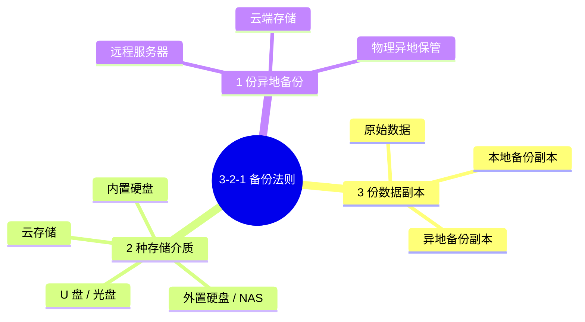
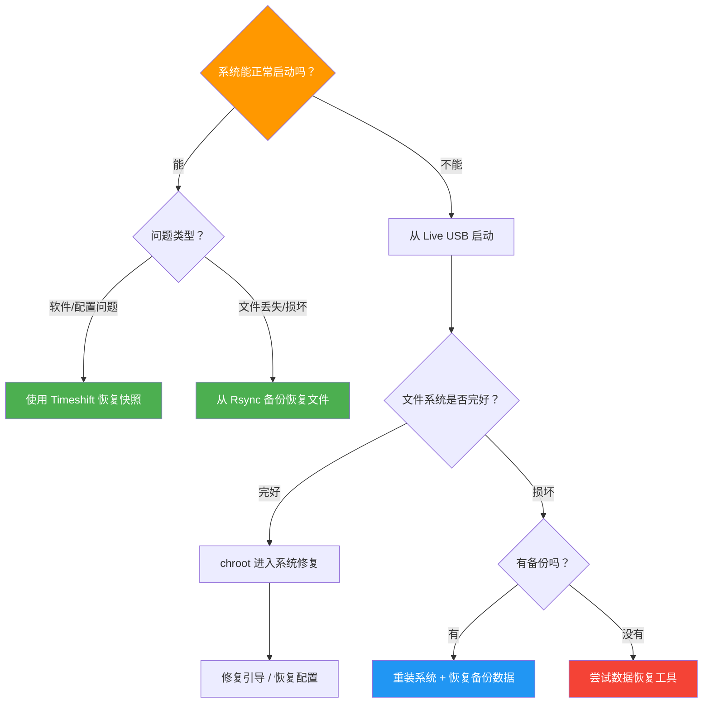

# 备份与恢复

数据是最宝贵的资产。无论是意外删除、硬盘故障还是系统崩溃，一个好的备份策略能让你快速恢复，避免数据丢失。本指南将从基础原则到实践操作，帮助你建立可靠的备份体系。

## 🎯 备份基本原则

### 3-2-1 备份法则

业界公认的黄金备份法则是 **3-2-1 原则**，它能最大程度地保障数据安全：



:::tip 为什么需要 3-2-1？
- **3 份副本**：即使两份同时损坏，仍有一份可用
- **2 种介质**：避免同一介质批次缺陷导致全部失效
- **1 份异地**：防范火灾、盗窃等物理灾难
:::

### 什么需要备份

不同类型的数据有不同的备份优先级：

| 类别 | 典型路径 | 优先级 | 说明 |
|------|---------|--------|------|
| 用户数据 | `/home/用户名/` | 最高 | 文档、照片、视频等不可替代的个人文件 |
| 系统配置 | `/etc/` | 高 | 系统和服务的配置文件，恢复后可避免重新配置 |
| 应用数据 | `/var/lib/`、`/var/www/` | 高 | 数据库、网站文件等应用运行数据 |
| 软件包列表 | `dpkg --get-selections` | 中 | 已安装软件的列表，方便重装后批量恢复 |
| 日志文件 | `/var/log/` | 低 | 通常不需要备份，除非有审计需求 |
| 系统文件 | `/usr/`、`/bin/` | 低 | 可通过重装系统恢复，一般不单独备份 |

### 备份策略类型

| 策略 | 说明 | 优点 | 缺点 | 适用场景 |
|------|------|------|------|---------|
| 完全备份 | 每次备份所有数据 | 恢复最简单、最快速 | 占用空间大，备份时间长 | 首次备份、重要节点 |
| 增量备份 | 只备份自上次备份以来的变化 | 速度快，占用空间小 | 恢复时需要依次还原所有增量 | 日常备份 |
| 差异备份 | 备份自上次完全备份以来的变化 | 恢复只需完全备份 + 最新差异 | 随时间推移备份量逐渐增大 | 折中方案 |

以下是典型的备份周期示意：


## 💾 Timeshift -- 系统快照

Timeshift 是 Linux 下最受欢迎的系统快照工具，类似于 Windows 的系统还原点。它专注于系统文件的备份，让你可以在系统出问题时快速回滚。

### 安装 Timeshift

```bash
# 更新软件源并安装
sudo apt update
sudo apt install timeshift
```

### 配置 Timeshift

Timeshift 支持两种快照模式：

| 模式 | 适用文件系统 | 特点 |
|------|-------------|------|
| RSYNC | 所有文件系统（ext4、XFS 等） | 通用性强，创建独立副本 |
| BTRFS | 仅 Btrfs 文件系统 | 利用 Btrfs 快照功能，速度快、占用空间小 |

**图形界面配置**：

```bash
# 启动 Timeshift 图形界面
sudo timeshift-gtk
```

首次启动时，向导会引导你完成以下配置：

1. **选择快照类型**：推荐大多数用户使用 RSYNC 模式
2. **选择快照存储位置**：建议选择独立的分区或外置硬盘
3. **设置自动快照频率**：
   - 每月保留：2 个
   - 每周保留：3 个
   - 每天保留：5 个
4. **选择包含的内容**：默认只包含系统文件，不包含用户主目录

:::tip 建议
Timeshift 主要用于系统文件的快照还原，用户数据（/home）建议使用 Rsync 或其他工具单独备份，避免快照体积过大。
:::

### 创建快照

```bash
# 创建快照并添加备注
sudo timeshift --create --comments "安装 NVIDIA 驱动前"

# 创建快照（使用默认备注）
sudo timeshift --create

# 查看已有快照列表
sudo timeshift --list
```

输出示例：

```
Device : /dev/sda2
UUID   : a1b2c3d4-e5f6-7890-abcd-ef1234567890
Path   : /
Mode   : RSYNC

Name                     Tags  Description
---------------------------------------------
2025-06-15_10-00-01  O   安装 NVIDIA 驱动前
2025-06-14_02-00-01  D
2025-06-13_02-00-01  D
```

### 恢复快照

**命令行恢复**：

```bash
# 查看可用快照
sudo timeshift --list

# 恢复到指定快照
sudo timeshift --restore --snapshot '2025-06-15_10-00-01'

# 恢复后系统会提示重启
sudo reboot
```

**图形界面恢复**：

1. 打开 Timeshift → 选择要恢复的快照 → 点击"还原"
2. 确认恢复的内容和目标设备
3. 等待恢复完成后重启系统

:::warning 注意
恢复操作会覆盖当前的系统文件。恢复前请确保重要的用户数据已另外备份。
:::

### 删除旧快照

```bash
# 删除指定快照
sudo timeshift --delete --snapshot '2025-06-13_02-00-01'

# 删除所有快照
sudo timeshift --delete-all
```

### Timeshift 最佳实践

:::tip Timeshift 使用建议
- 系统安装配置完成后，立即创建第一个快照作为"干净基线"
- 每次安装新软件、更新系统内核或修改关键配置前，手动创建快照
- 保留 2~3 个近期快照即可，过多快照会占用大量磁盘空间
- 快照存储位置应与系统分区分开，最好在独立硬盘上
:::

## 📁 Rsync -- 文件备份利器

Rsync 是 Linux 下最强大的文件同步和备份工具。它支持增量传输，只复制发生变化的文件部分，大幅提高备份效率。

### 基础用法

```bash
# 基本备份：将 /home/user/ 备份到 /backup/home/
rsync -avh /home/user/ /backup/home/

# 显示传输进度
rsync -avh --progress /home/user/ /backup/home/

# 预演模式（只显示会做什么，不实际执行）
rsync -avhn /home/user/ /backup/home/
```

:::warning 尾部斜杠很重要
- `rsync -avh /home/user/ /backup/` -- 复制 user 目录**内容**到 /backup/
- `rsync -avh /home/user /backup/` -- 复制 user 目录**本身**到 /backup/user/

注意源路径末尾有无 `/` 会影响结果，初学者常在此处犯错。
:::

### 常用参数表

| 参数 | 说明 | 示例 |
|------|------|------|
| `-a` | 归档模式，保留权限、时间戳、符号链接等 | `rsync -a src/ dst/` |
| `-v` | 详细输出，显示传输的文件列表 | `rsync -av src/ dst/` |
| `-h` | 人类可读的文件大小格式 | `rsync -avh src/ dst/` |
| `--progress` | 显示每个文件的传输进度 | `rsync -avh --progress src/ dst/` |
| `--delete` | 删除目标中源端已不存在的文件（镜像同步） | `rsync -avh --delete src/ dst/` |
| `--exclude` | 排除指定的文件或目录 | `rsync -avh --exclude='.cache' src/ dst/` |
| `-z` | 传输时压缩数据（适用于远程备份） | `rsync -avhz src/ remote:dst/` |
| `-e ssh` | 指定使用 SSH 作为远程传输通道 | `rsync -avhz -e ssh src/ user@host:dst/` |
| `--dry-run` | 预演模式，不做任何实际更改 | `rsync -avhn src/ dst/` |
| `--log-file` | 将操作日志写入文件 | `rsync -avh --log-file=backup.log src/ dst/` |

### 排除规则

备份时通常需要排除缓存、临时文件等不需要的内容：

```bash
# 使用 --exclude 参数排除单个目录
rsync -avh --exclude='.cache' --exclude='node_modules' --exclude='.local/share/Trash' \
  /home/user/ /backup/home/

# 使用排除文件批量排除（推荐）
rsync -avh --exclude-from=/home/user/backup-exclude.txt /home/user/ /backup/home/
```

排除文件 `backup-exclude.txt` 示例内容：

```text
# 缓存和临时文件
.cache/
.thumbnails/
.local/share/Trash/

# 开发相关
node_modules/
__pycache__/
.venv/
target/

# 浏览器缓存
.mozilla/firefox/*/cache2/
.config/google-chrome/*/Cache/

# 其他
*.tmp
*.swp
```

### 远程备份

```bash
# 备份本地文件到远程服务器
rsync -avhz -e ssh /home/user/Documents/ user@192.168.1.100:/backup/documents/

# 从远程服务器恢复到本地
rsync -avhz -e ssh user@192.168.1.100:/backup/documents/ /home/user/Documents/

# 使用非标准 SSH 端口
rsync -avhz -e 'ssh -p 2222' /home/user/ user@remote:/backup/
```

### 备份到外置硬盘

```bash
# 挂载外置硬盘
sudo mount /dev/sdb1 /mnt/external

# 执行备份
rsync -avh --delete /home/user/ /mnt/external/backup/home/

# 备份完成后安全卸载
sync
sudo umount /mnt/external
```

## 🤖 自动化备份脚本

手动备份容易遗忘，自动化脚本能确保备份按时执行。

### 完整备份脚本

创建脚本文件 `/home/user/scripts/backup.sh`：

```bash
#!/bin/bash
# ============================================
# 自动备份脚本
# 功能：备份用户数据到指定目标目录
# ============================================

# --- 配置区 ---
SOURCE="/home/user/"                          # 备份源目录
BACKUP_ROOT="/mnt/backup"                     # 备份目标根目录
EXCLUDE_FILE="/home/user/scripts/backup-exclude.txt"  # 排除规则文件
MAX_BACKUPS=7                                 # 保留最近的备份数量
LOG_DIR="/home/user/logs"                     # 日志目录

# --- 初始化 ---
DATE=$(date +%Y-%m-%d_%H%M%S)                # 当前时间戳
BACKUP_DIR="${BACKUP_ROOT}/${DATE}"           # 本次备份目录
LOG_FILE="${LOG_DIR}/backup_${DATE}.log"      # 本次日志文件
LATEST_LINK="${BACKUP_ROOT}/latest"           # 指向最新备份的符号链接

# 创建必要的目录
mkdir -p "${BACKUP_DIR}"
mkdir -p "${LOG_DIR}"

# --- 日志函数 ---
log() {
    echo "[$(date '+%Y-%m-%d %H:%M:%S')] $1" | tee -a "${LOG_FILE}"
}

# --- 开始备份 ---
log "========== 备份开始 =========="
log "源目录：${SOURCE}"
log "目标目录：${BACKUP_DIR}"

# 执行 rsync 增量备份（利用硬链接节省空间）
rsync -avh --delete \
    --exclude-from="${EXCLUDE_FILE}" \
    --link-dest="${LATEST_LINK}" \
    --log-file="${LOG_FILE}" \
    "${SOURCE}" "${BACKUP_DIR}"

# 检查 rsync 退出状态
if [ $? -eq 0 ]; then
    log "备份成功完成"
else
    log "错误：备份过程中出现问题，退出码: $?"
fi

# 更新 latest 符号链接
rm -f "${LATEST_LINK}"
ln -s "${BACKUP_DIR}" "${LATEST_LINK}"
log "已更新 latest 链接 -> ${BACKUP_DIR}"

# --- 清理旧备份 ---
log "开始清理旧备份（保留最近 ${MAX_BACKUPS} 份）..."
cd "${BACKUP_ROOT}" || exit 1
# 列出所有备份目录（按时间排序），删除超出保留数量的旧备份
ls -dt 20[0-9][0-9]-* 2>/dev/null | tail -n +$((MAX_BACKUPS + 1)) | while read -r old_backup; do
    log "删除旧备份：${old_backup}"
    rm -rf "${BACKUP_ROOT}/${old_backup}"
done

# --- 统计信息 ---
BACKUP_SIZE=$(du -sh "${BACKUP_DIR}" 2>/dev/null | cut -f1)
TOTAL_SIZE=$(du -sh "${BACKUP_ROOT}" 2>/dev/null | cut -f1)
log "本次备份大小：${BACKUP_SIZE}"
log "备份总占用空间：${TOTAL_SIZE}"
log "========== 备份结束 =========="
```

设置脚本权限：

```bash
# 给脚本添加执行权限
chmod +x /home/user/scripts/backup.sh

# 手动运行测试
/home/user/scripts/backup.sh
```

### Cron 定时任务

```bash
# 编辑当前用户的 crontab
crontab -e

# 添加以下行，每天凌晨 2 点自动执行备份
0 2 * * * /home/user/scripts/backup.sh >> /home/user/logs/cron-backup.log 2>&1

# 每周日凌晨 3 点执行完全备份
0 3 * * 0 /home/user/scripts/full-backup.sh >> /home/user/logs/cron-backup.log 2>&1
```

:::tip 验证 Cron 任务
设置好定时任务后，可以通过以下方式验证：
```bash
# 查看当前用户的 crontab
crontab -l

# 查看 cron 服务日志，确认任务有没有被执行
journalctl -u cron --since today
```
:::

## ☁️ 云备份方案

将备份存储在云端可以实现异地容灾，满足 3-2-1 法则中的"1 份异地备份"。

### Rclone 安装与配置

Rclone 是一款强大的命令行云存储同步工具，支持数十种云服务。

```bash
# 安装 rclone
sudo apt update
sudo apt install rclone

# 启动交互式配置向导
rclone config
```

### 支持的云服务

| 云服务 | 配置名 | 免费额度 | 说明 |
|--------|--------|---------|------|
| Google Drive | `drive` | 15 GB | 最常用，配置简单 |
| OneDrive | `onedrive` | 5 GB | 微软生态用户推荐 |
| Amazon S3 | `s3` | 按量付费 | 企业级，高可靠性 |
| Backblaze B2 | `b2` | 10 GB | 性价比极高的对象存储 |
| Dropbox | `dropbox` | 2 GB | 老牌云存储 |
| 阿里云 OSS | `s3`（兼容） | 按量付费 | 国内用户推荐 |
| WebDAV | `webdav` | 取决于服务商 | 通用协议，兼容坚果云等 |

### 备份到云端

```bash
# 查看远程存储中的内容
rclone ls myremote:backup/

# 同步本地目录到云端
rclone sync /home/user/Documents myremote:backup/documents/

# 带进度显示和限速（避免占满带宽）
rclone sync /home/user/Documents myremote:backup/documents/ \
    --progress \
    --bwlimit 5M

# 加密备份到云端（推荐用于敏感数据）
# 先在 rclone config 中配置 crypt 远程端，然后：
rclone sync /home/user/Documents mycrypt:backup/documents/
```

### Rclone 定期同步

```bash
# 编辑 crontab，每天凌晨 4 点同步到云端
crontab -e

# 添加以下行
0 4 * * * rclone sync /home/user/Documents myremote:backup/documents/ --log-file=/home/user/logs/rclone.log --log-level INFO
```

## 💿 完整系统备份

当你需要备份整个系统（而不仅仅是数据文件）时，可以使用以下方法。

### 使用 tar 备份

```bash
# 备份整个根文件系统（排除不需要的目录）
sudo tar czf /mnt/backup/system-$(date +%Y%m%d).tar.gz \
    --exclude=/mnt \
    --exclude=/proc \
    --exclude=/sys \
    --exclude=/dev \
    --exclude=/run \
    --exclude=/tmp \
    --exclude=/media \
    --exclude=/lost+found \
    --exclude=/mnt/backup \
    /

# 查看备份内容（不解压）
tar tzf /mnt/backup/system-20250615.tar.gz | head -20

# 查看备份文件大小
ls -lh /mnt/backup/system-20250615.tar.gz
```

### 使用 dd 克隆磁盘

`dd` 可以对磁盘进行逐字节的完整克隆，包括分区表、引导记录等所有内容。

```bash
# 克隆整个磁盘到镜像文件
sudo dd if=/dev/sda of=/mnt/backup/disk-full.img bs=4M status=progress

# 克隆单个分区
sudo dd if=/dev/sda1 of=/mnt/backup/sda1-root.img bs=4M status=progress

# 压缩克隆（节省空间）
sudo dd if=/dev/sda bs=4M status=progress | gzip > /mnt/backup/disk-full.img.gz
```

:::danger 极其重要：dd 操作前务必反复确认
`dd` 是一个非常强大但也非常危险的工具，**写反 if 和 of 参数会立即毁掉整块磁盘的数据！** 执行前请：
1. 用 `lsblk` 确认源盘（if）和目标盘/文件（of）
2. 确保目标位置有足够的空间
3. 确保源磁盘没有正在被写入数据
4. 执行前再三核实命令
:::

### Clonezilla 图形化备份

如果你不习惯命令行操作，Clonezilla 是一个优秀的图形化磁盘备份工具：

1. 从 [Clonezilla 官网](https://clonezilla.org/) 下载 Live ISO
2. 制作启动 U 盘（参考本站的[启动介质制作指南](/basics/bootable-media)）
3. 从 U 盘启动，按照向导选择"备份磁盘/分区"
4. 选择备份目标（本地硬盘、SSH 服务器、Samba 共享等）
5. 等待备份完成

:::tip 适用场景
Clonezilla 特别适合在以下场景使用：
- 更换硬盘前做完整迁移
- 批量部署相同配置的多台电脑
- 创建系统"黄金镜像"用于快速还原
:::

## 🔄 恢复操作

当灾难发生时，冷静地按照以下决策流程选择恢复方式：



### 从 Timeshift 恢复

```bash
# 查看可用快照
sudo timeshift --list

# 从指定快照恢复
sudo timeshift --restore --snapshot '2025-06-15_10-00-01'

# 如果系统无法启动，从 Live USB 启动后：
# 1. 安装 timeshift
sudo apt install timeshift
# 2. 挂载系统所在的分区
sudo mount /dev/sda2 /mnt
# 3. 使用 timeshift 恢复
sudo timeshift --restore --target /mnt
```

### 从 Rsync 备份恢复

```bash
# 恢复单个文件
cp /backup/home/Documents/重要文件.pdf /home/user/Documents/

# 恢复整个目录
rsync -avh /backup/home/Documents/ /home/user/Documents/

# 恢复整个用户主目录（注意：会覆盖现有文件）
rsync -avh /backup/home/ /home/user/

# 从远程备份恢复
rsync -avhz -e ssh user@backup-server:/backup/home/ /home/user/
```

### 从 tar 备份恢复

```bash
# 查看归档内容
tar tzf /mnt/backup/system-20250615.tar.gz | head -30

# 恢复整个系统（需要从 Live USB 启动）
# 1. 挂载目标分区
sudo mount /dev/sda2 /mnt
# 2. 解压备份到目标分区
sudo tar xzf /mnt/backup/system-20250615.tar.gz -C /mnt
# 3. 重建必要的目录
sudo mkdir -p /mnt/{proc,sys,dev,run,tmp,mnt,media}
# 4. 重新安装引导程序
sudo mount --bind /dev /mnt/dev
sudo mount --bind /proc /mnt/proc
sudo mount --bind /sys /mnt/sys
sudo chroot /mnt
grub-install /dev/sda
update-grub
exit

# 恢复单个文件或目录
sudo tar xzf /mnt/backup/system-20250615.tar.gz -C / etc/nginx/nginx.conf
```

## 🧪 验证备份

:::warning 关键提醒
备份如果不经过验证，等于没有备份。建议每月至少做一次恢复测试，确认备份数据可用。
:::

### 检查备份完整性

```bash
# 对比源目录和备份目录的差异
diff -rq /home/user/Documents /backup/home/Documents

# 检查 tar 归档的完整性
gzip -t /mnt/backup/system-20250615.tar.gz && echo "归档完好" || echo "归档损坏"

# 列出 tar 归档中的文件
tar tzf /mnt/backup/system-20250615.tar.gz | wc -l
# 输出文件总数，与源文件数量对比

# 使用 md5sum 校验关键文件
md5sum /home/user/Documents/重要文件.pdf
md5sum /backup/home/Documents/重要文件.pdf
# 两个哈希值应完全一致
```

### 定期恢复测试

```bash
# 创建临时恢复目录
mkdir -p /tmp/restore-test

# 从备份中恢复到临时目录
rsync -avh /backup/home/Documents/ /tmp/restore-test/

# 对比恢复的内容与原始数据
diff -rq /home/user/Documents /tmp/restore-test/

# 测试完成后清理
rm -rf /tmp/restore-test
```

### 自动化验证脚本

```bash
#!/bin/bash
# 备份验证脚本：检查最近的备份是否完好

BACKUP_DIR="/mnt/backup/latest"
SOURCE_DIR="/home/user"
REPORT="/home/user/logs/backup-verify-$(date +%Y%m%d).log"

echo "===== 备份验证报告 $(date) =====" > "${REPORT}"

# 检查备份目录是否存在
if [ ! -d "${BACKUP_DIR}" ]; then
    echo "错误：备份目录不存在！" >> "${REPORT}"
    exit 1
fi

# 检查备份目录的修改时间（确认备份是近期的）
BACKUP_AGE=$(( ($(date +%s) - $(stat -c %Y "${BACKUP_DIR}")) / 86400 ))
echo "备份距今天数：${BACKUP_AGE} 天" >> "${REPORT}"

if [ "${BACKUP_AGE}" -gt 7 ]; then
    echo "警告：备份已超过 7 天未更新！" >> "${REPORT}"
fi

# 对比文件数量
SOURCE_COUNT=$(find "${SOURCE_DIR}/Documents" -type f | wc -l)
BACKUP_COUNT=$(find "${BACKUP_DIR}/Documents" -type f | wc -l)
echo "源文件数量：${SOURCE_COUNT}" >> "${REPORT}"
echo "备份文件数量：${BACKUP_COUNT}" >> "${REPORT}"

echo "===== 验证完成 =====" >> "${REPORT}"
cat "${REPORT}"
```

## 📦 备份工具对比

| 工具 | 类型 | 去重 | 加密 | 易用性 | 推荐场景 |
|------|------|------|------|--------|---------|
| **Timeshift** | 系统快照 | 否（硬链接节省空间） | 否 | 简单，有 GUI | 系统回滚，初学者首选 |
| **Rsync** | 文件同步 | 否（增量传输） | 否（可配合 SSH） | 中等，命令行 | 文件备份，远程同步 |
| **Borg Backup** | 去重归档 | 是 | 是 | 中等，命令行 | 空间敏感的长期备份 |
| **Restic** | 去重归档 | 是 | 是 | 中等，命令行 | 多后端支持（S3、SFTP 等） |
| **Duplicity** | 增量归档 | 否 | 是（GPG） | 中等，命令行 | 加密远程备份 |
| **Rclone** | 云同步 | 否 | 是（可选） | 中等，命令行 | 云存储同步 |
| **Clonezilla** | 磁盘克隆 | 否 | 否 | 简单，有 GUI | 整盘备份、迁移硬盘 |
| **dd** | 磁盘镜像 | 否 | 否 | 低，命令行 | 完整磁盘/分区级克隆 |

:::tip 新手推荐方案
- **系统备份**：安装 Timeshift，设置每周自动快照
- **文件备份**：使用 Rsync 脚本，每日自动备份到外置硬盘
- **异地备份**：使用 Rclone 每周同步到云端
:::

## 📋 备份检查清单

定期检查以下事项，确保备份策略持续有效：

- [ ] Timeshift 快照是否正常创建（`sudo timeshift --list`）
- [ ] 最近一次备份的时间是否在预期范围内
- [ ] 备份目标磁盘/分区的剩余空间是否充足（`df -h`）
- [ ] 排除列表是否需要更新（新增了大型缓存目录？）
- [ ] Cron 定时任务是否正常运行（`journalctl -u cron --since today`）
- [ ] 云端备份是否同步成功（`rclone ls myremote:backup/ | tail -5`）
- [ ] 本月是否进行过至少一次恢复测试
- [ ] 备份日志中是否有错误或警告信息
- [ ] 异地备份（云端/远程服务器）是否可访问
- [ ] 备份密钥或密码是否安全保管并有副本

## 下一步

备份策略已经就绪，继续探索更多系统管理知识：

1. [计划任务](/administration/cron) -- 深入了解 Cron 和 systemd timer 定时任务
2. [安全管理](/administration/security) -- 加固你的 Debian 系统安全
3. [日志管理](/administration/logs) -- 监控系统运行状态
4. [系统服务管理](/administration/services) -- 管理和优化系统服务

---

**备份策略已经就绪？** [继续学习计划任务管理 -->](/administration/cron)
