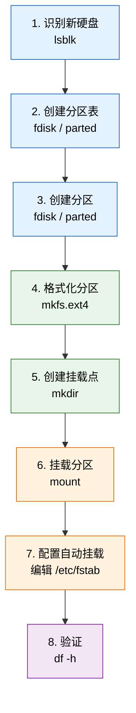
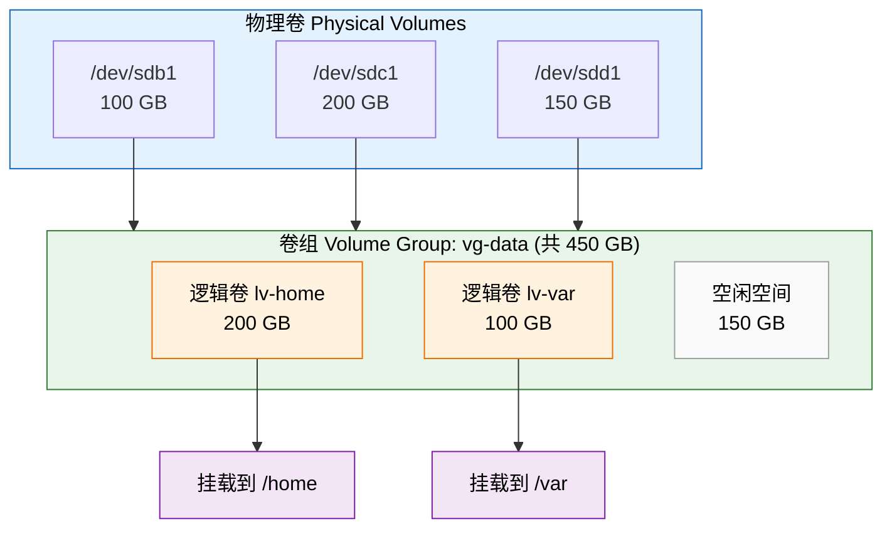

# 磁盘与存储管理

管理磁盘和存储是系统管理的基础技能。本章将带你了解 Linux 的存储体系，从查看磁盘信息到分区、格式化、挂载，再到 LVM 和磁盘加密等进阶内容。

## 💿 存储基础概念

### 存储层次结构

在 Linux 系统中，数据从物理硬盘到用户可用的目录，需要经过几个层次的抽象。理解这个层次结构有助于你掌握后续所有操作：


- **物理磁盘**：服务器或电脑中实际安装的硬盘设备，如 `/dev/sda`、`/dev/nvme0n1`
- **分区**：将一块物理磁盘划分成多个逻辑区域，每个分区独立使用
- **文件系统**：分区上的数据组织方式，决定了文件如何存储和检索
- **挂载点**：将文件系统"接入"到目录树中的某个位置，用户通过该目录访问数据

### 核心术语

| 术语 | 英文 | 说明 | 类比 |
|------|------|------|------|
| 硬盘 | Hard Disk / SSD | 物理存储设备 | 一栋大楼 |
| 分区 | Partition | 硬盘上划分的逻辑区域 | 大楼里的楼层 |
| 文件系统 | Filesystem | 数据在分区上的组织格式 | 楼层内的房间布局 |
| 挂载点 | Mount Point | 文件系统在目录树中的接入位置 | 进入楼层的门牌号 |
| 块设备 | Block Device | 内核中表示存储设备的抽象 | 大楼的建筑图纸 |
| inode | inode | 文件系统中记录文件元数据的数据结构 | 每间房的登记卡 |
| UUID | UUID | 分区的全局唯一标识符 | 每间房的唯一编号 |
| GPT/MBR | GPT/MBR | 分区表格式（GPT 为现代格式） | 大楼的楼层规划图标准 |

### 设备命名规则

Linux 中不同类型的磁盘有不同的设备名称：

```bash
# SATA / SCSI 磁盘
/dev/sda        # 第一块 SATA 磁盘
/dev/sda1       # 第一块 SATA 磁盘的第一个分区
/dev/sdb        # 第二块 SATA 磁盘

# NVMe 固态硬盘
/dev/nvme0n1    # 第一块 NVMe 磁盘
/dev/nvme0n1p1  # 第一块 NVMe 磁盘的第一个分区

# 虚拟磁盘（虚拟机中常见）
/dev/vda        # 第一块 virtio 磁盘
/dev/vda1       # 第一块 virtio 磁盘的第一个分区
```

## 🔍 查看磁盘信息

### 常用命令

```bash
# 以树形结构列出所有块设备
lsblk

# 列出块设备并显示文件系统信息
lsblk -f

# 查看所有磁盘的详细分区信息
sudo fdisk -l

# 查看各文件系统的磁盘使用情况（人类可读格式）
df -h

# 仅显示本地物理磁盘的使用情况（排除临时文件系统）
df -h --type=ext4 --type=btrfs --type=xfs

# 查看指定目录下各子目录的大小
du -sh /home/user/*

# 查看所有分区的 UUID 和文件系统类型
sudo blkid

# 查看磁盘 SMART 健康信息（需要安装 smartmontools）
sudo smartctl -a /dev/sda
```

### lsblk 输出解读

运行 `lsblk` 后你会看到类似如下的输出：

```
NAME        MAJ:MIN RM   SIZE RO TYPE MOUNTPOINTS
sda           8:0    0 238.5G  0 disk
├─sda1        8:1    0   512M  0 part /boot/efi
├─sda2        8:2    0   230G  0 part /
└─sda3        8:3    0     8G  0 part [SWAP]
sdb           8:16   0 931.5G  0 disk
└─sdb1        8:17   0 931.5G  0 part /mnt/data
```

各列含义：

| 列名 | 含义 |
|------|------|
| `NAME` | 设备名称，缩进表示层级关系（磁盘 → 分区） |
| `MAJ:MIN` | 主设备号和次设备号 |
| `RM` | 是否为可移动设备（1 = 是） |
| `SIZE` | 设备容量 |
| `RO` | 是否只读（1 = 只读） |
| `TYPE` | 类型：disk（磁盘）、part（分区）、lvm（逻辑卷） |
| `MOUNTPOINTS` | 挂载点路径 |

### df 输出解读

运行 `df -h` 后你会看到类似输出：

```
Filesystem      Size  Used Avail Use% Mounted on
/dev/sda2       230G   45G  174G  21% /
/dev/sda1       512M   12M  500M   3% /boot/efi
/dev/sdb1       932G  200G  685G  23% /mnt/data
tmpfs           3.9G   28M  3.9G   1% /dev/shm
```

- **Size**：分区总大小
- **Used / Avail**：已用 / 可用空间
- **Use%**：使用率百分比，超过 90% 时需要注意清理
- **Mounted on**：挂载点

:::tip
当 `Use%` 接近 100% 时，系统可能会出现异常。建议日常保持根分区使用率在 80% 以下。
:::

## 📊 文件系统类型

### 常见文件系统对比

| 文件系统 | 最大文件 | 最大分区 | 主要特点 | 推荐场景 | Debian 推荐度 |
|----------|----------|----------|----------|----------|---------------|
| **ext4** | 16 TB | 1 EB | 稳定可靠，日志功能，向后兼容 | 通用系统分区 | 默认推荐 |
| **Btrfs** | 16 EB | 16 EB | 快照、压缩、子卷、校验和 | 需要快照或数据校验 | 推荐 |
| **XFS** | 8 EB | 8 EB | 高性能、并行 I/O、在线扩展 | 大文件、数据库 | 推荐 |
| **NTFS** | 16 TB | 256 TB | Windows 默认文件系统 | 双系统共享数据 | 兼容使用 |
| **FAT32** | 4 GB | 2 TB | 兼容性最广 | U 盘、EFI 分区 | 仅限特殊用途 |
| **exFAT** | 16 EB | 128 PB | 无 4 GB 限制的 FAT | U 盘、外接存储 | 兼容使用 |
| **swap** | — | — | 交换空间 | 内存不足时的补充 | 必需 |

### 选择建议

- **通用桌面 / 服务器**：选择 **ext4**，它是 Debian 默认文件系统，稳定性经过长期验证
- **需要快照功能**：选择 **Btrfs**，支持透明压缩和快照回滚
- **大文件和数据库**：选择 **XFS**，在处理大文件和高并发 I/O 时表现优秀
- **与 Windows 共享数据**：选择 **NTFS**（只读性能好）或 **exFAT**（读写兼容）
- **U 盘和启动分区**：选择 **FAT32**（EFI 分区必须使用 FAT32）

:::tip
如果你是新手，不确定选哪个，就选 ext4。它是最安全、最成熟的选择。
:::

## 🔧 分区工具

### fdisk（命令行分区工具）

`fdisk` 是 Linux 最经典的命令行分区工具，适合 MBR 和 GPT 分区表：

```bash
# 对 /dev/sdb 进行分区操作
sudo fdisk /dev/sdb

# 进入交互模式后常用命令：
# m - 显示帮助菜单
# p - 打印当前分区表
# n - 创建新分区
# d - 删除分区
# t - 更改分区类型
# w - 写入分区表并退出
# q - 不保存退出
```

创建新分区的完整交互流程示例：

```bash
sudo fdisk /dev/sdb
# 输入 n（创建新分区）
# 输入 p（选择主分区）
# 输入 1（分区编号）
# 按 Enter（使用默认起始扇区）
# 按 Enter（使用全部剩余空间）或输入 +50G（指定大小）
# 输入 w（写入保存）
```

### parted（支持 GPT 的分区工具）

`parted` 功能更强大，原生支持 GPT 分区表和大容量磁盘：

```bash
# 对 /dev/sdb 进行分区操作
sudo parted /dev/sdb

# 交互模式中常用命令：
# print      - 显示当前分区信息
# mklabel gpt - 创建 GPT 分区表
# mkpart primary ext4 0% 100% - 创建一个占满整块磁盘的分区
# rm 1       - 删除第 1 个分区
# quit       - 退出
```

一行命令完成分区（非交互式）：

```bash
# 创建 GPT 分区表
sudo parted /dev/sdb mklabel gpt

# 创建一个占满整块磁盘的分区
sudo parted /dev/sdb mkpart primary ext4 0% 100%
```

### GParted（图形界面分区工具）

GParted 是一款直观的图形化分区管理工具，非常适合初学者：

```bash
# 安装 GParted
sudo apt install gparted

# 启动 GParted
sudo gparted
```

:::tip
新手推荐使用 GParted 图形界面工具，操作更直观，且可以预览更改后再应用，避免误操作。
:::

:::danger
分区操作会修改磁盘结构。在操作之前，请务必备份重要数据。对已有数据的磁盘进行分区操作可能导致数据丢失。
:::

## ➕ 添加新硬盘

### 完整流程

当你向系统中添加一块新硬盘时，需要按以下流程操作：



### 步骤详解

#### 第 1 步：识别新硬盘

```bash
# 查看所有块设备，找到新添加的磁盘
lsblk

# 输出示例（sdb 为新添加的磁盘，没有分区和挂载点）：
# NAME   MAJ:MIN RM   SIZE RO TYPE MOUNTPOINTS
# sda      8:0    0 238.5G  0 disk
# ├─sda1   8:1    0   512M  0 part /boot/efi
# ├─sda2   8:2    0   230G  0 part /
# └─sda3   8:3    0     8G  0 part [SWAP]
# sdb      8:16   0 500.0G  0 disk            ← 新硬盘
```

#### 第 2 步：创建分区

```bash
# 使用 parted 创建 GPT 分区表并分区（推荐）
sudo parted /dev/sdb mklabel gpt
sudo parted /dev/sdb mkpart primary ext4 0% 100%

# 或者使用 fdisk
sudo fdisk /dev/sdb
# 然后按交互步骤操作（参见前文 fdisk 部分）
```

#### 第 3 步：格式化分区

```bash
# 将新分区格式化为 ext4 文件系统
sudo mkfs.ext4 /dev/sdb1

# 如果需要其他文件系统：
# sudo mkfs.btrfs /dev/sdb1    # Btrfs
# sudo mkfs.xfs /dev/sdb1      # XFS
# sudo mkfs.vfat /dev/sdb1     # FAT32
```

#### 第 4 步：创建挂载点

```bash
# 创建用于挂载的目录
sudo mkdir -p /mnt/data
```

#### 第 5 步：挂载分区

```bash
# 将分区挂载到挂载点
sudo mount /dev/sdb1 /mnt/data

# 验证挂载是否成功
df -h /mnt/data
```

#### 第 6 步：配置自动挂载（fstab）

```bash
# 获取分区的 UUID
sudo blkid /dev/sdb1
# 输出示例：/dev/sdb1: UUID="a1b2c3d4-e5f6-7890-abcd-ef1234567890" TYPE="ext4"

# 编辑 fstab 文件
sudo nano /etc/fstab

# 在文件末尾添加一行（将 UUID 替换为你实际的值）：
# UUID=a1b2c3d4-e5f6-7890-abcd-ef1234567890  /mnt/data  ext4  defaults  0  2
```

#### 第 7 步：验证配置

```bash
# 先卸载分区
sudo umount /mnt/data

# 测试 fstab 配置是否正确（挂载 fstab 中所有未挂载的条目）
sudo mount -a

# 确认挂载成功
df -h /mnt/data

# 确认无错误信息
lsblk
```

:::warning
编辑 `/etc/fstab` 时务必小心。如果配置错误，系统重启后可能无法正常启动。建议每次修改后都用 `sudo mount -a` 测试。
:::

## 📍 挂载管理

### mount 和 umount 命令

```bash
# 挂载一个分区到指定目录
sudo mount /dev/sdb1 /mnt/data

# 以只读方式挂载
sudo mount -o ro /dev/sdb1 /mnt/data

# 挂载并指定文件系统类型
sudo mount -t ext4 /dev/sdb1 /mnt/data

# 带多个选项挂载
sudo mount -o rw,noexec,nosuid /dev/sdb1 /mnt/data

# 卸载分区
sudo umount /mnt/data

# 如果设备正忙，强制卸载（谨慎使用）
sudo umount -l /mnt/data

# 查看当前所有挂载点
mount | column -t
```

### /etc/fstab 详解

`/etc/fstab` 是控制系统启动时自动挂载行为的核心配置文件：

```bash
# /etc/fstab 格式：
# <设备>         <挂载点>   <类型>  <选项>     <dump>  <pass>
UUID=a1b2c3d4    /          ext4    defaults   0       1
UUID=e5f6a7b8    /boot/efi  vfat    umask=0077 0       1
UUID=c9d0e1f2    /mnt/data  ext4    defaults   0       2
/swapfile        swap       swap    defaults   0       0
```

各字段说明：

| 字段 | 说明 | 常用值 |
|------|------|--------|
| 设备 | 分区标识，推荐使用 UUID | `UUID=xxxx`、`/dev/sdb1` |
| 挂载点 | 挂载到目录树中的路径 | `/mnt/data`、`/home` |
| 类型 | 文件系统类型 | `ext4`、`btrfs`、`xfs`、`swap` |
| 选项 | 挂载选项 | `defaults`、`ro`、`noexec` |
| dump | 是否允许 dump 备份 | `0`（禁用）或 `1`（启用） |
| pass | 启动时 fsck 检查顺序 | `0`（不检查）、`1`（根分区）、`2`（其他分区） |

### 常用挂载选项

| 选项 | 说明 |
|------|------|
| `defaults` | 等同于 rw,suid,dev,exec,auto,nouser,async |
| `rw` | 读写模式 |
| `ro` | 只读模式 |
| `noexec` | 禁止执行该分区上的可执行文件 |
| `nosuid` | 忽略 SUID/SGID 位 |
| `nodev` | 禁止在该分区上解释字符或块设备 |
| `auto` | 系统启动时自动挂载 |
| `noauto` | 不自动挂载，需要手动 mount |
| `nofail` | 即使设备不存在也不报错（适合外接硬盘） |
| `user` | 允许普通用户挂载 |

### 使用 UUID 而非设备名

```bash
# 获取分区的 UUID
sudo blkid /dev/sdb1

# 输出示例：
# /dev/sdb1: UUID="a1b2c3d4-e5f6-7890-abcd-ef1234567890" TYPE="ext4"

# 在 fstab 中使用 UUID（推荐写法）
UUID=a1b2c3d4-e5f6-7890-abcd-ef1234567890  /mnt/data  ext4  defaults  0  2
```

:::tip
始终使用 UUID 而不是 `/dev/sdX` 设备名来标识分区。设备名（如 `/dev/sdb1`）可能在添加或移除硬盘后发生变化，而 UUID 是分区的唯一标识，不会改变。
:::

## 💾 LVM 逻辑卷管理

### LVM 概念

LVM（Logical Volume Manager）是 Linux 中强大的磁盘管理方案，在物理磁盘和文件系统之间增加了一层逻辑抽象，实现灵活的空间管理：



LVM 三层架构：

| 层级 | 缩写 | 说明 |
|------|------|------|
| 物理卷 | PV (Physical Volume) | 实际的磁盘分区或整块磁盘 |
| 卷组 | VG (Volume Group) | 将多个 PV 汇聚成一个存储池 |
| 逻辑卷 | LV (Logical Volume) | 从 VG 中划分出来的可使用空间，类似于传统分区 |

### 为什么使用 LVM

- **灵活扩缩容**：逻辑卷可以在线扩展，无需卸载文件系统
- **跨磁盘合并**：多块物理磁盘可以组合成一个大的存储池
- **快照功能**：支持创建卷快照，方便备份和测试
- **易于管理**：添加新磁盘后只需扩展卷组即可增加可用空间

### 安装 LVM 工具

```bash
# 安装 LVM2 工具包
sudo apt install lvm2
```

### 创建 LVM 完整流程

```bash
# 第 1 步：创建物理卷（PV）
sudo pvcreate /dev/sdb1 /dev/sdc1

# 查看物理卷信息
sudo pvs
sudo pvdisplay

# 第 2 步：创建卷组（VG），名称为 vg-data
sudo vgcreate vg-data /dev/sdb1 /dev/sdc1

# 查看卷组信息
sudo vgs
sudo vgdisplay

# 第 3 步：创建逻辑卷（LV），名称为 lv-home，大小 50 GB
sudo lvcreate -L 50G -n lv-home vg-data

# 查看逻辑卷信息
sudo lvs
sudo lvdisplay

# 第 4 步：格式化逻辑卷
sudo mkfs.ext4 /dev/vg-data/lv-home

# 第 5 步：挂载逻辑卷
sudo mkdir -p /mnt/home
sudo mount /dev/vg-data/lv-home /mnt/home

# 第 6 步：添加到 fstab 实现自动挂载
# 先获取 UUID
sudo blkid /dev/vg-data/lv-home
# 然后编辑 /etc/fstab 添加：
# UUID=xxxx  /mnt/home  ext4  defaults  0  2
```

### 扩展逻辑卷

```bash
# 扩展逻辑卷，增加 10 GB
sudo lvextend -L +10G /dev/vg-data/lv-home

# 扩展文件系统以使用新增空间
sudo resize2fs /dev/vg-data/lv-home

# 或者一步完成扩展（推荐），使用所有卷组中的剩余空间
sudo lvextend -l +100%FREE /dev/vg-data/lv-home
sudo resize2fs /dev/vg-data/lv-home

# 对于 XFS 文件系统，使用 xfs_growfs 代替 resize2fs
# sudo xfs_growfs /mnt/home
```

### 向卷组添加新磁盘

```bash
# 将新磁盘创建为物理卷
sudo pvcreate /dev/sdd1

# 将新物理卷加入现有卷组
sudo vgextend vg-data /dev/sdd1

# 查看卷组可用空间
sudo vgs
```

:::warning
缩小逻辑卷是一项高风险操作。ext4 文件系统支持缩小但必须先卸载，XFS 文件系统不支持缩小。建议仅在必要时执行，且操作前务必备份数据。
:::

## 🔄 交换空间（Swap）

### Swap 分区 vs Swap 文件

| 特性 | Swap 分区 | Swap 文件 |
|------|-----------|-----------|
| 创建方式 | 需要专用分区 | 在现有文件系统上创建文件 |
| 灵活性 | 需要重新分区才能调整大小 | 可以随时创建、删除或调整大小 |
| 性能 | 略优（直接访问磁盘） | 几乎无差别（现代内核已优化） |
| 适用场景 | 安装时规划好的固定配置 | 后期需要添加或调整 swap 时 |
| 推荐度 | 传统方案 | Debian 13 推荐方案 |

### 创建 Swap 文件

```bash
# 创建一个 4 GB 的 swap 文件
sudo fallocate -l 4G /swapfile

# 如果 fallocate 不可用（某些文件系统不支持），使用 dd：
# sudo dd if=/dev/zero of=/swapfile bs=1M count=4096

# 设置正确的权限（仅 root 可读写）
sudo chmod 600 /swapfile

# 将文件初始化为 swap 格式
sudo mkswap /swapfile

# 启用 swap 文件
sudo swapon /swapfile

# 验证 swap 是否已启用
swapon --show

# 添加到 fstab 实现开机自动启用
echo '/swapfile swap swap defaults 0 0' | sudo tee -a /etc/fstab
```

### Swap 大小建议

| 物理内存 | 推荐 Swap 大小 | 需要休眠时 |
|----------|----------------|------------|
| 2 GB 以下 | 内存的 2 倍 | 内存的 3 倍 |
| 2 - 8 GB | 与内存相同 | 内存的 2 倍 |
| 8 - 64 GB | 4 - 8 GB | 内存的 1.5 倍 |
| 64 GB 以上 | 4 GB（或不用） | 不建议休眠 |

### 调整 Swappiness

Swappiness 参数控制内核将数据从内存移到 swap 的倾向，取值范围 0-100：

- **0**：尽可能不使用 swap（仅在内存极度不足时使用）
- **10**：推荐桌面系统使用的值
- **60**：Debian 默认值
- **100**：积极使用 swap

```bash
# 查看当前 swappiness 值
cat /proc/sys/vm/swappiness

# 临时修改（重启后失效）
sudo sysctl vm.swappiness=10

# 永久修改
echo 'vm.swappiness=10' | sudo tee -a /etc/sysctl.conf

# 立即生效
sudo sysctl -p
```

:::tip
桌面用户建议将 swappiness 设为 10，这样系统会优先使用物理内存，减少不必要的磁盘读写，提升系统响应速度。
:::

## 🧹 磁盘空间清理

### 常用清理命令

```bash
# 清理 APT 软件包缓存
sudo apt clean           # 删除所有已下载的 .deb 包
sudo apt autoclean       # 仅删除已过时的 .deb 包
sudo apt autoremove      # 删除不再需要的依赖包

# 清理旧内核（释放 /boot 空间）
sudo apt autoremove --purge

# 限制 systemd 日志大小
sudo journalctl --vacuum-size=100M    # 将日志限制为 100 MB
sudo journalctl --vacuum-time=7d      # 仅保留最近 7 天的日志

# 清理临时文件
sudo rm -rf /tmp/*
sudo rm -rf /var/tmp/*

# 查找系统中最大的文件和目录
sudo du -ah / --exclude=/proc --exclude=/sys | sort -rh | head -20

# 查找超过 100 MB 的大文件
sudo find / -type f -size +100M -exec ls -lh {} \; 2>/dev/null

# 清理用户缓存
rm -rf ~/.cache/thumbnails/*
```

### 自动清理脚本

创建一个简单的磁盘清理脚本 `/usr/local/bin/disk-cleanup.sh`：

```bash
#!/bin/bash
# 磁盘清理脚本 - Debian 13
# 用法：sudo bash /usr/local/bin/disk-cleanup.sh

echo "===== 磁盘清理开始 ====="
echo ""

# 显示清理前的磁盘使用情况
echo "--- 清理前磁盘使用 ---"
df -h /

# 清理 APT 缓存
echo ""
echo "--- 清理 APT 缓存 ---"
sudo apt clean
sudo apt autoclean
sudo apt autoremove -y

# 清理旧日志
echo ""
echo "--- 清理旧日志 ---"
sudo journalctl --vacuum-size=100M

# 清理临时文件
echo ""
echo "--- 清理临时文件 ---"
sudo rm -rf /tmp/*
sudo rm -rf /var/tmp/*

# 显示清理后的磁盘使用情况
echo ""
echo "--- 清理后磁盘使用 ---"
df -h /

echo ""
echo "===== 磁盘清理完成 ====="
```

```bash
# 赋予执行权限
sudo chmod +x /usr/local/bin/disk-cleanup.sh

# 运行脚本
sudo /usr/local/bin/disk-cleanup.sh
```

## 🔐 磁盘加密（LUKS）

LUKS（Linux Unified Key Setup）是 Linux 标准的磁盘加密方案，用于保护存储在磁盘上的数据。

### 安装加密工具

```bash
sudo apt install cryptsetup
```

### 加密新分区

```bash
# 第 1 步：格式化分区为 LUKS 加密格式（会清除分区上的所有数据）
# 系统会要求你输入并确认加密密码
sudo cryptsetup luksFormat /dev/sdb1

# 第 2 步：打开（解锁）加密分区，映射为 /dev/mapper/encrypted
sudo cryptsetup open /dev/sdb1 encrypted

# 第 3 步：在解密后的设备上创建文件系统
sudo mkfs.ext4 /dev/mapper/encrypted

# 第 4 步：挂载加密分区
sudo mkdir -p /mnt/secure
sudo mount /dev/mapper/encrypted /mnt/secure

# 现在可以正常使用 /mnt/secure 目录读写文件了
```

### 关闭加密分区

```bash
# 先卸载文件系统
sudo umount /mnt/secure

# 关闭（锁定）加密分区
sudo cryptsetup close encrypted
```

### 开机自动挂载加密分区

如果需要在启动时自动挂载加密分区（启动时会提示输入密码）：

```bash
# 获取加密分区的 UUID
sudo blkid /dev/sdb1

# 编辑 /etc/crypttab，添加：
# encrypted  UUID=xxxx  none  luks

# 编辑 /etc/fstab，添加：
# /dev/mapper/encrypted  /mnt/secure  ext4  defaults  0  2
```

:::warning
加密密码一旦忘记，数据将无法恢复。请务必妥善保管密码，建议在安全的地方记录备份密码。
:::

:::danger
`cryptsetup luksFormat` 命令会完全擦除目标分区上的所有数据。在执行之前请确保已备份重要数据。
:::

## 🏥 SMART 磁盘健康监控

### 什么是 SMART

SMART（Self-Monitoring, Analysis and Reporting Technology）是硬盘内建的健康监控技术，可以预警潜在的硬盘故障。

### 安装和使用

```bash
# 安装 smartmontools
sudo apt install smartmontools

# 查看磁盘的完整 SMART 信息
sudo smartctl -a /dev/sda

# 快速健康检查（返回 PASSED 或 FAILED）
sudo smartctl -H /dev/sda

# 查看磁盘的错误日志
sudo smartctl -l error /dev/sda

# 运行短时自检（约 2 分钟）
sudo smartctl -t short /dev/sda

# 运行长时自检（可能需要数小时）
sudo smartctl -t long /dev/sda

# 查看自检结果
sudo smartctl -l selftest /dev/sda
```

### 关键 SMART 指标

| 指标 | 说明 | 警示标准 |
|------|------|----------|
| `Reallocated_Sector_Ct` | 重新分配的扇区数 | 大于 0 需关注 |
| `Current_Pending_Sector` | 当前待重分配的扇区 | 大于 0 需关注 |
| `Offline_Uncorrectable` | 无法修正的离线扇区 | 大于 0 需关注 |
| `UDMA_CRC_Error_Count` | 数据传输错误计数 | 持续增长需检查线缆 |
| `Temperature_Celsius` | 硬盘温度 | 超过 55°C 需改善散热 |
| `Power_On_Hours` | 通电运行时间 | 仅供参考 |

### 配置自动监控

```bash
# 启用 smartd 守护进程（自动监控所有磁盘）
sudo systemctl enable smartd
sudo systemctl start smartd

# 编辑 smartd 配置文件以自定义监控规则
sudo nano /etc/smartd.conf

# 示例配置：监控 /dev/sda，发现问题时发送邮件
# /dev/sda -a -o on -S on -s (S/../.././02|L/../../6/03) -m admin@example.com
```

:::tip
建议至少每月检查一次 SMART 状态。当 `Reallocated_Sector_Ct` 或 `Current_Pending_Sector` 不为零时，应尽快备份数据并准备更换硬盘。
:::

## 🚨 故障排查

### 磁盘空间满了

```bash
# 查看整体磁盘使用情况
df -h

# 找出哪些目录占用了最多空间
sudo du -sh /* | sort -rh | head -10

# 进一步深入到占用最多的目录
sudo du -sh /var/* | sort -rh | head -10

# 查找最近 7 天内创建的大文件
sudo find / -type f -size +50M -mtime -7 -ls 2>/dev/null

# 检查 inode 使用情况（小文件过多也会导致"空间满"）
df -i
```

### 无法挂载分区

```bash
# 检查文件系统是否损坏（分区必须先卸载）
sudo fsck /dev/sdb1

# 查看系统日志获取错误信息
sudo dmesg | tail -30
sudo journalctl -xe

# 检查 fstab 配置是否正确
cat /etc/fstab

# 尝试手动挂载并查看错误信息
sudo mount -v /dev/sdb1 /mnt/data
```

### 文件系统错误修复

```bash
# 重要：必须先卸载文件系统才能修复
sudo umount /dev/sdb1

# 检查并修复 ext4 文件系统
sudo fsck.ext4 -f /dev/sdb1

# 检查并修复 XFS 文件系统
sudo xfs_repair /dev/sdb1

# 检查并修复 Btrfs 文件系统
sudo btrfs check /dev/sdb1
```

:::danger
绝对不要在已挂载的文件系统上运行 `fsck`！这可能导致严重的数据损坏。如果需要修复根分区，请使用 Live USB 启动后再操作。
:::

### 磁盘读写速度异常

```bash
# 简单测试磁盘写入速度
dd if=/dev/zero of=/tmp/testfile bs=1M count=1024 oflag=direct 2>&1

# 简单测试磁盘读取速度
dd if=/tmp/testfile of=/dev/null bs=1M count=1024 iflag=direct 2>&1

# 清理测试文件
rm /tmp/testfile

# 使用 hdparm 测试读取速度
sudo apt install hdparm
sudo hdparm -tT /dev/sda

# 检查磁盘 I/O 状况
sudo apt install sysstat
iostat -x 1 5
```

## 📝 实用技巧汇总

### 快速参考

| 任务 | 命令 |
|------|------|
| 查看所有磁盘 | `lsblk` |
| 查看磁盘使用 | `df -h` |
| 查看目录大小 | `du -sh /path` |
| 查看分区 UUID | `sudo blkid` |
| 格式化为 ext4 | `sudo mkfs.ext4 /dev/sdX1` |
| 挂载分区 | `sudo mount /dev/sdX1 /mnt/point` |
| 卸载分区 | `sudo umount /mnt/point` |
| 测试 fstab | `sudo mount -a` |
| 扩展 LVM | `sudo lvextend -L +10G /dev/vg/lv && sudo resize2fs /dev/vg/lv` |
| 创建 swap 文件 | `sudo fallocate -l 4G /swapfile` |
| 磁盘健康检查 | `sudo smartctl -H /dev/sda` |
| 文件系统修复 | `sudo fsck /dev/sdX1`（须先卸载） |

### 安全操作清单

在进行磁盘操作前，请核对以下事项：

1. **备份数据**：任何分区、格式化操作前，确保重要数据已备份
2. **确认设备名**：使用 `lsblk` 反复确认要操作的设备，避免误操作系统盘
3. **卸载后操作**：修复文件系统前必须先卸载
4. **测试 fstab**：修改 `/etc/fstab` 后使用 `mount -a` 验证
5. **使用 UUID**：fstab 中始终使用 UUID，不使用 `/dev/sdX`
6. **保存密码**：加密分区的密码要妥善保管

## 下一步

掌握磁盘与存储管理后，您可以继续学习：

1. [系统服务管理](/administration/services) - 管理系统守护进程和服务
2. [安全加固](/administration/security) - 加强系统安全防护
3. [日志管理](/administration/logs) - 查看和管理系统日志

---

**磁盘管理已经掌握了？** [继续学习系统服务管理 →](/administration/services)
