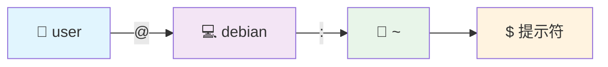
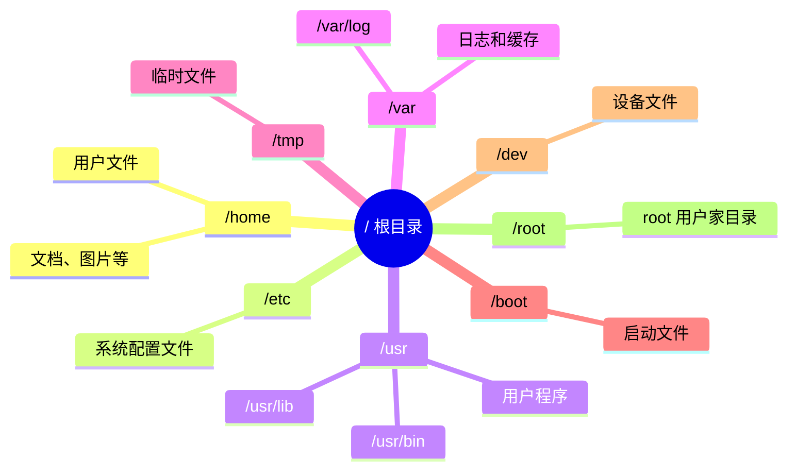
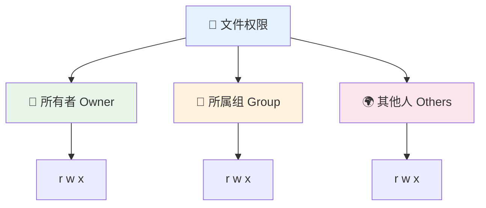
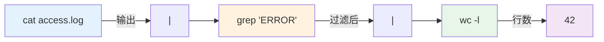

# Shell 与命令行基础

命令行是 Linux 系统最强大的工具。掌握基本的命令行操作，能让你高效地管理系统、安装软件、排查问题。本章将从零开始，带你入门 Debian 的命令行世界。

## 🖥️ 什么是命令行

### 终端与 Shell 的区别

在 Linux 中，"终端"和"Shell"是两个不同的概念：

| 概念 | 说明 | 类比 |
|------|------|------|
| **终端（Terminal）** | 一个窗口程序，用于显示文字界面 | 电视屏幕 |
| **Shell** | 解释并执行命令的程序 | 电视节目 |
| **命令行（CLI）** | 通过键入文字来操作系统的方式 | 遥控器 |

Debian 13 默认使用 **Bash**（Bourne Again Shell）作为 Shell。

### 为什么要学习命令行

- **效率更高** — 批量操作文件、自动化任务远比图形界面快
- **远程管理** — 服务器通常没有图形界面，只能通过命令行管理
- **故障排修** — 系统出问题时，命令行往往是唯一的修复途径
- **深入理解** — 命令行让你真正理解系统的运作方式

::: tip 💡 初学者提示
不用一次记住所有命令。先掌握最常用的 10 个命令，其余的用到时再查。命令行学习是一个渐进的过程。
:::

## 🚀 打开终端

### 图形界面打开方式

| 桌面环境 | 打开方式 | 默认终端程序 |
|---------|---------|------------|
| GNOME | 活动 → 搜索"终端" | GNOME Terminal |
| KDE Plasma | 应用菜单 → 系统 → Konsole | Konsole |
| Xfce | 应用菜单 → 系统 → Xfce 终端 | Xfce Terminal |
| MATE | 应用程序 → 系统工具 → 终端 | MATE Terminal |

### 快捷键方式

大多数桌面环境都支持快捷键打开终端：

```
Ctrl + Alt + T
```

::: tip 💡 初学者提示
记住 `Ctrl + Alt + T` 这个快捷键，它几乎在所有 Linux 桌面环境中都有效。
:::

### 初识终端界面

打开终端后，你会看到类似这样的提示符：

```bash
user@debian:~$
```



| 部分 | 含义 | 示例 |
|------|------|------|
| `user` | 当前登录的用户名 | ivmm、root |
| `debian` | 计算机的主机名 | mypc、server1 |
| `~` | 当前所在目录（`~` 表示家目录） | /home/user |
| `$` | 普通用户提示符（root 用户为 `#`） | $ 或 # |

## 📂 文件系统基础

### Linux 文件系统结构

Linux 的文件系统是一棵以 `/`（根目录）为起点的树形结构，与 Windows 的 C:、D: 盘不同：



**最重要的目录：**

| 目录 | 用途 | 你会用到吗 |
|------|------|-----------|
| `/home/你的用户名/` | 你的个人文件存放处 | ✅ 经常 |
| `/etc/` | 系统和软件的配置文件 | ✅ 经常 |
| `/var/log/` | 系统日志文件 | ✅ 排查问题时 |
| `/usr/bin/` | 用户可执行程序 | 偶尔 |
| `/tmp/` | 临时文件（重启后清空） | 偶尔 |
| `/boot/` | 系统启动文件 | 很少 |
| `/dev/` | 硬件设备文件 | 很少 |

### 绝对路径与相对路径

```bash
# 绝对路径 — 从根目录 / 开始的完整路径
/home/user/Documents/report.txt

# 相对路径 — 相对于当前目录的路径
Documents/report.txt        # 当前目录下的 Documents
./Documents/report.txt      # 同上，./ 表示当前目录
../Downloads/file.zip       # 上级目录下的 Downloads
```

### 特殊目录符号

| 符号 | 含义 | 示例 |
|------|------|------|
| `/` | 根目录 | `cd /` |
| `~` | 当前用户的家目录 | `cd ~` 等于 `cd /home/user` |
| `.` | 当前目录 | `./script.sh` |
| `..` | 上级目录 | `cd ..` |
| `-` | 上一次所在的目录 | `cd -` |

## 🗂️ 基础文件操作命令

### 浏览目录

```bash
# 显示当前所在目录
pwd
# 输出: /home/user

# 列出当前目录的文件
ls

# 列出详细信息（权限、大小、日期）
ls -l

# 显示隐藏文件（以 . 开头的文件）
ls -la

# 以人类可读的方式显示文件大小
ls -lh

# 切换到指定目录
cd /home/user/Documents

# 回到家目录
cd ~
# 或直接
cd

# 回到上级目录
cd ..

# 回到上次所在目录
cd -
```

::: tip 💡 初学者提示
`ls -lah` 是最常用的组合，它能显示所有文件（包括隐藏文件）的详细信息，并用 KB/MB/GB 显示文件大小。
:::

### 创建和删除

```bash
# 创建目录
mkdir my-project

# 创建多级目录（父目录不存在时自动创建）
mkdir -p projects/web/css

# 创建空文件
touch readme.txt

# 删除文件
rm readme.txt

# 删除目录（必须为空）
rmdir my-project

# 删除目录及其所有内容（递归删除）
rm -r my-project

# 删除前逐一确认
rm -ri my-project
```

::: danger ⚠️ 危险操作
`rm -rf /` 会删除整个系统！**永远不要**执行此命令。使用 `rm -r` 时务必仔细检查路径。建议新手始终加上 `-i` 参数来逐一确认。
:::

### 复制和移动

```bash
# 复制文件
cp source.txt destination.txt

# 复制文件到指定目录
cp report.txt /home/user/Documents/

# 复制整个目录（递归复制）
cp -r my-project/ backup-project/

# 移动文件（也用于重命名）
mv old-name.txt new-name.txt

# 移动文件到其他目录
mv report.txt /home/user/Documents/

# 移动整个目录
mv my-project/ /home/user/workspace/
```

### 查看文件内容

```bash
# 显示整个文件内容（适合短文件）
cat config.txt

# 分页查看文件（适合长文件，按 q 退出）
less /var/log/syslog

# 显示文件前 10 行
head config.txt

# 显示文件前 20 行
head -n 20 config.txt

# 显示文件最后 10 行
tail config.txt

# 实时追踪文件变化（常用于查看日志）
tail -f /var/log/syslog

# 统计文件的行数、单词数、字符数
wc readme.txt
```

## 👤 文件权限详解

### 权限系统概述

Linux 中每个文件都有三组权限，分别对应文件的所有者、所属组和其他用户：



| 权限 | 字母 | 数字 | 对文件的含义 | 对目录的含义 |
|------|------|------|-------------|-------------|
| 读 | `r` | 4 | 查看文件内容 | 列出目录内容 |
| 写 | `w` | 2 | 修改文件内容 | 在目录中创建/删除文件 |
| 执行 | `x` | 1 | 运行可执行文件 | 进入该目录 |
| 无 | `-` | 0 | 无此权限 | 无此权限 |

### 查看权限

```bash
ls -l
# 输出示例:
# -rw-r--r-- 1 user group 4096 Jan 15 10:30 readme.txt
# drwxr-xr-x 2 user group 4096 Jan 15 10:30 Documents/
```

解读 `-rw-r--r--`：

| 位置 | 值 | 含义 |
|------|-----|------|
| 第 1 位 | `-` | 文件类型（`-` 普通文件，`d` 目录，`l` 链接） |
| 第 2-4 位 | `rw-` | 所有者权限（可读、可写、不可执行） |
| 第 5-7 位 | `r--` | 所属组权限（可读） |
| 第 8-10 位 | `r--` | 其他人权限（可读） |

### 修改权限

```bash
# 使用数字模式修改权限
chmod 755 script.sh    # 所有者 rwx，组和其他 r-x
chmod 644 config.txt   # 所有者 rw-，组和其他 r--
chmod 600 secret.key   # 仅所有者可读写

# 使用符号模式修改权限
chmod +x script.sh     # 给所有人添加执行权限
chmod u+x script.sh    # 仅给所有者添加执行权限
chmod go-w file.txt    # 移除组和其他人的写权限

# 修改文件所有者
sudo chown user:group file.txt

# 递归修改目录权限
chmod -R 755 my-project/
sudo chown -R user:group my-project/
```

::: tip 💡 常用权限速记
- `755` — 目录和脚本（所有者完全控制，其他人可读可执行）
- `644` — 普通文件（所有者可读写，其他人只读）
- `600` — 敏感文件（仅所有者可读写）
- `700` — 私有目录（仅所有者可访问）
:::

## 🔍 搜索与编辑

### 搜索文件

```bash
# 按文件名搜索
find /home/user -name "*.txt"

# 按文件名搜索（不区分大小写）
find /home/user -iname "readme*"

# 搜索大于 100MB 的文件
find / -size +100M

# 搜索最近 7 天内修改过的文件
find /home/user -mtime -7

# 使用 locate 快速搜索（需先更新数据库）
sudo updatedb
locate readme.txt
```

### 搜索文件内容

```bash
# 在文件中搜索关键词
grep "error" /var/log/syslog

# 递归搜索目录下所有文件
grep -r "password" /etc/

# 不区分大小写搜索
grep -i "warning" /var/log/syslog

# 显示行号
grep -n "error" /var/log/syslog

# 搜索不包含某关键词的行
grep -v "debug" /var/log/syslog
```

### Nano 编辑器（推荐新手）

Nano 是最适合新手的文本编辑器，操作简单直观：

```bash
# 打开或创建文件
nano myfile.txt
```

**Nano 常用快捷键：**

| 快捷键 | 功能 |
|--------|------|
| `Ctrl + O` | 保存文件 |
| `Ctrl + X` | 退出编辑器 |
| `Ctrl + K` | 剪切当前行 |
| `Ctrl + U` | 粘贴 |
| `Ctrl + W` | 搜索文字 |
| `Ctrl + G` | 查看帮助 |
| `Alt + U` | 撤销 |

### Vim 基础（进阶）

Vim 功能强大但学习曲线较陡，了解基本操作即可：

```bash
# 打开文件
vim myfile.txt
```

| 操作 | 按键 | 说明 |
|------|------|------|
| 进入编辑模式 | `i` | 开始输入文字 |
| 退出编辑模式 | `Esc` | 回到命令模式 |
| 保存并退出 | `:wq` | 在命令模式下输入 |
| 不保存退出 | `:q!` | 放弃修改并退出 |
| 删除一行 | `dd` | 在命令模式下 |
| 搜索 | `/关键词` | 按 `n` 查找下一个 |

::: tip 💡 初学者提示
如果你不小心进入了 Vim 且不知道怎么退出，按 `Esc` 键，然后输入 `:q!` 再按回车即可退出。
:::

## 🔗 管道与重定向

管道和重定向是 Linux 命令行最强大的特性之一，它们允许你将多个命令组合起来完成复杂任务。

### 输出重定向

```bash
# 将命令输出写入文件（覆盖已有内容）
ls -l > filelist.txt

# 将命令输出追加到文件末尾
echo "new line" >> filelist.txt

# 将错误信息重定向到文件
command 2> errors.log

# 同时重定向标准输出和错误输出
command > output.log 2>&1
```

### 管道操作

管道符 `|` 将前一个命令的输出传递给下一个命令作为输入：



```bash
# 搜索日志中的错误并统计数量
cat /var/log/syslog | grep "error" | wc -l

# 查看磁盘使用量并排序
du -sh /home/user/* | sort -rh

# 查看占用内存最多的 10 个进程
ps aux | sort -k4 -rn | head -10

# 实时过滤日志
tail -f /var/log/syslog | grep --color "error"
```

### 实用组合示例

```bash
# 查找并删除 7 天前的日志文件
find /var/log -name "*.log" -mtime +7 -exec rm {} \;

# 统计当前目录下各类型文件数量
find . -type f | sed 's/.*\.//' | sort | uniq -c | sort -rn

# 查看当前哪些端口在监听
ss -tlnp | grep LISTEN
```

## 🔐 Sudo 与权限提升

### 什么是 sudo

`sudo`（Super User DO）允许普通用户以管理员（root）身份执行命令，是 Debian 系统管理的核心工具。

```bash
# 以 root 权限执行命令
sudo apt update

# 以 root 身份打开文件编辑器
sudo nano /etc/fstab

# 查看 sudo 权限
sudo -l

# 切换到 root 用户（不推荐日常使用）
sudo -i
# 或
su -
```

::: warning ⚠️ 安全提醒
- 只在需要时使用 `sudo`，不要所有命令都加 `sudo`
- 绝对不要用 `sudo` 运行来历不明的脚本
- 切换到 root 用户后，记得及时用 `exit` 退出
:::

### sudo 与 su 的区别

| 特性 | `sudo` | `su` |
|------|--------|------|
| 用途 | 以 root 执行单个命令 | 切换到 root 用户 |
| 密码 | 输入当前用户密码 | 输入 root 密码 |
| 安全性 | 更安全，有日志记录 | 相对不安全 |
| 推荐度 | ✅ 推荐 | ⚠️ 仅在必要时使用 |

## 🌍 环境变量

### 查看环境变量

```bash
# 查看所有环境变量
env

# 查看某个环境变量
echo $HOME
echo $PATH
echo $USER
echo $SHELL
```

### 重要的环境变量

| 变量 | 说明 | 示例值 |
|------|------|--------|
| `$HOME` | 用户家目录 | `/home/user` |
| `$PATH` | 可执行程序搜索路径 | `/usr/local/bin:/usr/bin:/bin` |
| `$USER` | 当前用户名 | `user` |
| `$SHELL` | 当前使用的 Shell | `/bin/bash` |
| `$LANG` | 系统语言 | `zh_CN.UTF-8` |
| `$PWD` | 当前工作目录 | `/home/user/Documents` |

### 设置环境变量

```bash
# 临时设置（仅当前终端有效）
export MY_VAR="hello"

# 永久设置 — 添加到 ~/.bashrc
echo 'export MY_VAR="hello"' >> ~/.bashrc

# 修改 PATH（添加新路径）
export PATH="$HOME/.local/bin:$PATH"

# 使修改立即生效
source ~/.bashrc
```

### 配置文件加载顺序

| 文件 | 何时加载 | 用途 |
|------|---------|------|
| `/etc/profile` | 登录时 | 全局配置 |
| `~/.profile` | 登录时 | 用户个人登录配置 |
| `~/.bashrc` | 每次打开终端时 | 用户个人 Shell 配置 |
| `~/.bash_aliases` | 被 .bashrc 加载 | 用户命令别名 |

## 💡 实用技巧

### Tab 自动补全

Tab 键是命令行中最有用的按键：

```bash
# 输入文件名的前几个字符，按 Tab 自动补全
cd Doc<Tab>        # 自动补全为 cd Documents/

# 按两次 Tab 显示所有可能的补全选项
cd D<Tab><Tab>     # 显示 Desktop/ Documents/ Downloads/

# 命令也可以补全
apt in<Tab>        # 自动补全为 apt install
```

### 通配符

```bash
# * 匹配任意数量的字符
ls *.txt           # 列出所有 .txt 文件
rm *.log           # 删除所有 .log 文件

# ? 匹配单个字符
ls file?.txt       # 匹配 file1.txt、fileA.txt 等

# [] 匹配括号中的任一字符
ls file[123].txt   # 匹配 file1.txt、file2.txt、file3.txt
```

### 命令别名

```bash
# 创建别名（临时）
alias ll='ls -lah'
alias update='sudo apt update && sudo apt upgrade'
alias ..='cd ..'

# 永久保存别名 — 添加到 ~/.bashrc
echo "alias ll='ls -lah'" >> ~/.bashrc
source ~/.bashrc
```

### 命令历史

```bash
# 查看命令历史
history

# 查看最近 20 条命令
history 20

# 执行历史中的第 N 条命令
!42

# 执行上一条命令
!!

# 以 sudo 重新执行上一条命令（超实用）
sudo !!
```

**快捷键速查：**

| 快捷键 | 功能 |
|--------|------|
| `Ctrl + R` | 反向搜索命令历史 |
| `Ctrl + A` | 光标移到行首 |
| `Ctrl + E` | 光标移到行尾 |
| `Ctrl + U` | 删除光标前的所有内容 |
| `Ctrl + K` | 删除光标后的所有内容 |
| `Ctrl + W` | 删除光标前的一个单词 |
| `Ctrl + L` | 清屏（等同 clear） |
| `Ctrl + C` | 终止当前命令 |
| `Ctrl + D` | 退出当前终端 |
| `↑` / `↓` | 浏览上/下一条历史命令 |

### 多命令执行

```bash
# 顺序执行（无论成功失败）
command1 ; command2

# 前一个成功才执行下一个
command1 && command2

# 前一个失败才执行下一个
command1 || command2

# 示例：更新系统并清理
sudo apt update && sudo apt upgrade -y && sudo apt autoremove -y
```

## 📊 系统信息查看

```bash
# 查看系统信息
uname -a           # 内核版本、架构等
lsb_release -a     # Debian 版本信息
hostnamectl        # 主机名和系统信息

# 查看进程
ps aux             # 列出所有进程
top                # 实时进程监控（按 q 退出）
htop               # 更好用的进程监控（需安装）

# 查看磁盘使用情况
df -h              # 各分区的使用情况
du -sh ~/Documents # 指定目录的大小

# 查看内存使用
free -h            # 内存和交换空间使用情况

# 查看网络信息
ip addr            # IP 地址信息
ip route           # 路由表
ss -tlnp           # 监听的端口
```

## 🆘 常见问题

### 命令找不到

```bash
# 错误信息: bash: xxx: command not found

# 解决方法 1: 安装对应的软件包
sudo apt install xxx

# 解决方法 2: 检查 PATH 是否正确
echo $PATH

# 解决方法 3: 使用完整路径执行
/usr/bin/xxx
```

### 权限被拒绝

```bash
# 错误信息: Permission denied

# 解决方法 1: 使用 sudo
sudo command

# 解决方法 2: 修改文件权限
chmod +x script.sh

# 解决方法 3: 修改文件所有者
sudo chown $USER:$USER file.txt
```

### 如何停止运行中的命令

| 操作 | 快捷键 | 说明 |
|------|--------|------|
| 终止命令 | `Ctrl + C` | 立即停止当前命令 |
| 暂停命令 | `Ctrl + Z` | 挂起到后台 |
| 恢复命令 | `fg` | 将后台任务恢复到前台 |
| 后台运行 | `bg` | 让暂停的任务在后台继续 |

## 📝 快速参考表

### 文件与目录操作

| 命令 | 功能 | 示例 |
|------|------|------|
| `ls` | 列出文件 | `ls -lah` |
| `cd` | 切换目录 | `cd /home/user` |
| `pwd` | 显示当前目录 | `pwd` |
| `mkdir` | 创建目录 | `mkdir -p a/b/c` |
| `rm` | 删除文件/目录 | `rm -r dir/` |
| `cp` | 复制 | `cp -r src/ dst/` |
| `mv` | 移动/重命名 | `mv old.txt new.txt` |
| `touch` | 创建空文件 | `touch file.txt` |
| `cat` | 查看文件内容 | `cat config.txt` |
| `less` | 分页查看 | `less /var/log/syslog` |
| `head` | 查看前 N 行 | `head -n 20 file` |
| `tail` | 查看后 N 行 | `tail -f /var/log/syslog` |

### 搜索与处理

| 命令 | 功能 | 示例 |
|------|------|------|
| `find` | 搜索文件 | `find / -name "*.conf"` |
| `grep` | 搜索内容 | `grep -r "error" /var/log/` |
| `wc` | 统计行/词/字 | `wc -l file.txt` |
| `sort` | 排序 | `sort -rn data.txt` |
| `uniq` | 去重 | `sort file \| uniq -c` |
| `diff` | 比较文件 | `diff file1 file2` |

### 系统管理

| 命令 | 功能 | 示例 |
|------|------|------|
| `sudo` | 提升权限 | `sudo apt update` |
| `chmod` | 修改权限 | `chmod 755 script.sh` |
| `chown` | 修改所有者 | `sudo chown user:group file` |
| `ps` | 查看进程 | `ps aux` |
| `top` | 实时监控 | `top` |
| `kill` | 终止进程 | `kill -9 PID` |
| `df` | 磁盘使用 | `df -h` |
| `free` | 内存使用 | `free -h` |
| `uname` | 系统信息 | `uname -a` |

### 网络相关

| 命令 | 功能 | 示例 |
|------|------|------|
| `ip addr` | 查看 IP 地址 | `ip addr` |
| `ping` | 测试连通性 | `ping debian.org` |
| `ss` | 查看端口 | `ss -tlnp` |
| `curl` | 下载/请求 | `curl -O https://url/file` |
| `wget` | 下载文件 | `wget https://url/file` |

## 下一步

恭喜你掌握了 Linux 命令行的基础知识！接下来，你可以继续学习：

1. [系统配置](/basics/configuration) - 进一步配置和优化你的 Debian 系统
2. [APT 包管理](/administration/packages) - 学习软件安装与管理
3. [用户与权限](/administration/users) - 深入了解用户管理和权限控制
4. [磁盘与存储管理](/administration/disk-management) - 管理磁盘和存储设备

---

**命令行操作越来越熟练了？** [开始学习系统配置 →](/basics/configuration)
