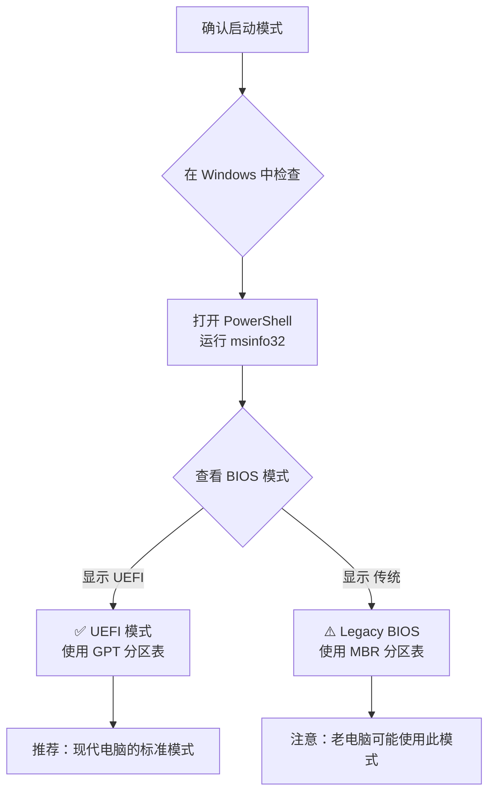
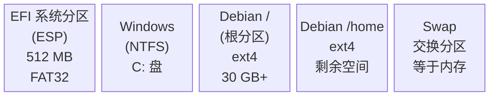
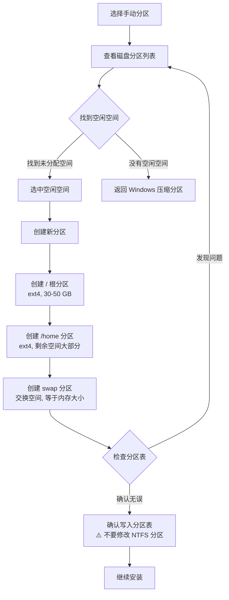
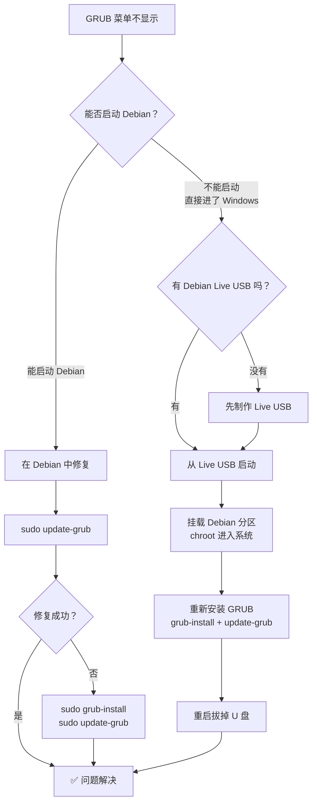

# 双系统安装指南

如果你想保留 Windows 的同时体验 Debian，双系统是最佳选择。本指南将带你完成从准备到安装的全过程。

## 🎯 双系统的优势与考量

### 优势

- ✅ **保留 Windows** 用于游戏、办公软件、Adobe 等专业工具
- ✅ **享受 Debian 的稳定与安全**，用于开发、服务器管理、日常使用
- ✅ **两个系统完全独立**，互不影响，数据隔离
- ✅ **可以随时选择启动哪个系统**，通过 GRUB 引导菜单切换

### 考量因素

- 需要足够的硬盘空间（建议至少 50 GB 给 Debian）
- 安装过程中的分区操作需要仔细，误操作可能丢失数据
- 需要了解磁盘分区的基本概念
- Windows 大版本更新可能影响 GRUB 引导

### 安装方式对比

| 方式 | 适合人群 | 性能 | 难度 | 风险 |
|------|---------|------|------|------|
| **双系统安装** | 需要原生性能的用户 | ⭐⭐⭐⭐⭐ | 中等 | 中等 |
| **虚拟机安装** | 仅需轻度使用 Linux | ⭐⭐⭐ | 简单 | 极低 |
| **WSL** | Windows 下使用 Linux 命令行 | ⭐⭐⭐⭐ | 简单 | 极低 |
| **完全替换** | 不再需要 Windows | ⭐⭐⭐⭐⭐ | 简单 | 高 |

## 📋 安装前准备

### 准备检查清单

在开始之前，请逐一确认以下事项：

- [ ] 备份 Windows 中的重要数据（文档、照片、书签等）
- [ ] 确认硬盘至少有 50 GB 可用空间（推荐 100 GB 以上）
- [ ] 已下载 Debian 13 ISO 镜像
- [ ] 已制作好启动 U 盘（参考 [制作启动盘](/basics/bootable-media)）
- [ ] 了解 BIOS/UEFI 设置方法（参考 [BIOS 设置](/basics/bios-settings)）
- [ ] 记录 Windows 产品密钥（以防万一）
- [ ] 电源连接稳定（笔记本用户务必接通电源）

::: warning ⚠️ 数据备份是第一要务
分区操作有风险！即使按照正确步骤操作，也建议提前将重要文件备份到外置硬盘、云盘或其他设备上。
:::

### 确认系统启动模式

在开始安装前，你需要确认电脑使用的是 UEFI 还是 Legacy BIOS 模式，因为这直接影响分区方案。



在 Windows 中，打开 PowerShell 运行以下命令来确认：

```powershell
# 方法一：系统信息
msinfo32
# 查看"BIOS 模式"字段，显示"UEFI"或"传统"

# 方法二：PowerShell 命令
$env:firmware_type
# 返回 UEFI 或 Legacy
```

### UEFI 与 Legacy BIOS 对比

| 特性 | UEFI | Legacy BIOS |
|------|------|-------------|
| **分区表** | GPT | MBR |
| **启动分区** | 需要 EFI 系统分区（ESP） | 不需要 |
| **最大磁盘支持** | 超过 2 TB | 最大 2 TB |
| **启动速度** | 较快 | 较慢 |
| **安全启动** | 支持 Secure Boot | 不支持 |
| **适用年代** | 2012 年后的电脑 | 2012 年前的老电脑 |

::: tip 💡 初学者建议
2012 年以后出厂的电脑几乎都是 UEFI 模式。如果你的电脑是近几年购买的，可以直接按 UEFI 模式操作。
:::

## 💾 分区规划

分区规划是双系统安装最关键的环节。合理的分区方案能让两个系统和谐共存。

### 磁盘分区布局

以下是典型的 UEFI 双系统分区布局：



### 推荐分区方案

根据你的硬盘大小，选择合适的分区方案：

| 分区 | 最小方案（120 GB） | 推荐方案（256 GB+） | 高级方案（512 GB+） |
|------|-------------------|--------------------|--------------------|
| **EFI 系统分区** | 512 MB（已有） | 512 MB（已有） | 512 MB（已有） |
| **Windows（NTFS）** | 60 GB | 120 GB | 200 GB |
| **Debian /（根分区）** | 20 GB | 40 GB | 60 GB |
| **Debian /home** | 30 GB | 80 GB | 220 GB |
| **Swap（交换分区）** | 4 GB | 8 GB | 16 GB |
| **共享数据分区（可选）** | — | — | 剩余空间（NTFS） |

### 分区大小建议

| 挂载点 | 最小大小 | 推荐大小 | 说明 |
|--------|---------|---------|------|
| `/`（根分区） | 15 GB | 30-50 GB | 系统文件和程序 |
| `/home` | 10 GB | 50 GB+ | 用户文件、配置和下载 |
| `swap` | 2 GB | 等于内存大小 | 休眠需要 ≥ 内存大小 |
| `/boot/efi` | 100 MB | 512 MB | 与 Windows 共享已有的 EFI 分区 |

::: tip 💡 关于 Swap 分区
如果你的内存 ≥ 16 GB 且不需要休眠功能，swap 分区可以设置为 4-8 GB。如果需要休眠（Hibernate），swap 必须 ≥ 物理内存大小。
:::

## 🔧 Windows 端准备

在开始安装 Debian 之前，需要在 Windows 中完成几项准备工作。

### 步骤 1：关闭快速启动

Windows 快速启动会锁定磁盘分区，可能导致 Debian 无法正常访问 NTFS 分区。

1. 打开 **控制面板** → **电源选项**
2. 点击左侧 **选择电源按钮的功能**
3. 点击 **更改当前不可用的设置**
4. 取消勾选 **启用快速启动（推荐）**
5. 点击 **保存修改**

```powershell
# 或者在管理员 PowerShell 中执行
powercfg /h off
# 这会同时关闭休眠和快速启动
```

### 步骤 2：关闭休眠

休眠功能会将内存数据保存到硬盘，可能影响 Debian 访问 Windows 分区。

```cmd
:: 在管理员命令提示符中运行
powercfg /h off
```

### 步骤 3：压缩 Windows 分区

这是最关键的一步——从 Windows 分区中腾出空间给 Debian。

**使用磁盘管理工具：**

1. 右键"此电脑" → **管理** → **磁盘管理**
2. 右键你的 **C: 盘**（或数据盘） → **压缩卷**
3. 等待系统计算可压缩空间
4. 在"输入压缩空间量"中填写你要给 Debian 的空间大小（单位 MB）
5. 点击 **压缩**

```powershell
# 例如：腾出 100 GB 给 Debian
# 100 GB = 102400 MB
# 在"输入压缩空间量"中输入 102400
```

压缩完成后，你会在磁盘管理器中看到一块"未分配"的空间，这就是 Debian 的安装位置。

::: warning ⚠️ 重要提醒
- 不要删除 **EFI 系统分区**（通常 100-512 MB，FAT32 格式）
- 不要删除 **Windows 恢复分区**（通常 500 MB - 1 GB）
- 不要删除 **MSR（Microsoft Reserved）分区**
- 只在"未分配"空间上安装 Debian
:::

### 步骤 4：关闭 BitLocker（如果启用）

如果你的 Windows 启用了 BitLocker 加密，必须先解密：

1. 打开 **设置** → **隐私和安全性** → **设备加密**
2. 关闭 **设备加密**
3. 等待解密完成（可能需要较长时间）

```powershell
# 检查 BitLocker 状态
manage-bde -status

# 关闭 BitLocker
manage-bde -off C:
```

::: danger ⚠️ BitLocker 警告
如果不关闭 BitLocker 就安装 Debian，可能导致 Windows 无法启动，需要恢复密钥才能解锁。请务必记录你的 BitLocker 恢复密钥。
:::

### 步骤 5：关闭安全启动（可选）

某些情况下 Secure Boot 可能影响 Debian 的安装或第三方驱动：

1. 重启电脑，进入 BIOS/UEFI 设置
2. 找到 **Secure Boot** 选项
3. 将其设置为 **Disabled**
4. 保存并退出

::: tip 💡 关于安全启动
Debian 13 官方安装镜像支持 Secure Boot，大多数情况下不需要关闭。只有在安装遇到问题或需要使用非自由驱动时才需要关闭。
:::

## 🚀 安装 Debian（双系统模式）

### 启动安装程序

1. **插入启动 U 盘**
2. **重启电脑**，进入 BIOS 设置 USB 为第一启动项
3. 从 U 盘启动后，选择 **Graphical install**（图形界面安装）

```
Debian GNU/Linux installer boot menu

Graphical install          ← 推荐选择
Install
Advanced options >
Accessible dark contrast installer menu >
Help
Install with speech synthesis
```

### 语言和基本设置

1. **语言**：选择 **中文（简体）**
2. **地区**：选择 **中国**
3. **键盘**：选择 **汉语**
4. **网络**：配置网络连接（可跳过，安装后配置）
5. **用户**：设置 root 密码和普通用户

::: tip 💡 安装语言建议
选择中文安装界面有助于理解每一步操作。安装完成后还可以根据需要调整系统语言。
:::

### 关键步骤：磁盘分区

::: danger ⚠️ 最重要的步骤
分区操作是双系统安装最关键的步骤。选错分区可能会覆盖 Windows！请仔细核对分区信息，确认你操作的是之前压缩出的"空闲空间"而非 Windows 分区。
:::

#### 选择分区方式

在安装程序的"磁盘分区"步骤中，你会看到以下选项：

```
分区方法：
  ○ 向导 - 使用整个磁盘
  ○ 向导 - 使用整个磁盘并配置 LVM
  ○ 向导 - 使用整个磁盘并配置加密 LVM
  ● 手动                          ← 双系统必须选择手动！
```

**双系统安装必须选择"手动"！** 其他选项会擦除整个磁盘。

#### 分区操作流程



#### 详细分区步骤

**1. 在空闲空间上创建根分区 `/`：**

```bash
# 选中"空闲空间" → 创建新分区
大小：30 GB（或更多）
类型：主分区
位置：空间起始位置
用途：Ext4 日志文件系统
挂载点：/
```

**2. 创建 /home 分区：**

```bash
# 选中剩余空闲空间 → 创建新分区
大小：（剩余空间减去 swap 大小）
类型：逻辑分区
用途：Ext4 日志文件系统
挂载点：/home
```

**3. 创建 swap 交换分区：**

```bash
# 选中剩余空闲空间 → 创建新分区
大小：等于内存大小（如 8 GB）
类型：逻辑分区
用途：交换空间
```

**4. 设置 EFI 分区（UEFI 模式）：**

```bash
# 不需要创建新的 EFI 分区！
# 找到已有的 EFI 系统分区（通常 100-512 MB，FAT32）
# 确认其挂载点为 /boot/efi
# Debian 会与 Windows 共用这个 EFI 分区
```

::: warning ⚠️ 分区核对要点
在确认写入分区表之前，请仔细检查：
- Windows 的 NTFS 分区**没有被修改**
- EFI 系统分区**没有被格式化**（仅设置挂载点）
- 新分区**只创建在空闲空间**上
- 分区大小与规划一致
:::

### 引导加载器安装位置

安装程序会询问 GRUB 引导加载器的安装位置：

**UEFI 模式：**
- GRUB 会自动安装到 EFI 系统分区
- 不需要额外操作，安装程序会自动处理

**Legacy BIOS 模式：**
- 选择安装 GRUB 到磁盘的 MBR
- 通常选择 `/dev/sda`（主硬盘）
- 不要选择分区（如 `/dev/sda1`），要选择整个磁盘

### 完成安装

1. 等待系统安装完成
2. 移除 U 盘
3. 重启电脑
4. 你会看到 GRUB 引导菜单，列出 Debian 和 Windows

## 🔌 GRUB 引导管理

### 什么是 GRUB

GRUB（GRand Unified Bootloader）是 Linux 系统最常用的引导加载器。安装双系统后，GRUB 会在开机时显示一个菜单，让你选择启动 Debian 还是 Windows。

```bash
                     GNU GRUB  version 2.12

      Debian GNU/Linux
      Advanced options for Debian GNU/Linux
      Windows Boot Manager (on /dev/sda1)

Use the ↑ and ↓ keys to select which entry is highlighted.
Press enter to boot the selected OS.
```

### 修改默认启动系统

默认情况下，GRUB 会优先启动 Debian。如果你希望默认启动 Windows：

```bash
# 编辑 GRUB 配置
sudo nano /etc/default/grub

# 找到并修改以下参数：
GRUB_DEFAULT=0          # 0=第一项(Debian), 2=第三项(通常是Windows)
GRUB_TIMEOUT=5          # 等待时间（秒），设为 0 则不显示菜单
GRUB_TIMEOUT_STYLE=menu # menu=显示菜单, hidden=隐藏菜单

# 保存退出后，更新 GRUB 配置
sudo update-grub
```

::: tip 💡 使用菜单项名称设置默认
你也可以用名称来指定默认启动项，这样即使顺序变化也不受影响：
```bash
GRUB_DEFAULT="Windows Boot Manager (on /dev/sda1)"
```
:::

### GRUB 界面美化（可选）

如果你想让 GRUB 菜单更美观：

```bash
# 安装 GRUB 主题（以 Vimix 为例）
sudo apt install grub2-themes-vimix

# 或者手动安装第三方主题
cd /tmp
git clone https://github.com/vinceliuice/grub2-themes.git
cd grub2-themes
sudo ./install.sh -b -t tela

# 更新 GRUB 使主题生效
sudo update-grub
```

## 🕐 时间同步问题

### 问题说明

双系统用户几乎都会遇到的一个问题：切换系统后时间不对。

**原因**：Windows 将硬件时钟（RTC）视为本地时间，而 Linux 默认将其视为 UTC 时间。当你从 Linux 切换到 Windows（或反过来），系统时间就会产生偏差。例如，在中国（UTC+8）使用时，时间会差 8 个小时。

### 解决方案

**方法一：让 Debian 使用本地时间（推荐双系统用户）**

```bash
# 查看当前时间设置
timedatectl

# 设置 Debian 使用本地时间（与 Windows 保持一致）
timedatectl set-local-rtc 1

# 验证设置
timedatectl
# 应该显示：RTC in local TZ: yes
```

**方法二：让 Windows 使用 UTC**

```powershell
# 在管理员 PowerShell 中运行
reg add "HKEY_LOCAL_MACHINE\System\CurrentControlSet\Control\TimeZoneInformation" /v RealTimeIsUniversal /d 1 /t REG_DWORD /f
# 重启 Windows 生效
```

::: tip 💡 推荐方法一
方法一最简单且不影响 Windows 的正常使用，推荐双系统用户采用。
:::

## 📂 访问 Windows 文件

双系统最方便的地方之一是可以在 Debian 中直接访问 Windows 分区的文件。

### 安装 NTFS 支持

```bash
# Debian 13 通常已预装 ntfs-3g，如果没有则手动安装
sudo apt install ntfs-3g
```

### 手动挂载 NTFS 分区

```bash
# 查看磁盘分区信息，找到 Windows 分区
sudo fdisk -l
# 或者使用更直观的命令
lsblk -f

# 输出示例：
# NAME   FSTYPE   LABEL     MOUNTPOINT
# sda
# ├─sda1 vfat     EFI       /boot/efi
# ├─sda2 ntfs     Recovery
# ├─sda3 ntfs     Windows            ← 这是 Windows 系统分区
# ├─sda4 ext4                /
# ├─sda5 ext4                /home
# └─sda6 swap                [SWAP]

# 创建挂载点
sudo mkdir -p /mnt/windows

# 挂载 Windows 分区（假设是 /dev/sda3）
sudo mount -t ntfs-3g /dev/sda3 /mnt/windows

# 查看文件
ls /mnt/windows/Users/你的用户名/
```

### 设置开机自动挂载

```bash
# 查看 Windows 分区的 UUID
sudo blkid /dev/sda3
# 输出示例：/dev/sda3: UUID="XXXX-XXXX" TYPE="ntfs" LABEL="Windows"

# 编辑 fstab 文件
sudo nano /etc/fstab

# 在末尾添加一行（替换 UUID 为实际值）
# 只读挂载（推荐，更安全）
UUID=XXXX-XXXX  /mnt/windows  ntfs-3g  ro,auto,users,uid=1000,gid=1000  0  0

# 读写挂载（如需要在 Debian 中修改 Windows 文件）
# UUID=XXXX-XXXX  /mnt/windows  ntfs-3g  rw,auto,users,uid=1000,gid=1000  0  0

# 测试挂载配置（不重启）
sudo mount -a
```

::: warning ⚠️ 安全建议
建议以只读方式（`ro`）挂载 Windows 系统分区，避免意外修改导致 Windows 无法启动。如果需要在两个系统间传输文件，建议创建一个单独的 NTFS 共享数据分区。
:::

## 🔄 启动顺序管理

### UEFI 启动管理

UEFI 系统有自己的启动管理器，可以独立于 GRUB 管理启动顺序：

```bash
# 查看所有启动项
efibootmgr -v

# 输出示例：
# BootCurrent: 0001
# BootOrder: 0001,0000,0002
# Boot0000* Windows Boot Manager
# Boot0001* debian
# Boot0002* USB Device

# 修改启动顺序（让 Debian 优先）
sudo efibootmgr -o 0001,0000,0002

# 修改启动顺序（让 Windows 优先）
sudo efibootmgr -o 0000,0001,0002
```

### 临时切换启动

不想修改默认设置，但下次启动想进 Windows？

```bash
# 下次启动时进入 Windows（仅一次）
sudo grub-reboot "Windows Boot Manager"
sudo reboot
# 这次重启会进入 Windows，之后再重启又会回到默认的 Debian
```

### 从 Windows 切换到 Debian

在 Windows 中，你可以通过以下方式重启到 Debian：

1. **方法一**：正常重启，在 GRUB 菜单选择 Debian
2. **方法二**：进入 UEFI 固件设置选择启动项
   - **设置** → **系统** → **恢复** → **高级启动** → **立即重新启动**
   - 选择 **使用设备** → **debian**

## 🆘 故障排查

双系统使用过程中可能会遇到一些问题，以下是常见故障的排查和解决方法。

### GRUB 启动菜单不见了

这是双系统最常见的问题，通常是因为 Windows 更新覆盖了引导记录。



### Windows 更新后 GRUB 消失

Windows 大版本更新可能会覆盖 EFI 分区的引导配置：

```bash
# 从 Debian Live USB 启动后执行以下操作

# 1. 查看分区信息，找到 Debian 根分区和 EFI 分区
lsblk

# 2. 挂载 Debian 根分区（假设是 /dev/sda4）
sudo mount /dev/sda4 /mnt

# 3. 挂载必要的文件系统
sudo mount /dev/sda1 /mnt/boot/efi   # EFI 分区
sudo mount --bind /dev /mnt/dev
sudo mount --bind /proc /mnt/proc
sudo mount --bind /sys /mnt/sys

# 4. 进入 Debian 系统环境
sudo chroot /mnt

# 5. 重新安装 GRUB
grub-install --target=x86_64-efi --efi-directory=/boot/efi --bootloader-id=debian
update-grub

# 6. 退出并重启
exit
sudo umount -R /mnt
sudo reboot
```

### 找不到 Windows 启动项

如果 GRUB 菜单中没有 Windows 选项：

```bash
# 安装 os-prober（检测其他操作系统的工具）
sudo apt install os-prober

# 启用 os-prober（Debian 12+ 默认禁用）
sudo nano /etc/default/grub
# 添加以下行：
# GRUB_DISABLE_OS_PROBER=false

# 运行 os-prober 检测 Windows
sudo os-prober
# 应该输出类似：/dev/sda1@/EFI/Microsoft/Boot/bootmgfw.efi:Windows Boot Manager:Windows:efi

# 更新 GRUB 菜单
sudo update-grub

# 检查 GRUB 配置中是否包含 Windows
grep -i windows /boot/grub/grub.cfg
```

### 时间显示不正确

请参考上方 [时间同步问题](#🕐-时间同步问题) 章节的解决方案。

### Debian 无法访问 Windows 分区

```bash
# 错误信息：The disk contains an unclean file system
# 原因：Windows 快速启动未关闭，或 Windows 未正常关机

# 解决方案一：在 Windows 中正常关机（不要休眠或快速启动）

# 解决方案二：强制只读挂载
sudo mount -t ntfs-3g -o ro /dev/sda3 /mnt/windows

# 解决方案三：修复 NTFS 文件系统（谨慎使用）
sudo ntfsfix /dev/sda3
```

### GRUB 引导报错 "error: unknown filesystem"

```bash
# 从 Live USB 启动
# 检查磁盘分区是否完好
sudo fdisk -l

# 检查文件系统
sudo fsck /dev/sda4   # Debian 根分区
sudo fsck /dev/sda1   # EFI 分区

# 如果 EFI 分区损坏，重新安装 GRUB（步骤同上）
```

## 🗑️ 卸载双系统

如果你决定不再使用双系统，可以安全地卸载其中一个系统。

### 卸载 Debian 保留 Windows

**步骤 1：修复 Windows 引导**

```cmd
:: 从 Windows 安装盘启动，进入修复模式
:: 选择：疑难解答 → 命令提示符

:: 修复 Windows 引导
bootrec /fixmbr
bootrec /fixboot
bootrec /rebuildbcd

:: 或使用 UEFI 方式修复
bcdboot C:\Windows /s S: /f UEFI
```

**步骤 2：删除 Debian 分区**

1. 启动 Windows
2. 打开 **磁盘管理**（右键"此电脑" → 管理 → 磁盘管理）
3. 右键 Debian 的 ext4 和 swap 分区 → **删除卷**
4. 右键 Windows 分区 → **扩展卷**，将空间合并回 Windows

**步骤 3：清理 EFI 分区中的 Debian 启动文件**

```cmd
:: 在管理员命令提示符中
:: 挂载 EFI 分区
mountvol S: /s

:: 删除 Debian 启动文件
rd /s /q S:\EFI\debian

:: 卸载 EFI 分区
mountvol S: /d
```

### 卸载 Windows 保留 Debian

**步骤 1：备份 Windows 中需要的文件**

```bash
# 在 Debian 中挂载 Windows 分区，复制需要的文件
sudo mount -t ntfs-3g /dev/sda3 /mnt/windows
cp -r /mnt/windows/Users/你的用户名/Documents ~/windows-backup/
```

**步骤 2：删除 Windows 分区并扩展 Debian**

```bash
# 安装 GParted（图形分区工具）
sudo apt install gparted

# 运行 GParted
sudo gparted
# 在 GParted 中：
# 1. 删除 Windows NTFS 分区
# 2. 调整 Debian /home 分区大小，利用释放的空间
# 3. 应用更改
```

**步骤 3：清理 GRUB**

```bash
# 更新 GRUB 配置（移除 Windows 启动项）
sudo update-grub
```

::: danger ⚠️ 不可逆操作
卸载操作不可逆，请务必提前备份重要数据！删除分区后数据将无法恢复。
:::

## 下一步

双系统安装完成后，你可以继续以下内容：

1. [首次启动配置](/basics/first-boot) - 完成 Debian 的基本设置和优化
2. [Shell 与命令行基础](/basics/command-line) - 学习 Linux 命令行的基本操作
3. [软件包管理](/administration/packages) - 学习如何安装和管理软件
4. [网络配置](/administration/network) - 配置有线和无线网络
5. [安全加固](/administration/security) - 保护你的系统安全

---

**双系统安装成功了？** [开始配置你的 Debian →](/basics/first-boot)