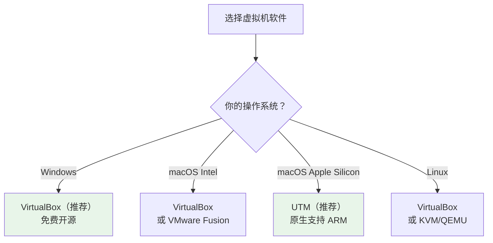
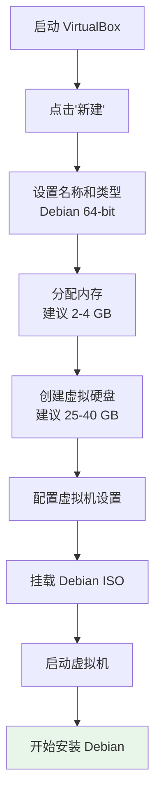

# 虚拟机体验指南

如果你还没准备好直接在电脑上安装 Debian，虚拟机是一个完美的起点。它让你在现有系统中创建一台"虚拟电脑"，零风险地体验和学习 Debian。

## 🎯 为什么先用虚拟机

### 优势一览

- **零风险** — 不影响你现有的操作系统和数据
- **随时回滚** — 利用快照功能，搞坏了可以一键恢复
- **学习实验** — 自由尝试各种命令和配置，不怕出错
- **多版本并存** — 可以同时运行多个 Debian 虚拟机

### 安装方式对比

| 方式 | 风险 | 性能 | 适合场景 |
|------|------|------|---------|
| **虚拟机** | ✅ 无风险 | 70-90% | 学习体验、测试 |
| **双系统** | ⚠️ 需要分区 | 100% | 日常使用 + Windows |
| **直接安装** | ⚠️ 覆盖原系统 | 100% | 全面切换到 Debian |
| **Live USB** | ✅ 无风险 | 较低 | 快速体验 |

::: tip 💡 初学者提示
建议先在虚拟机中体验 Debian，熟悉基本操作后再考虑安装到物理机。
:::

## 💻 虚拟机软件选择

根据你的操作系统选择合适的虚拟机软件：



### 软件对比

| 软件 | 价格 | 支持系统 | 特点 | 推荐度 |
|------|------|---------|------|--------|
| **VirtualBox** | 免费 | Windows/macOS/Linux | 跨平台、功能全面 | ✅ 强烈推荐 |
| **VMware Workstation** | 免费（个人） | Windows/Linux | 性能优秀 | ✅ 推荐 |
| **UTM** | 免费 | macOS | 支持 Apple Silicon | ✅ Mac 用户推荐 |
| **KVM/QEMU** | 免费 | Linux | 接近原生性能 | 适合高级用户 |

## 📥 安装 VirtualBox

### Windows 安装

1. 访问 [VirtualBox 官网](https://www.virtualbox.org/wiki/Downloads)
2. 下载 "Windows hosts" 安装包
3. 运行安装程序，一路"下一步"即可
4. 安装完成后重启电脑

### macOS 安装

```bash
# 方法 1：直接下载安装包
# 访问 https://www.virtualbox.org/wiki/Downloads
# 下载 "macOS / Intel hosts"

# 方法 2：使用 Homebrew
brew install --cask virtualbox
```

### Linux 安装

```bash
# Debian/Ubuntu
sudo apt update
sudo apt install virtualbox

# 或安装最新版本
# 访问官网下载 .deb 包
sudo dpkg -i virtualbox-7.1_7.1.x-xxxxx~Debian~bookworm_amd64.deb
sudo apt install -f
```

::: warning ⚠️ 重要提醒
安装 VirtualBox 前，请确保 BIOS 中已启用虚拟化技术（VT-x / AMD-V）。
:::

## 🔧 创建虚拟机

### 创建流程



### 步骤 1：新建虚拟机

1. 打开 VirtualBox，点击 **"新建"**
2. 填写基本信息：
   - **名称**：`Debian 13`
   - **类型**：`Linux`
   - **版本**：`Debian (64-bit)`

### 步骤 2：分配内存

根据你的物理内存选择：

| 物理内存 | 建议分配 | 桌面环境 |
|---------|---------|---------|
| 8 GB | 2 GB | Xfce / MATE |
| 16 GB | 4 GB | GNOME / KDE |
| 32 GB+ | 4-8 GB | 任意桌面 |

::: tip 💡 初学者提示
分配给虚拟机的内存不要超过物理内存的一半，否则主机系统会变慢。
:::

### 步骤 3：创建虚拟硬盘

- **文件类型**：VDI（VirtualBox 磁盘映像）
- **分配方式**：动态分配（推荐，按需占用实际空间）
- **大小**：建议 25-40 GB

### 步骤 4：挂载 ISO 镜像

1. 选中新建的虚拟机，点击 **"设置"**
2. 进入 **"存储"** 选项
3. 点击 **"没有盘片"** 下方的光盘图标
4. 选择 **"选择虚拟光盘文件"**
5. 浏览并选中你下载的 Debian ISO 文件

## ⚙️ 虚拟机配置详解

### 系统设置

- **处理器**：分配 2-4 核心
- **启动顺序**：光驱优先
- **启用 EFI**：建议勾选（模拟现代 UEFI 启动）

### 显示设置

- **显存**：设为 128 MB
- **显示控制器**：VMSVGA
- **启用 3D 加速**：安装 Guest Additions 后可开启

### 网络设置

| 模式 | 说明 | 适用场景 |
|------|------|---------|
| **NAT** | 虚拟机通过主机上网，外部无法访问虚拟机 | 日常上网（默认） |
| **桥接** | 虚拟机获得独立 IP，局域网可访问 | 服务器测试 |
| **仅主机** | 只能与主机通信，无法上网 | 内部网络测试 |

## 🚀 安装 Debian 到虚拟机

1. 选中虚拟机，点击 **"启动"**
2. 虚拟机会从 ISO 镜像引导
3. 按照安装向导完成安装

::: tip 💡 初学者提示
虚拟机安装和物理机安装步骤完全一致，详细安装步骤请参考 [安装指南](/basics/installation)。在虚拟机中可以放心选择"使用整个磁盘"，不会影响你的真实硬盘。
:::

安装过程中的建议选择：
- **分区方案**：使用整个磁盘（虚拟硬盘，安全无忧）
- **桌面环境**：GNOME 或 Xfce（Xfce 更轻量，虚拟机中更流畅）
- **勾选**：SSH 服务器 + 标准系统工具

## 🔌 Guest Additions 安装

Guest Additions（增强功能）能大幅提升虚拟机体验：

### 功能特性

- ✅ 自动调整分辨率
- ✅ 无缝鼠标切换
- ✅ 共享剪贴板
- ✅ 共享文件夹
- ✅ 拖放文件
- ✅ 更好的显示性能

### 安装步骤

```bash
# 1. 安装编译依赖
sudo apt update
sudo apt install -y build-essential dkms linux-headers-$(uname -r)

# 2. 在 VirtualBox 菜单中选择：
#    设备 → 安装增强功能光盘...

# 3. 挂载并安装
sudo mount /dev/cdrom /mnt
sudo /mnt/VBoxLinuxAdditions.run

# 4. 重启虚拟机
sudo reboot
```

### 启用剪贴板共享

安装完成后，在 VirtualBox 菜单中：
- **设备 → 共享剪贴板 → 双向**
- **设备 → 拖放 → 双向**

## 📁 共享文件夹配置

共享文件夹让你在主机和虚拟机之间方便地交换文件。

### 创建共享文件夹

1. 虚拟机 **设置 → 共享文件夹**
2. 点击右侧的 **添加** 图标
3. 选择主机上的文件夹路径
4. 设置名称（如 `shared`）
5. 勾选 **自动挂载** 和 **固定分配**

### 在虚拟机中访问

```bash
# 将用户添加到 vboxsf 组
sudo usermod -aG vboxsf $USER

# 重新登录后，共享文件夹位于
ls /media/sf_shared/

# 或手动挂载
sudo mount -t vboxsf shared /mnt/shared
```

## 📸 快照管理

快照是虚拟机最强大的功能之一 — 随时保存系统状态，出问题一键恢复。

### 创建快照

1. 在 VirtualBox 中选择虚拟机
2. 点击 **"快照"** 标签
3. 点击 **"拍摄快照"**
4. 输入快照名称和描述

### 恢复快照

1. 在快照列表中选择要恢复的快照
2. 点击 **"恢复"**
3. 虚拟机将回到快照时的状态

::: tip 💡 快照最佳实践
- 安装完系统后立即创建一个"干净系统"快照
- 安装重要软件或做重大配置前创建快照
- 快照会占用磁盘空间，定期清理不需要的快照
:::

## ⚡ 性能优化

### 优化检查清单

| 项目 | 优化方式 | 效果 |
|------|---------|------|
| **内存** | 分配 2-4 GB | 系统流畅度 |
| **CPU** | 分配 2-4 核心 | 运算速度 |
| **显存** | 设为 128 MB | 显示效果 |
| **硬盘** | 使用 SSD 存储虚拟磁盘 | I/O 性能 |
| **Guest Additions** | 安装增强功能 | 整体体验 |
| **3D 加速** | 安装 GA 后启用 | 图形性能 |

### 额外优化

```bash
# 虚拟机内部优化：减少 swap 使用
echo 'vm.swappiness=10' | sudo tee -a /etc/sysctl.conf
sudo sysctl -p

# 禁用不需要的服务
sudo systemctl disable bluetooth
sudo systemctl disable cups
```

## 🆘 常见问题

### 虚拟机启动失败

**错误：VT-x is disabled in the BIOS**

```
解决方案：
1. 重启电脑，进入 BIOS 设置
2. 找到 Virtualization Technology（VT-x 或 AMD-V）
3. 将其设为 Enabled
4. 保存并重启
```

### 性能太慢

- 增加分配的内存和 CPU 核心数
- 确保虚拟磁盘存储在 SSD 上
- 安装 Guest Additions
- 选择轻量级桌面环境（如 Xfce）

### 网络不通

```bash
# 检查网络模式是否为 NAT
# VirtualBox 设置 → 网络 → 连接方式：NAT

# 在虚拟机内检查
ip addr show
ping -c 4 debian.org

# 如果不通，尝试重启网络
sudo systemctl restart NetworkManager
```

### Guest Additions 安装失败

```bash
# 确保安装了所有依赖
sudo apt update
sudo apt install -y build-essential dkms linux-headers-$(uname -r)

# 重新挂载光盘
sudo mount /dev/cdrom /mnt

# 查看错误日志
sudo /mnt/VBoxLinuxAdditions.run 2>&1 | tail -20
```

### 无法全屏显示

```bash
# 确保已安装 Guest Additions
# VirtualBox 菜单 → 视图 → 自动调整显示尺寸

# 或手动设置分辨率
xrandr --output Virtual-1 --mode 1920x1080
```

## 下一步

在虚拟机中体验了 Debian 之后，你可以：

1. [安装指南](/basics/installation) - 在物理机上正式安装 Debian
2. [双系统安装指南](/basics/dual-boot) - 保留 Windows 同时安装 Debian
3. [首次启动配置](/basics/first-boot) - 完成系统初始配置

---

**虚拟机中的 Debian 运行顺利吗？** [准备好就去正式安装 →](/basics/installation)
