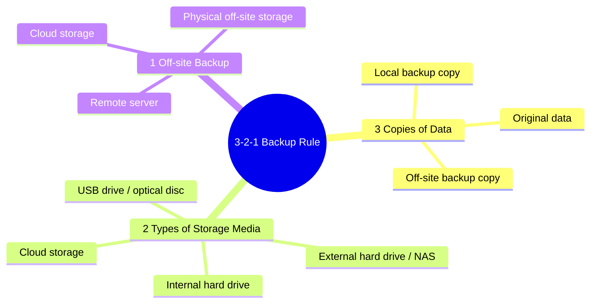
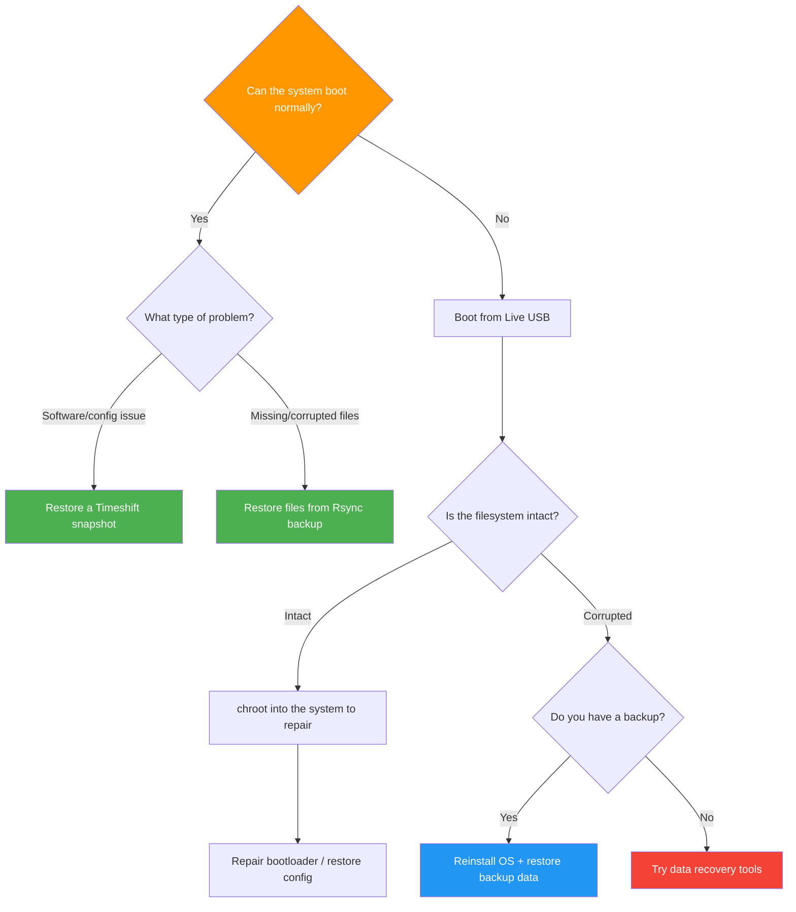

# Backup and Recovery

Data is your most valuable asset. Whether it is accidental deletion, hard drive failure, or a system crash, a solid backup strategy lets you recover quickly and avoid data loss. This guide walks you through everything from fundamental principles to hands-on operations, helping you build a reliable backup system.

## 🎯 Backup Fundamentals

### The 3-2-1 Backup Rule

The industry-recognized golden rule of backups is the **3-2-1 principle**, which provides the highest level of data protection:



:::tip Why 3-2-1?
- **3 copies**: Even if two are damaged simultaneously, one remains available
- **2 media types**: Avoids a single batch defect causing total failure
- **1 off-site**: Protects against physical disasters such as fire or theft
:::

### What to Back Up

Different types of data have different backup priorities:

| Category | Typical Path | Priority | Description |
|----------|-------------|----------|-------------|
| User data | `/home/username/` | Highest | Documents, photos, videos, and other irreplaceable personal files |
| System configuration | `/etc/` | High | System and service configuration files; avoids reconfiguration after recovery |
| Application data | `/var/lib/`, `/var/www/` | High | Databases, website files, and other application runtime data |
| Package list | `dpkg --get-selections` | Medium | List of installed packages for bulk restoration after a reinstall |
| Log files | `/var/log/` | Low | Usually not backed up unless required for auditing |
| System files | `/usr/`, `/bin/` | Low | Can be restored by reinstalling the OS; generally not backed up separately |

### Backup Strategy Types

| Strategy | Description | Pros | Cons | Use Case |
|----------|-------------|------|------|----------|
| Full backup | Backs up all data every time | Simplest and fastest to restore | Large space usage, long backup time | Initial backup, critical milestones |
| Incremental backup | Only backs up changes since the last backup | Fast, uses little space | Restoration requires replaying all increments in order | Daily backups |
| Differential backup | Backs up changes since the last full backup | Restoration only needs full backup + latest differential | Backup size grows over time | A middle-ground approach |

Below is a typical backup cycle diagram:


## 💾 Timeshift -- System Snapshots

Timeshift is the most popular system snapshot tool on Linux, similar to Windows System Restore. It focuses on backing up system files, allowing you to quickly roll back when something goes wrong.

### Installing Timeshift

```bash
# Update package sources and install
sudo apt update
sudo apt install timeshift
```

### Configuring Timeshift

Timeshift supports two snapshot modes:

| Mode | Supported Filesystems | Features |
|------|----------------------|----------|
| RSYNC | All filesystems (ext4, XFS, etc.) | Highly compatible, creates independent copies |
| BTRFS | Btrfs only | Leverages Btrfs snapshot capabilities, fast and space-efficient |

**GUI configuration**:

```bash
# Launch the Timeshift GUI
sudo timeshift-gtk
```

On first launch, the wizard will guide you through the following configuration:

1. **Choose snapshot type**: RSYNC mode is recommended for most users
2. **Choose snapshot storage location**: An independent partition or external drive is recommended
3. **Set automatic snapshot frequency**:
   - Monthly retention: 2
   - Weekly retention: 3
   - Daily retention: 5
4. **Choose what to include**: By default, only system files are included, not the user home directory

:::tip 💡 Tip
Timeshift is primarily designed for system file snapshot and restoration. User data (/home) should be backed up separately using Rsync or another tool to avoid excessively large snapshots.
:::

### Creating Snapshots

```bash
# Create a snapshot with a comment
sudo timeshift --create --comments "Before installing NVIDIA driver"

# Create a snapshot (with default comment)
sudo timeshift --create

# List existing snapshots
sudo timeshift --list
```

Example output:

```
Device : /dev/sda2
UUID   : a1b2c3d4-e5f6-7890-abcd-ef1234567890
Path   : /
Mode   : RSYNC

Name                     Tags  Description
---------------------------------------------
2025-06-15_10-00-01  O   Before installing NVIDIA driver
2025-06-14_02-00-01  D
2025-06-13_02-00-01  D
```

### Restoring a Snapshot

**Command-line restoration**:

```bash
# List available snapshots
sudo timeshift --list

# Restore to a specific snapshot
sudo timeshift --restore --snapshot '2025-06-15_10-00-01'

# The system will prompt you to reboot after restoration
sudo reboot
```

**GUI restoration**:

1. Open Timeshift → select the snapshot to restore → click "Restore"
2. Confirm the restoration content and target device
3. Wait for the restoration to complete, then reboot the system

:::warning ⚠️ Warning
The restore operation will overwrite your current system files. Make sure important user data is backed up separately before proceeding.
:::

### Deleting Old Snapshots

```bash
# Delete a specific snapshot
sudo timeshift --delete --snapshot '2025-06-13_02-00-01'

# Delete all snapshots
sudo timeshift --delete-all
```

### Timeshift Best Practices

:::tip 💡 Tip
- Create the first snapshot immediately after installing and configuring the system as a "clean baseline"
- Manually create a snapshot before installing new software, updating the kernel, or modifying critical configurations
- Keep only 2-3 recent snapshots; too many snapshots consume significant disk space
- The snapshot storage location should be separate from the system partition, ideally on a dedicated drive
:::

## 📁 Rsync -- The File Backup Powerhouse

Rsync is the most powerful file synchronization and backup tool on Linux. It supports incremental transfers, copying only the changed portions of files, which greatly improves backup efficiency.

### Basic Usage

```bash
# Basic backup: back up /home/user/ to /backup/home/
rsync -avh /home/user/ /backup/home/

# Show transfer progress
rsync -avh --progress /home/user/ /backup/home/

# Dry-run mode (only shows what would be done, without actually executing)
rsync -avhn /home/user/ /backup/home/
```

:::warning ⚠️ Trailing Slashes Matter
- `rsync -avh /home/user/ /backup/` -- copies the **contents** of the user directory into /backup/
- `rsync -avh /home/user /backup/` -- copies the user directory **itself** into /backup/user/

Whether the source path ends with `/` or not affects the result. This is a common mistake for beginners.
:::

### Common Options Reference

| Option | Description | Example |
|--------|-------------|---------|
| `-a` | Archive mode; preserves permissions, timestamps, symlinks, etc. | `rsync -a src/ dst/` |
| `-v` | Verbose output; shows the list of transferred files | `rsync -av src/ dst/` |
| `-h` | Human-readable file sizes | `rsync -avh src/ dst/` |
| `--progress` | Shows transfer progress for each file | `rsync -avh --progress src/ dst/` |
| `--delete` | Deletes files in the destination that no longer exist in the source (mirror sync) | `rsync -avh --delete src/ dst/` |
| `--exclude` | Excludes specified files or directories | `rsync -avh --exclude='.cache' src/ dst/` |
| `-z` | Compresses data during transfer (useful for remote backups) | `rsync -avhz src/ remote:dst/` |
| `-e ssh` | Specifies SSH as the remote transport channel | `rsync -avhz -e ssh src/ user@host:dst/` |
| `--dry-run` | Dry-run mode; makes no actual changes | `rsync -avhn src/ dst/` |
| `--log-file` | Writes the operation log to a file | `rsync -avh --log-file=backup.log src/ dst/` |

### Exclusion Rules

When backing up, you typically need to exclude caches, temporary files, and other unnecessary content:

```bash
# Use --exclude to exclude individual directories
rsync -avh --exclude='.cache' --exclude='node_modules' --exclude='.local/share/Trash' \
  /home/user/ /backup/home/

# Use an exclude file for batch exclusions (recommended)
rsync -avh --exclude-from=/home/user/backup-exclude.txt /home/user/ /backup/home/
```

Example contents of the exclude file `backup-exclude.txt`:

```text
# Caches and temporary files
.cache/
.thumbnails/
.local/share/Trash/

# Development related
node_modules/
__pycache__/
.venv/
target/

# Browser caches
.mozilla/firefox/*/cache2/
.config/google-chrome/*/Cache/

# Other
*.tmp
*.swp
```

### Remote Backup

```bash
# Back up local files to a remote server
rsync -avhz -e ssh /home/user/Documents/ user@192.168.1.100:/backup/documents/

# Restore from a remote server to local
rsync -avhz -e ssh user@192.168.1.100:/backup/documents/ /home/user/Documents/

# Use a non-standard SSH port
rsync -avhz -e 'ssh -p 2222' /home/user/ user@remote:/backup/
```

### Backing Up to an External Drive

```bash
# Mount the external drive
sudo mount /dev/sdb1 /mnt/external

# Perform the backup
rsync -avh --delete /home/user/ /mnt/external/backup/home/

# Safely unmount after backup is complete
sync
sudo umount /mnt/external
```

## 🤖 Automated Backup Scripts

Manual backups are easy to forget. Automated scripts ensure backups run on schedule.

### Complete Backup Script

Create the script file `/home/user/scripts/backup.sh`:

```bash
#!/bin/bash
# ============================================
# Automated Backup Script
# Purpose: Back up user data to a designated target directory
# ============================================

# --- Configuration ---
SOURCE="/home/user/"                          # Source directory to back up
BACKUP_ROOT="/mnt/backup"                     # Backup target root directory
EXCLUDE_FILE="/home/user/scripts/backup-exclude.txt"  # Exclusion rules file
MAX_BACKUPS=7                                 # Number of recent backups to keep
LOG_DIR="/home/user/logs"                     # Log directory

# --- Initialization ---
DATE=$(date +%Y-%m-%d_%H%M%S)                # Current timestamp
BACKUP_DIR="${BACKUP_ROOT}/${DATE}"           # This backup's directory
LOG_FILE="${LOG_DIR}/backup_${DATE}.log"      # This backup's log file
LATEST_LINK="${BACKUP_ROOT}/latest"           # Symlink pointing to the latest backup

# Create necessary directories
mkdir -p "${BACKUP_DIR}"
mkdir -p "${LOG_DIR}"

# --- Logging function ---
log() {
    echo "[$(date '+%Y-%m-%d %H:%M:%S')] $1" | tee -a "${LOG_FILE}"
}

# --- Start backup ---
log "========== Backup started =========="
log "Source directory: ${SOURCE}"
log "Target directory: ${BACKUP_DIR}"

# Perform rsync incremental backup (using hard links to save space)
rsync -avh --delete \
    --exclude-from="${EXCLUDE_FILE}" \
    --link-dest="${LATEST_LINK}" \
    --log-file="${LOG_FILE}" \
    "${SOURCE}" "${BACKUP_DIR}"

# Check rsync exit status
if [ $? -eq 0 ]; then
    log "Backup completed successfully"
else
    log "Error: An issue occurred during backup, exit code: $?"
fi

# Update the latest symlink
rm -f "${LATEST_LINK}"
ln -s "${BACKUP_DIR}" "${LATEST_LINK}"
log "Updated latest link -> ${BACKUP_DIR}"

# --- Clean up old backups ---
log "Cleaning up old backups (keeping the most recent ${MAX_BACKUPS})..."
cd "${BACKUP_ROOT}" || exit 1
# List all backup directories (sorted by time), delete those beyond the retention count
ls -dt 20[0-9][0-9]-* 2>/dev/null | tail -n +$((MAX_BACKUPS + 1)) | while read -r old_backup; do
    log "Deleting old backup: ${old_backup}"
    rm -rf "${BACKUP_ROOT}/${old_backup}"
done

# --- Statistics ---
BACKUP_SIZE=$(du -sh "${BACKUP_DIR}" 2>/dev/null | cut -f1)
TOTAL_SIZE=$(du -sh "${BACKUP_ROOT}" 2>/dev/null | cut -f1)
log "This backup size: ${BACKUP_SIZE}"
log "Total backup space used: ${TOTAL_SIZE}"
log "========== Backup finished =========="
```

Set script permissions:

```bash
# Make the script executable
chmod +x /home/user/scripts/backup.sh

# Run a manual test
/home/user/scripts/backup.sh
```

### Cron Scheduled Tasks

```bash
# Edit the current user's crontab
crontab -e

# Add the following line to run the backup automatically at 2:00 AM every day
0 2 * * * /home/user/scripts/backup.sh >> /home/user/logs/cron-backup.log 2>&1

# Run a full backup at 3:00 AM every Sunday
0 3 * * 0 /home/user/scripts/full-backup.sh >> /home/user/logs/cron-backup.log 2>&1
```

:::tip 💡 Verifying Cron Tasks
After setting up scheduled tasks, you can verify them as follows:
```bash
# View the current user's crontab
crontab -l

# Check the cron service log to confirm tasks have been executed
journalctl -u cron --since today
```
:::

## ☁️ Cloud Backup Solutions

Storing backups in the cloud enables off-site disaster recovery, fulfilling the "1 off-site backup" requirement of the 3-2-1 rule.

### Installing and Configuring Rclone

Rclone is a powerful command-line cloud storage synchronization tool that supports dozens of cloud services.

```bash
# Install rclone
sudo apt update
sudo apt install rclone

# Launch the interactive configuration wizard
rclone config
```

### Supported Cloud Services

| Cloud Service | Config Name | Free Tier | Description |
|---------------|-------------|-----------|-------------|
| Google Drive | `drive` | 15 GB | Most popular, easy to configure |
| OneDrive | `onedrive` | 5 GB | Recommended for Microsoft ecosystem users |
| Amazon S3 | `s3` | Pay-as-you-go | Enterprise-grade, high reliability |
| Backblaze B2 | `b2` | 10 GB | Extremely cost-effective object storage |
| Dropbox | `dropbox` | 2 GB | A well-established cloud storage service |
| Alibaba Cloud OSS | `s3` (compatible) | Pay-as-you-go | Recommended for users in China |
| WebDAV | `webdav` | Depends on provider | Universal protocol, compatible with Nutstore and others |

### Backing Up to the Cloud

```bash
# View the contents of the remote storage
rclone ls myremote:backup/

# Sync a local directory to the cloud
rclone sync /home/user/Documents myremote:backup/documents/

# With progress display and bandwidth limiting (to avoid saturating your connection)
rclone sync /home/user/Documents myremote:backup/documents/ \
    --progress \
    --bwlimit 5M

# Encrypted backup to the cloud (recommended for sensitive data)
# First configure a crypt remote in rclone config, then:
rclone sync /home/user/Documents mycrypt:backup/documents/
```

### Rclone Periodic Sync

```bash
# Edit crontab to sync to the cloud at 4:00 AM daily
crontab -e

# Add the following line
0 4 * * * rclone sync /home/user/Documents myremote:backup/documents/ --log-file=/home/user/logs/rclone.log --log-level INFO
```

## 💿 Full System Backup

When you need to back up the entire system (not just data files), you can use the following methods.

### Using tar for Backup

```bash
# Back up the entire root filesystem (excluding unnecessary directories)
sudo tar czf /mnt/backup/system-$(date +%Y%m%d).tar.gz \
    --exclude=/mnt \
    --exclude=/proc \
    --exclude=/sys \
    --exclude=/dev \
    --exclude=/run \
    --exclude=/tmp \
    --exclude=/media \
    --exclude=/lost+found \
    --exclude=/mnt/backup \
    /

# View archive contents (without extracting)
tar tzf /mnt/backup/system-20250615.tar.gz | head -20

# Check the archive file size
ls -lh /mnt/backup/system-20250615.tar.gz
```

### Using dd to Clone a Disk

`dd` can perform a byte-by-byte full clone of a disk, including the partition table, boot records, and all other content.

```bash
# Clone an entire disk to an image file
sudo dd if=/dev/sda of=/mnt/backup/disk-full.img bs=4M status=progress

# Clone a single partition
sudo dd if=/dev/sda1 of=/mnt/backup/sda1-root.img bs=4M status=progress

# Compressed clone (saves space)
sudo dd if=/dev/sda bs=4M status=progress | gzip > /mnt/backup/disk-full.img.gz
```

:::danger Extremely Important: Always double-check before running dd
`dd` is an extremely powerful but also extremely dangerous tool. **Swapping the if and of parameters will immediately destroy all data on the target disk!** Before executing:
1. Use `lsblk` to confirm the source disk (if) and target disk/file (of)
2. Ensure the target location has enough space
3. Ensure the source disk is not being written to
4. Triple-check the command before running it
:::

### Clonezilla -- GUI-Based Backup

If you are not comfortable with command-line operations, Clonezilla is an excellent graphical disk backup tool:

1. Download the Live ISO from the [Clonezilla website](https://clonezilla.org/)
2. Create a bootable USB drive (refer to our [Bootable Media Creation Guide](/en/basics/bootable-media))
3. Boot from the USB drive and follow the wizard to select "Backup disk/partition"
4. Choose a backup target (local drive, SSH server, Samba share, etc.)
5. Wait for the backup to complete

:::tip 💡 Tip
Clonezilla is particularly well-suited for the following scenarios:
- Making a full migration before replacing a hard drive
- Batch deploying multiple computers with identical configurations
- Creating a "golden image" of the system for rapid restoration
:::

## 🔄 Recovery Operations

When disaster strikes, calmly follow this decision flow to choose the appropriate recovery method:



### Restoring from Timeshift

```bash
# List available snapshots
sudo timeshift --list

# Restore from a specific snapshot
sudo timeshift --restore --snapshot '2025-06-15_10-00-01'

# If the system cannot boot, boot from a Live USB first:
# 1. Install timeshift
sudo apt install timeshift
# 2. Mount the partition containing the system
sudo mount /dev/sda2 /mnt
# 3. Use timeshift to restore
sudo timeshift --restore --target /mnt
```

### Restoring from Rsync Backup

```bash
# Restore a single file
cp /backup/home/Documents/important-file.pdf /home/user/Documents/

# Restore an entire directory
rsync -avh /backup/home/Documents/ /home/user/Documents/

# Restore the entire user home directory (note: this will overwrite existing files)
rsync -avh /backup/home/ /home/user/

# Restore from a remote backup
rsync -avhz -e ssh user@backup-server:/backup/home/ /home/user/
```

### Restoring from a tar Backup

```bash
# View archive contents
tar tzf /mnt/backup/system-20250615.tar.gz | head -30

# Restore the entire system (must boot from a Live USB)
# 1. Mount the target partition
sudo mount /dev/sda2 /mnt
# 2. Extract the backup to the target partition
sudo tar xzf /mnt/backup/system-20250615.tar.gz -C /mnt
# 3. Recreate necessary directories
sudo mkdir -p /mnt/{proc,sys,dev,run,tmp,mnt,media}
# 4. Reinstall the bootloader
sudo mount --bind /dev /mnt/dev
sudo mount --bind /proc /mnt/proc
sudo mount --bind /sys /mnt/sys
sudo chroot /mnt
grub-install /dev/sda
update-grub
exit

# Restore a single file or directory
sudo tar xzf /mnt/backup/system-20250615.tar.gz -C / etc/nginx/nginx.conf
```

## 🧪 Verifying Backups

:::warning ⚠️ Critical Reminder
A backup that has not been verified is as good as no backup at all. It is recommended to perform a recovery test at least once a month to confirm your backup data is usable.
:::

### Checking Backup Integrity

```bash
# Compare differences between the source and backup directories
diff -rq /home/user/Documents /backup/home/Documents

# Check the integrity of a tar archive
gzip -t /mnt/backup/system-20250615.tar.gz && echo "Archive is intact" || echo "Archive is corrupted"

# List the files in a tar archive
tar tzf /mnt/backup/system-20250615.tar.gz | wc -l
# Outputs the total file count; compare with the source file count

# Use md5sum to verify critical files
md5sum /home/user/Documents/important-file.pdf
md5sum /backup/home/Documents/important-file.pdf
# The two hash values should be identical
```

### Periodic Recovery Testing

```bash
# Create a temporary restore directory
mkdir -p /tmp/restore-test

# Restore from backup to the temporary directory
rsync -avh /backup/home/Documents/ /tmp/restore-test/

# Compare the restored content with the original data
diff -rq /home/user/Documents /tmp/restore-test/

# Clean up after testing
rm -rf /tmp/restore-test
```

### Automated Verification Script

```bash
#!/bin/bash
# Backup verification script: checks whether the latest backup is intact

BACKUP_DIR="/mnt/backup/latest"
SOURCE_DIR="/home/user"
REPORT="/home/user/logs/backup-verify-$(date +%Y%m%d).log"

echo "===== Backup Verification Report $(date) =====" > "${REPORT}"

# Check if the backup directory exists
if [ ! -d "${BACKUP_DIR}" ]; then
    echo "Error: Backup directory does not exist!" >> "${REPORT}"
    exit 1
fi

# Check the backup directory's modification time (confirm the backup is recent)
BACKUP_AGE=$(( ($(date +%s) - $(stat -c %Y "${BACKUP_DIR}")) / 86400 ))
echo "Days since last backup: ${BACKUP_AGE} days" >> "${REPORT}"

if [ "${BACKUP_AGE}" -gt 7 ]; then
    echo "Warning: Backup has not been updated in over 7 days!" >> "${REPORT}"
fi

# Compare file counts
SOURCE_COUNT=$(find "${SOURCE_DIR}/Documents" -type f | wc -l)
BACKUP_COUNT=$(find "${BACKUP_DIR}/Documents" -type f | wc -l)
echo "Source file count: ${SOURCE_COUNT}" >> "${REPORT}"
echo "Backup file count: ${BACKUP_COUNT}" >> "${REPORT}"

echo "===== Verification complete =====" >> "${REPORT}"
cat "${REPORT}"
```

## 📦 Backup Tool Comparison

| Tool | Type | Deduplication | Encryption | Ease of Use | Recommended Scenario |
|------|------|---------------|------------|-------------|---------------------|
| **Timeshift** | System snapshot | No (hard links save space) | No | Easy, has GUI | System rollback, best for beginners |
| **Rsync** | File sync | No (incremental transfer) | No (can use SSH) | Moderate, CLI | File backup, remote sync |
| **Borg Backup** | Dedup archive | Yes | Yes | Moderate, CLI | Space-conscious long-term backups |
| **Restic** | Dedup archive | Yes | Yes | Moderate, CLI | Multi-backend support (S3, SFTP, etc.) |
| **Duplicity** | Incremental archive | No | Yes (GPG) | Moderate, CLI | Encrypted remote backups |
| **Rclone** | Cloud sync | No | Yes (optional) | Moderate, CLI | Cloud storage synchronization |
| **Clonezilla** | Disk cloning | No | No | Easy, has GUI | Full disk backup, drive migration |
| **dd** | Disk imaging | No | No | Low, CLI | Complete disk/partition-level cloning |

:::tip 💡 Recommended Setup for Beginners
- **System backup**: Install Timeshift and set up weekly automatic snapshots
- **File backup**: Use an Rsync script for daily automatic backups to an external drive
- **Off-site backup**: Use Rclone to sync to the cloud weekly
:::

## 📋 Backup Checklist

Regularly check the following items to ensure your backup strategy remains effective:

- [ ] Are Timeshift snapshots being created normally (`sudo timeshift --list`)
- [ ] Is the most recent backup within the expected time range
- [ ] Is there sufficient free space on the backup target disk/partition (`df -h`)
- [ ] Does the exclusion list need updating (any new large cache directories?)
- [ ] Are cron scheduled tasks running properly (`journalctl -u cron --since today`)
- [ ] Are cloud backups syncing successfully (`rclone ls myremote:backup/ | tail -5`)
- [ ] Has at least one recovery test been performed this month
- [ ] Are there any errors or warnings in the backup logs
- [ ] Is the off-site backup (cloud/remote server) accessible
- [ ] Are backup keys or passwords securely stored with copies available

## Next Steps

Your backup strategy is in place. Continue exploring more system administration topics:

1. [Disk & Storage Management](/en/administration/disk-management) -- Manage disks, partitions, and storage devices
2. [Security Management](/en/administration/security) -- Harden your Debian system security
3. [Network Configuration](/en/administration/network) -- Configure and manage network settings
4. [Package Management](/en/administration/packages) -- Install and manage software packages

---

**Backup strategy in place?** [Continue to Disk & Storage Management →](/en/administration/disk-management)
