# Disk and Storage Management

Managing disks and storage is a fundamental system administration skill. This chapter will walk you through the Linux storage architecture, from viewing disk information to partitioning, formatting, and mounting, all the way to advanced topics like LVM and disk encryption.

## 💿 Storage Fundamentals

### Storage Hierarchy

In a Linux system, data goes through several layers of abstraction from the physical hard drive to a user-accessible directory. Understanding this hierarchy will help you master all the operations that follow:

```mermaid
flowchart LR
    A["🔩 Physical Disk\n/dev/sda"] --> B["📦 Partition\n/dev/sda1"]
    B --> C["📂 Filesystem\next4 / Btrfs"]
    C --> D["📍 Mount Point\n/home"]

    style A fill:#e1f5fe,stroke:#0288d1,color:#000
    style B fill:#f3e5f5,stroke:#7b1fa2,color:#000
    style C fill:#e8f5e9,stroke:#388e3c,color:#000
    style D fill:#fff3e0,stroke:#f57c00,color:#000
```



- **Physical Disk**: The actual hard drive device installed in a server or computer, such as `/dev/sda` or `/dev/nvme0n1`
- **Partition**: Dividing a physical disk into multiple logical regions, each used independently
- **Filesystem**: The data organization scheme on a partition, determining how files are stored and retrieved
- **Mount Point**: The location in the directory tree where a filesystem is "attached"; users access data through this directory

### Core Terminology

| Term | Description | Analogy |
|------|-------------|---------|
| Hard Disk / SSD | Physical storage device | A building |
| Partition | Logical region carved out of a hard disk | Floors in the building |
| Filesystem | Data organization format on a partition | Room layout on each floor |
| Mount Point | Where a filesystem is attached in the directory tree | The door number to enter a floor |
| Block Device | Kernel abstraction representing a storage device | The building's blueprint |
| inode | Data structure recording file metadata in a filesystem | Registration card for each room |
| UUID | Globally unique identifier for a partition | Unique serial number for each room |
| GPT/MBR | Partition table formats (GPT is the modern format) | The standard for floor plan design |

### Device Naming Conventions

Different types of disks in Linux have different device names:

```bash
# SATA / SCSI disks
/dev/sda        # First SATA disk
/dev/sda1       # First partition on the first SATA disk
/dev/sdb        # Second SATA disk

# NVMe solid-state drives
/dev/nvme0n1    # First NVMe disk
/dev/nvme0n1p1  # First partition on the first NVMe disk

# Virtual disks (common in virtual machines)
/dev/vda        # First virtio disk
/dev/vda1       # First partition on the first virtio disk
```

## 🔍 Viewing Disk Information

### Common Commands

```bash
# List all block devices in a tree structure
lsblk

# List block devices with filesystem information
lsblk -f

# View detailed partition information for all disks
sudo fdisk -l

# View disk usage for all filesystems (human-readable format)
df -h

# Show only local physical disk usage (exclude temporary filesystems)
df -h --type=ext4 --type=btrfs --type=xfs

# View the size of each subdirectory under a specific directory
du -sh /home/user/*

# View UUIDs and filesystem types of all partitions
sudo blkid

# View disk SMART health information (requires smartmontools)
sudo smartctl -a /dev/sda
```

### Understanding lsblk Output

After running `lsblk`, you will see output similar to the following:

```
NAME        MAJ:MIN RM   SIZE RO TYPE MOUNTPOINTS
sda           8:0    0 238.5G  0 disk
├─sda1        8:1    0   512M  0 part /boot/efi
├─sda2        8:2    0   230G  0 part /
└─sda3        8:3    0     8G  0 part [SWAP]
sdb           8:16   0 931.5G  0 disk
└─sdb1        8:17   0 931.5G  0 part /mnt/data
```

Column descriptions:

| Column | Description |
|--------|-------------|
| `NAME` | Device name; indentation shows hierarchy (disk -> partition) |
| `MAJ:MIN` | Major and minor device numbers |
| `RM` | Whether the device is removable (1 = yes) |
| `SIZE` | Device capacity |
| `RO` | Whether the device is read-only (1 = read-only) |
| `TYPE` | Type: disk, part (partition), lvm (logical volume) |
| `MOUNTPOINTS` | Mount point path |

### Understanding df Output

After running `df -h`, you will see output similar to:

```
Filesystem      Size  Used Avail Use% Mounted on
/dev/sda2       230G   45G  174G  21% /
/dev/sda1       512M   12M  500M   3% /boot/efi
/dev/sdb1       932G  200G  685G  23% /mnt/data
tmpfs           3.9G   28M  3.9G   1% /dev/shm
```

- **Size**: Total size of the partition
- **Used / Avail**: Used / available space
- **Use%**: Usage percentage; attention is needed when it exceeds 90%
- **Mounted on**: Mount point

:::tip 💡 Tip
When `Use%` approaches 100%, the system may behave abnormally. It is recommended to keep root partition usage below 80% during normal operation.
:::

## 📊 Filesystem Types

### Common Filesystem Comparison

| Filesystem | Max File | Max Partition | Key Features | Recommended Use Case | Debian Recommendation |
|------------|----------|---------------|--------------|----------------------|-----------------------|
| **ext4** | 16 TB | 1 EB | Stable, reliable, journaling, backward compatible | General system partitions | Default recommendation |
| **Btrfs** | 16 EB | 16 EB | Snapshots, compression, subvolumes, checksums | When snapshots or data checksums are needed | Recommended |
| **XFS** | 8 EB | 8 EB | High performance, parallel I/O, online expansion | Large files, databases | Recommended |
| **NTFS** | 16 TB | 256 TB | Default Windows filesystem | Sharing data in dual-boot setups | Compatible use |
| **FAT32** | 4 GB | 2 TB | Broadest compatibility | USB drives, EFI partitions | Special purposes only |
| **exFAT** | 16 EB | 128 PB | FAT without the 4 GB limit | USB drives, external storage | Compatible use |
| **swap** | — | — | Swap space | Supplement when memory is insufficient | Required |

### Selection Recommendations

- **General desktop / server**: Choose **ext4** — it is the Debian default filesystem with stability proven over many years
- **Need snapshot functionality**: Choose **Btrfs** — supports transparent compression and snapshot rollback
- **Large files and databases**: Choose **XFS** — excels at handling large files and high-concurrency I/O
- **Sharing data with Windows**: Choose **NTFS** (good read-only performance) or **exFAT** (read-write compatible)
- **USB drives and boot partitions**: Choose **FAT32** (the EFI partition must use FAT32)

:::tip 💡 Tip
If you are a beginner and unsure which to pick, go with ext4. It is the safest and most mature choice.
:::

## 🔧 Partitioning Tools

### fdisk (Command-Line Partitioning Tool)

`fdisk` is the most classic command-line partitioning tool in Linux, suitable for both MBR and GPT partition tables:

```bash
# Partition /dev/sdb
sudo fdisk /dev/sdb

# Common commands in interactive mode:
# m - Display help menu
# p - Print current partition table
# n - Create a new partition
# d - Delete a partition
# t - Change partition type
# w - Write partition table and exit
# q - Quit without saving
```

Example of the complete interactive flow for creating a new partition:

```bash
sudo fdisk /dev/sdb
# Enter n (create new partition)
# Enter p (select primary partition)
# Enter 1 (partition number)
# Press Enter (use default starting sector)
# Press Enter (use all remaining space) or enter +50G (specify size)
# Enter w (write and save)
```

### parted (GPT-Capable Partitioning Tool)

`parted` is more powerful and natively supports GPT partition tables and large-capacity disks:

```bash
# Partition /dev/sdb
sudo parted /dev/sdb

# Common commands in interactive mode:
# print      - Display current partition information
# mklabel gpt - Create a GPT partition table
# mkpart primary ext4 0% 100% - Create a partition spanning the entire disk
# rm 1       - Delete partition 1
# quit       - Exit
```

Complete partitioning in a single command (non-interactive):

```bash
# Create a GPT partition table
sudo parted /dev/sdb mklabel gpt

# Create a partition spanning the entire disk
sudo parted /dev/sdb mkpart primary ext4 0% 100%
```

### GParted (Graphical Partitioning Tool)

GParted is an intuitive graphical partition management tool, ideal for beginners:

```bash
# Install GParted
sudo apt install gparted

# Launch GParted
sudo gparted
```

:::tip 💡 Tip
Beginners are recommended to use the GParted graphical tool. It offers a more intuitive interface and lets you preview changes before applying them, helping avoid accidental mistakes.
:::

:::danger
Partitioning operations modify disk structure. Always back up important data before proceeding. Partitioning a disk that already contains data may result in data loss.
:::

## ➕ Adding a New Hard Drive

### Complete Workflow

When adding a new hard drive to your system, follow this workflow:


### Step-by-Step Guide

#### Step 1: Identify the New Hard Drive

```bash
# List all block devices to find the newly added disk
lsblk

# Example output (sdb is the newly added disk, with no partitions or mount points):
# NAME   MAJ:MIN RM   SIZE RO TYPE MOUNTPOINTS
# sda      8:0    0 238.5G  0 disk
# ├─sda1   8:1    0   512M  0 part /boot/efi
# ├─sda2   8:2    0   230G  0 part /
# └─sda3   8:3    0     8G  0 part [SWAP]
# sdb      8:16   0 500.0G  0 disk            ← New hard drive
```

#### Step 2: Create a Partition

```bash
# Use parted to create a GPT partition table and partition (recommended)
sudo parted /dev/sdb mklabel gpt
sudo parted /dev/sdb mkpart primary ext4 0% 100%

# Or use fdisk
sudo fdisk /dev/sdb
# Then follow the interactive steps (see the fdisk section above)
```

#### Step 3: Format the Partition

```bash
# Format the new partition with the ext4 filesystem
sudo mkfs.ext4 /dev/sdb1

# For other filesystems:
# sudo mkfs.btrfs /dev/sdb1    # Btrfs
# sudo mkfs.xfs /dev/sdb1      # XFS
# sudo mkfs.vfat /dev/sdb1     # FAT32
```

#### Step 4: Create a Mount Point

```bash
# Create a directory for mounting
sudo mkdir -p /mnt/data
```

#### Step 5: Mount the Partition

```bash
# Mount the partition to the mount point
sudo mount /dev/sdb1 /mnt/data

# Verify the mount was successful
df -h /mnt/data
```

#### Step 6: Configure Auto-Mount (fstab)

```bash
# Get the partition's UUID
sudo blkid /dev/sdb1
# Example output: /dev/sdb1: UUID="a1b2c3d4-e5f6-7890-abcd-ef1234567890" TYPE="ext4"

# Edit the fstab file
sudo nano /etc/fstab

# Add a line at the end of the file (replace the UUID with your actual value):
# UUID=a1b2c3d4-e5f6-7890-abcd-ef1234567890  /mnt/data  ext4  defaults  0  2
```

#### Step 7: Verify the Configuration

```bash
# First unmount the partition
sudo umount /mnt/data

# Test whether the fstab configuration is correct (mount all unmounted entries in fstab)
sudo mount -a

# Confirm the mount was successful
df -h /mnt/data

# Confirm there are no error messages
lsblk
```

:::warning
Be very careful when editing `/etc/fstab`. An incorrect configuration may prevent the system from booting properly after a restart. It is recommended to test with `sudo mount -a` after every modification.
:::

## 📍 Mount Management

### mount and umount Commands

```bash
# Mount a partition to a specified directory
sudo mount /dev/sdb1 /mnt/data

# Mount in read-only mode
sudo mount -o ro /dev/sdb1 /mnt/data

# Mount with a specified filesystem type
sudo mount -t ext4 /dev/sdb1 /mnt/data

# Mount with multiple options
sudo mount -o rw,noexec,nosuid /dev/sdb1 /mnt/data

# Unmount a partition
sudo umount /mnt/data

# Force unmount if the device is busy (use with caution)
sudo umount -l /mnt/data

# View all current mount points
mount | column -t
```

### /etc/fstab In Detail

`/etc/fstab` is the core configuration file that controls automatic mounting behavior at system startup:

```bash
# /etc/fstab format:
# <device>         <mount point>  <type>  <options>    <dump>  <pass>
UUID=a1b2c3d4    /          ext4    defaults   0       1
UUID=e5f6a7b8    /boot/efi  vfat    umask=0077 0       1
UUID=c9d0e1f2    /mnt/data  ext4    defaults   0       2
/swapfile        swap       swap    defaults   0       0
```

Field descriptions:

| Field | Description | Common Values |
|-------|-------------|---------------|
| Device | Partition identifier; UUID is recommended | `UUID=xxxx`, `/dev/sdb1` |
| Mount Point | Path in the directory tree where it is mounted | `/mnt/data`, `/home` |
| Type | Filesystem type | `ext4`, `btrfs`, `xfs`, `swap` |
| Options | Mount options | `defaults`, `ro`, `noexec` |
| Dump | Whether dump backup is allowed | `0` (disabled) or `1` (enabled) |
| Pass | fsck check order at boot | `0` (no check), `1` (root partition), `2` (other partitions) |

### Common Mount Options

| Option | Description |
|--------|-------------|
| `defaults` | Equivalent to rw,suid,dev,exec,auto,nouser,async |
| `rw` | Read-write mode |
| `ro` | Read-only mode |
| `noexec` | Prevent execution of binaries on this partition |
| `nosuid` | Ignore SUID/SGID bits |
| `nodev` | Prevent interpretation of character or block devices on this partition |
| `auto` | Automatically mount at system startup |
| `noauto` | Do not auto-mount; requires manual mount |
| `nofail` | Do not report errors if the device does not exist (suitable for external drives) |
| `user` | Allow non-root users to mount |

### Use UUIDs Instead of Device Names

```bash
# Get the partition's UUID
sudo blkid /dev/sdb1

# Example output:
# /dev/sdb1: UUID="a1b2c3d4-e5f6-7890-abcd-ef1234567890" TYPE="ext4"

# Use UUID in fstab (recommended approach)
UUID=a1b2c3d4-e5f6-7890-abcd-ef1234567890  /mnt/data  ext4  defaults  0  2
```

:::tip 💡 Tip
Always use UUIDs instead of `/dev/sdX` device names to identify partitions. Device names (such as `/dev/sdb1`) may change when hard drives are added or removed, whereas UUIDs are unique identifiers for partitions and do not change.
:::

## 💾 LVM Logical Volume Management

### LVM Concepts

LVM (Logical Volume Manager) is a powerful disk management solution in Linux that adds a layer of logical abstraction between physical disks and filesystems, enabling flexible space management:


LVM three-layer architecture:

| Layer | Abbreviation | Description |
|-------|--------------|-------------|
| Physical Volume | PV (Physical Volume) | An actual disk partition or an entire disk |
| Volume Group | VG (Volume Group) | Pools multiple PVs into a single storage pool |
| Logical Volume | LV (Logical Volume) | Usable space carved out from a VG, similar to a traditional partition |

### Why Use LVM

- **Flexible resizing**: Logical volumes can be expanded online without unmounting the filesystem
- **Cross-disk pooling**: Multiple physical disks can be combined into a single large storage pool
- **Snapshot support**: Supports creating volume snapshots for easy backup and testing
- **Easy management**: After adding a new disk, simply extend the volume group to increase available space

### Installing LVM Tools

```bash
# Install the LVM2 toolset
sudo apt install lvm2
```

### Complete LVM Creation Workflow

```bash
# Step 1: Create Physical Volumes (PV)
sudo pvcreate /dev/sdb1 /dev/sdc1

# View physical volume information
sudo pvs
sudo pvdisplay

# Step 2: Create a Volume Group (VG) named vg-data
sudo vgcreate vg-data /dev/sdb1 /dev/sdc1

# View volume group information
sudo vgs
sudo vgdisplay

# Step 3: Create a Logical Volume (LV) named lv-home, size 50 GB
sudo lvcreate -L 50G -n lv-home vg-data

# View logical volume information
sudo lvs
sudo lvdisplay

# Step 4: Format the logical volume
sudo mkfs.ext4 /dev/vg-data/lv-home

# Step 5: Mount the logical volume
sudo mkdir -p /mnt/home
sudo mount /dev/vg-data/lv-home /mnt/home

# Step 6: Add to fstab for auto-mounting
# First get the UUID
sudo blkid /dev/vg-data/lv-home
# Then edit /etc/fstab and add:
# UUID=xxxx  /mnt/home  ext4  defaults  0  2
```

### Extending a Logical Volume

```bash
# Extend the logical volume by 10 GB
sudo lvextend -L +10G /dev/vg-data/lv-home

# Extend the filesystem to use the new space
sudo resize2fs /dev/vg-data/lv-home

# Or complete the extension in one step (recommended), using all remaining space in the volume group
sudo lvextend -l +100%FREE /dev/vg-data/lv-home
sudo resize2fs /dev/vg-data/lv-home

# For XFS filesystems, use xfs_growfs instead of resize2fs
# sudo xfs_growfs /mnt/home
```

### Adding a New Disk to a Volume Group

```bash
# Create a physical volume from the new disk
sudo pvcreate /dev/sdd1

# Add the new physical volume to the existing volume group
sudo vgextend vg-data /dev/sdd1

# View available space in the volume group
sudo vgs
```

:::warning
Shrinking a logical volume is a high-risk operation. The ext4 filesystem supports shrinking but must be unmounted first, while XFS does not support shrinking at all. It is recommended to only perform this when necessary, and always back up data before proceeding.
:::

## 🔄 Swap Space

### Swap Partition vs. Swap File

| Feature | Swap Partition | Swap File |
|---------|----------------|-----------|
| Creation method | Requires a dedicated partition | Creates a file on an existing filesystem |
| Flexibility | Requires repartitioning to resize | Can be created, deleted, or resized at any time |
| Performance | Slightly better (direct disk access) | Nearly identical (modern kernels are optimized) |
| Use case | Fixed configuration planned during installation | When swap needs to be added or adjusted later |
| Recommendation | Traditional approach | Recommended approach for Debian 13 |

### Creating a Swap File

```bash
# Create a 4 GB swap file
sudo fallocate -l 4G /swapfile

# If fallocate is not available (some filesystems do not support it), use dd:
# sudo dd if=/dev/zero of=/swapfile bs=1M count=4096

# Set the correct permissions (only root can read and write)
sudo chmod 600 /swapfile

# Initialize the file as swap format
sudo mkswap /swapfile

# Enable the swap file
sudo swapon /swapfile

# Verify that swap is enabled
swapon --show

# Add to fstab for automatic activation at boot
echo '/swapfile swap swap defaults 0 0' | sudo tee -a /etc/fstab
```

### Recommended Swap Size

| Physical Memory | Recommended Swap Size | With Hibernation |
|-----------------|----------------------|------------------|
| Under 2 GB | 2x the memory | 3x the memory |
| 2 - 8 GB | Same as memory | 2x the memory |
| 8 - 64 GB | 4 - 8 GB | 1.5x the memory |
| Over 64 GB | 4 GB (or none) | Hibernation not recommended |

### Adjusting Swappiness

The swappiness parameter controls the kernel's tendency to move data from memory to swap, with a range of 0-100:

- **0**: Avoid using swap as much as possible (only use when memory is critically low)
- **10**: Recommended value for desktop systems
- **60**: Debian default value
- **100**: Aggressively use swap

```bash
# View the current swappiness value
cat /proc/sys/vm/swappiness

# Temporarily change (resets after reboot)
sudo sysctl vm.swappiness=10

# Permanently change
echo 'vm.swappiness=10' | sudo tee -a /etc/sysctl.conf

# Apply immediately
sudo sysctl -p
```

:::tip 💡 Tip
Desktop users are recommended to set swappiness to 10. This way, the system will prioritize using physical memory, reducing unnecessary disk read/write operations and improving system responsiveness.
:::

## 🧹 Disk Space Cleanup

### Common Cleanup Commands

```bash
# Clean APT package cache
sudo apt clean           # Delete all downloaded .deb packages
sudo apt autoclean       # Delete only outdated .deb packages
sudo apt autoremove      # Remove dependencies that are no longer needed

# Clean old kernels (free up /boot space)
sudo apt autoremove --purge

# Limit systemd journal size
sudo journalctl --vacuum-size=100M    # Limit journal to 100 MB
sudo journalctl --vacuum-time=7d      # Keep only the last 7 days of logs

# Clean temporary files
sudo rm -rf /tmp/*
sudo rm -rf /var/tmp/*

# Find the largest files and directories on the system
sudo du -ah / --exclude=/proc --exclude=/sys | sort -rh | head -20

# Find files larger than 100 MB
sudo find / -type f -size +100M -exec ls -lh {} \; 2>/dev/null

# Clean user cache
rm -rf ~/.cache/thumbnails/*
```

### Automated Cleanup Script

Create a simple disk cleanup script at `/usr/local/bin/disk-cleanup.sh`:

```bash
#!/bin/bash
# Disk cleanup script - Debian 13
# Usage: sudo bash /usr/local/bin/disk-cleanup.sh

echo "===== Disk Cleanup Started ====="
echo ""

# Show disk usage before cleanup
echo "--- Disk Usage Before Cleanup ---"
df -h /

# Clean APT cache
echo ""
echo "--- Cleaning APT Cache ---"
sudo apt clean
sudo apt autoclean
sudo apt autoremove -y

# Clean old logs
echo ""
echo "--- Cleaning Old Logs ---"
sudo journalctl --vacuum-size=100M

# Clean temporary files
echo ""
echo "--- Cleaning Temporary Files ---"
sudo rm -rf /tmp/*
sudo rm -rf /var/tmp/*

# Show disk usage after cleanup
echo ""
echo "--- Disk Usage After Cleanup ---"
df -h /

echo ""
echo "===== Disk Cleanup Complete ====="
```

```bash
# Grant execute permission
sudo chmod +x /usr/local/bin/disk-cleanup.sh

# Run the script
sudo /usr/local/bin/disk-cleanup.sh
```

## 🔐 Disk Encryption (LUKS)

LUKS (Linux Unified Key Setup) is the standard disk encryption solution for Linux, used to protect data stored on disk.

### Installing Encryption Tools

```bash
sudo apt install cryptsetup
```

### Encrypting a New Partition

```bash
# Step 1: Format the partition as LUKS encrypted format (this erases all data on the partition)
# You will be prompted to enter and confirm an encryption passphrase
sudo cryptsetup luksFormat /dev/sdb1

# Step 2: Open (unlock) the encrypted partition, mapping it to /dev/mapper/encrypted
sudo cryptsetup open /dev/sdb1 encrypted

# Step 3: Create a filesystem on the decrypted device
sudo mkfs.ext4 /dev/mapper/encrypted

# Step 4: Mount the encrypted partition
sudo mkdir -p /mnt/secure
sudo mount /dev/mapper/encrypted /mnt/secure

# You can now read and write files to /mnt/secure as usual
```

### Closing an Encrypted Partition

```bash
# First unmount the filesystem
sudo umount /mnt/secure

# Close (lock) the encrypted partition
sudo cryptsetup close encrypted
```

### Auto-Mounting an Encrypted Partition at Boot

If you need to automatically mount an encrypted partition at startup (a passphrase prompt will appear during boot):

```bash
# Get the UUID of the encrypted partition
sudo blkid /dev/sdb1

# Edit /etc/crypttab and add:
# encrypted  UUID=xxxx  none  luks

# Edit /etc/fstab and add:
# /dev/mapper/encrypted  /mnt/secure  ext4  defaults  0  2
```

:::warning
If you forget the encryption passphrase, the data cannot be recovered. Make sure to keep your passphrase safe, and consider recording a backup passphrase in a secure location.
:::

:::danger
The `cryptsetup luksFormat` command completely erases all data on the target partition. Make sure important data has been backed up before executing this command.
:::

## 🏥 SMART Disk Health Monitoring

### What is SMART

SMART (Self-Monitoring, Analysis and Reporting Technology) is a built-in health monitoring technology in hard drives that can provide early warnings of potential drive failures.

### Installation and Usage

```bash
# Install smartmontools
sudo apt install smartmontools

# View full SMART information for a disk
sudo smartctl -a /dev/sda

# Quick health check (returns PASSED or FAILED)
sudo smartctl -H /dev/sda

# View the disk's error log
sudo smartctl -l error /dev/sda

# Run a short self-test (approximately 2 minutes)
sudo smartctl -t short /dev/sda

# Run a long self-test (may take several hours)
sudo smartctl -t long /dev/sda

# View self-test results
sudo smartctl -l selftest /dev/sda
```

### Key SMART Indicators

| Indicator | Description | Warning Threshold |
|-----------|-------------|-------------------|
| `Reallocated_Sector_Ct` | Number of reallocated sectors | Greater than 0 requires attention |
| `Current_Pending_Sector` | Sectors currently pending reallocation | Greater than 0 requires attention |
| `Offline_Uncorrectable` | Uncorrectable offline sectors | Greater than 0 requires attention |
| `UDMA_CRC_Error_Count` | Data transfer error count | Check cables if continuously increasing |
| `Temperature_Celsius` | Drive temperature | Improve cooling if above 55 C |
| `Power_On_Hours` | Total powered-on time | For reference only |

### Configuring Automatic Monitoring

```bash
# Enable the smartd daemon (automatically monitors all disks)
sudo systemctl enable smartd
sudo systemctl start smartd

# Edit the smartd configuration file to customize monitoring rules
sudo nano /etc/smartd.conf

# Example configuration: monitor /dev/sda and send email when issues are found
# /dev/sda -a -o on -S on -s (S/../.././02|L/../../6/03) -m admin@example.com
```

:::tip 💡 Tip
It is recommended to check SMART status at least once a month. When `Reallocated_Sector_Ct` or `Current_Pending_Sector` is non-zero, you should back up your data promptly and prepare to replace the drive.
:::

## 🚨 Troubleshooting

### Disk Space Full

```bash
# Check overall disk usage
df -h

# Find which directories are using the most space
sudo du -sh /* | sort -rh | head -10

# Drill further into the largest directory
sudo du -sh /var/* | sort -rh | head -10

# Find large files created in the last 7 days
sudo find / -type f -size +50M -mtime -7 -ls 2>/dev/null

# Check inode usage (too many small files can also cause a "full disk" error)
df -i
```

### Unable to Mount a Partition

```bash
# Check if the filesystem is corrupted (partition must be unmounted first)
sudo fsck /dev/sdb1

# Check system logs for error messages
sudo dmesg | tail -30
sudo journalctl -xe

# Check if the fstab configuration is correct
cat /etc/fstab

# Try mounting manually and check for error messages
sudo mount -v /dev/sdb1 /mnt/data
```

### Filesystem Error Repair

```bash
# Important: the filesystem must be unmounted before repair
sudo umount /dev/sdb1

# Check and repair an ext4 filesystem
sudo fsck.ext4 -f /dev/sdb1

# Check and repair an XFS filesystem
sudo xfs_repair /dev/sdb1

# Check and repair a Btrfs filesystem
sudo btrfs check /dev/sdb1
```

:::danger
Never run `fsck` on a mounted filesystem! This can cause severe data corruption. If you need to repair the root partition, boot from a Live USB first.
:::

### Abnormal Disk Read/Write Speed

```bash
# Simple disk write speed test
dd if=/dev/zero of=/tmp/testfile bs=1M count=1024 oflag=direct 2>&1

# Simple disk read speed test
dd if=/tmp/testfile of=/dev/null bs=1M count=1024 iflag=direct 2>&1

# Clean up the test file
rm /tmp/testfile

# Test read speed using hdparm
sudo apt install hdparm
sudo hdparm -tT /dev/sda

# Check disk I/O status
sudo apt install sysstat
iostat -x 1 5
```

## 📝 Practical Tips Summary

### Quick Reference

| Task | Command |
|------|---------|
| View all disks | `lsblk` |
| View disk usage | `df -h` |
| View directory size | `du -sh /path` |
| View partition UUID | `sudo blkid` |
| Format as ext4 | `sudo mkfs.ext4 /dev/sdX1` |
| Mount a partition | `sudo mount /dev/sdX1 /mnt/point` |
| Unmount a partition | `sudo umount /mnt/point` |
| Test fstab | `sudo mount -a` |
| Extend LVM | `sudo lvextend -L +10G /dev/vg/lv && sudo resize2fs /dev/vg/lv` |
| Create swap file | `sudo fallocate -l 4G /swapfile` |
| Disk health check | `sudo smartctl -H /dev/sda` |
| Filesystem repair | `sudo fsck /dev/sdX1` (must unmount first) |

### Safety Checklist

Before performing disk operations, verify the following items:

1. **Back up data**: Before any partitioning or formatting operation, ensure important data has been backed up
2. **Confirm device name**: Use `lsblk` repeatedly to confirm the device you are about to operate on, to avoid accidentally modifying the system disk
3. **Unmount before operating**: The filesystem must be unmounted before repair
4. **Test fstab**: After modifying `/etc/fstab`, validate with `mount -a`
5. **Use UUIDs**: Always use UUIDs in fstab, not `/dev/sdX`
6. **Keep passphrases safe**: Store encryption passphrases securely

## Next Steps

After mastering disk and storage management, you can continue learning:

1. [Backup & Recovery](/en/administration/backup) - Protect your data with backup strategies
2. [Security Hardening](/en/administration/security) - Strengthen system security
3. [Network Configuration](/en/administration/network) - Configure and manage network settings

---

**Disk management mastered?** [Continue to Backup & Recovery →](/en/administration/backup)
