# Shell and Command Line Basics

The command line is the most powerful tool in a Linux system. Mastering basic command line operations enables you to efficiently manage your system, install software, and troubleshoot problems. This chapter will take you from zero to comfortable in Debian's command line world.

## 🖥️ What is the Command Line

### The Difference Between Terminal and Shell

In Linux, "terminal" and "Shell" are two distinct concepts:

| Concept | Description | Analogy |
|---------|-------------|---------|
| **Terminal** | A window program that displays a text interface | TV screen |
| **Shell** | A program that interprets and executes commands | TV show |
| **CLI (Command Line Interface)** | A way of operating the system by typing text | Remote control |

Debian 13 uses **Bash** (Bourne Again Shell) as the default Shell.

### Why Learn the Command Line

- **Greater Efficiency** — Batch file operations and task automation are far faster than using a graphical interface
- **Remote Management** — Servers typically have no graphical interface and can only be managed via the command line
- **Troubleshooting** — When the system has problems, the command line is often the only way to fix things
- **Deeper Understanding** — The command line helps you truly understand how the system works

::: tip 💡 Beginner Tip
You don't need to memorize every command at once. Start by learning the 10 most commonly used commands, and look up the rest when you need them. Learning the command line is a gradual process.
:::

## 🚀 Opening the Terminal

### Opening from the Graphical Interface

| Desktop Environment | How to Open | Default Terminal Program |
|--------------------|-------------|------------------------|
| GNOME | Activities → Search for "Terminal" | GNOME Terminal |
| KDE Plasma | Application Menu → System → Konsole | Konsole |
| Xfce | Application Menu → System → Xfce Terminal | Xfce Terminal |
| MATE | Applications → System Tools → Terminal | MATE Terminal |

### Keyboard Shortcut

Most desktop environments support a keyboard shortcut to open the terminal:

```
Ctrl + Alt + T
```

::: tip 💡 Beginner Tip
Remember the `Ctrl + Alt + T` shortcut — it works in virtually every Linux desktop environment.
:::

### Getting Familiar with the Terminal Interface

After opening the terminal, you'll see a prompt that looks something like this:

```bash
user@debian:~$
```



```mermaid
flowchart LR
    A["👤 user"] -->|"@"| B["💻 debian"]
    B -->|":"| C["📂 ~"]
    C --> D["$ Prompt"]
    style A fill:#e1f5fe
    style B fill:#f3e5f5
    style C fill:#e8f5e9
    style D fill:#fff3e0
```

| Part | Meaning | Example |
|------|---------|---------|
| `user` | The currently logged-in username | ivmm, root |
| `debian` | The computer's hostname | mypc, server1 |
| `~` | The current directory (`~` represents the home directory) | /home/user |
| `$` | Regular user prompt (root uses `#`) | $ or # |

## 📂 Filesystem Basics

### Linux Filesystem Structure

The Linux filesystem is a tree structure rooted at `/` (the root directory), unlike Windows' C:, D: drives:


**Most Important Directories:**

| Directory | Purpose | Will You Use It? |
|-----------|---------|-----------------|
| `/home/yourusername/` | Where your personal files are stored | ✅ Frequently |
| `/etc/` | System and software configuration files | ✅ Frequently |
| `/var/log/` | System log files | ✅ When troubleshooting |
| `/usr/bin/` | User executable programs | Occasionally |
| `/tmp/` | Temporary files (cleared on reboot) | Occasionally |
| `/boot/` | System boot files | Rarely |
| `/dev/` | Hardware device files | Rarely |

### Absolute Paths vs Relative Paths

```bash
# Absolute path — the full path starting from the root directory /
/home/user/Documents/report.txt

# Relative path — a path relative to the current directory
Documents/report.txt        # Documents under the current directory
./Documents/report.txt      # Same as above, ./ means current directory
../Downloads/file.zip       # Downloads under the parent directory
```

### Special Directory Symbols

| Symbol | Meaning | Example |
|--------|---------|---------|
| `/` | Root directory | `cd /` |
| `~` | Current user's home directory | `cd ~` is the same as `cd /home/user` |
| `.` | Current directory | `./script.sh` |
| `..` | Parent directory | `cd ..` |
| `-` | Previous directory | `cd -` |

## 🗂️ Basic File Operation Commands

### Browsing Directories

```bash
# Display the current directory
pwd
# Output: /home/user

# List files in the current directory
ls

# List with detailed information (permissions, size, date)
ls -l

# Show hidden files (files starting with .)
ls -la

# Display file sizes in human-readable format
ls -lh

# Change to a specific directory
cd /home/user/Documents

# Go back to the home directory
cd ~
# Or simply
cd

# Go up to the parent directory
cd ..

# Go back to the previous directory
cd -
```

::: tip 💡 Beginner Tip
`ls -lah` is the most commonly used combination — it shows detailed information for all files (including hidden files) with file sizes displayed in KB/MB/GB.
:::

### Creating and Deleting

```bash
# Create a directory
mkdir my-project

# Create nested directories (automatically creates parent directories if they don't exist)
mkdir -p projects/web/css

# Create an empty file
touch readme.txt

# Delete a file
rm readme.txt

# Delete a directory (must be empty)
rmdir my-project

# Delete a directory and all its contents (recursive deletion)
rm -r my-project

# Confirm each deletion before proceeding
rm -ri my-project
```

::: danger ⚠️ Dangerous Operation
`rm -rf /` will delete your entire system! **Never** run this command. Always double-check the path when using `rm -r`. Beginners should always add the `-i` flag to confirm each deletion.
:::

### Copying and Moving

```bash
# Copy a file
cp source.txt destination.txt

# Copy a file to a specific directory
cp report.txt /home/user/Documents/

# Copy an entire directory (recursive copy)
cp -r my-project/ backup-project/

# Move a file (also used for renaming)
mv old-name.txt new-name.txt

# Move a file to another directory
mv report.txt /home/user/Documents/

# Move an entire directory
mv my-project/ /home/user/workspace/
```

### Viewing File Contents

```bash
# Display the entire file contents (suitable for short files)
cat config.txt

# View a file page by page (suitable for long files, press q to quit)
less /var/log/syslog

# Display the first 10 lines of a file
head config.txt

# Display the first 20 lines of a file
head -n 20 config.txt

# Display the last 10 lines of a file
tail config.txt

# Follow file changes in real time (commonly used for viewing logs)
tail -f /var/log/syslog

# Count the number of lines, words, and characters in a file
wc readme.txt
```

## 👤 File Permissions Explained

### Permissions Overview

Every file in Linux has three sets of permissions, corresponding to the file's owner, group, and other users:

```mermaid
flowchart TD
    A["📄 File Permissions"] --> B["👤 Owner"]
    A --> C["👥 Group"]
    A --> D["🌍 Others"]
    B --> E["r w x"]
    C --> F["r w x"]
    D --> G["r w x"]
    style A fill:#e3f2fd
    style B fill:#e8f5e9
    style C fill:#fff3e0
    style D fill:#fce4ec
```



| Permission | Letter | Number | Meaning for Files | Meaning for Directories |
|------------|--------|--------|-------------------|------------------------|
| Read | `r` | 4 | View file contents | List directory contents |
| Write | `w` | 2 | Modify file contents | Create/delete files in the directory |
| Execute | `x` | 1 | Run the executable file | Enter the directory |
| None | `-` | 0 | No permission | No permission |

### Viewing Permissions

```bash
ls -l
# Example output:
# -rw-r--r-- 1 user group 4096 Jan 15 10:30 readme.txt
# drwxr-xr-x 2 user group 4096 Jan 15 10:30 Documents/
```

Interpreting `-rw-r--r--`:

| Position | Value | Meaning |
|----------|-------|---------|
| 1st character | `-` | File type (`-` regular file, `d` directory, `l` symlink) |
| Characters 2-4 | `rw-` | Owner permissions (read, write, no execute) |
| Characters 5-7 | `r--` | Group permissions (read only) |
| Characters 8-10 | `r--` | Others permissions (read only) |

### Modifying Permissions

```bash
# Modify permissions using numeric mode
chmod 755 script.sh    # Owner rwx, group and others r-x
chmod 644 config.txt   # Owner rw-, group and others r--
chmod 600 secret.key   # Only owner can read and write

# Modify permissions using symbolic mode
chmod +x script.sh     # Add execute permission for everyone
chmod u+x script.sh    # Add execute permission for owner only
chmod go-w file.txt    # Remove write permission for group and others

# Change file ownership
sudo chown user:group file.txt

# Recursively modify directory permissions
chmod -R 755 my-project/
sudo chown -R user:group my-project/
```

::: tip 💡 Common Permission Quick Reference
- `755` — Directories and scripts (owner has full control, others can read and execute)
- `644` — Regular files (owner can read and write, others read only)
- `600` — Sensitive files (only owner can read and write)
- `700` — Private directories (only owner can access)
:::

## 🔍 Searching and Editing

### Searching for Files

```bash
# Search by filename
find /home/user -name "*.txt"

# Search by filename (case-insensitive)
find /home/user -iname "readme*"

# Search for files larger than 100MB
find / -size +100M

# Search for files modified in the last 7 days
find /home/user -mtime -7

# Quick search using locate (database must be updated first)
sudo updatedb
locate readme.txt
```

### Searching File Contents

```bash
# Search for a keyword in a file
grep "error" /var/log/syslog

# Recursively search all files in a directory
grep -r "password" /etc/

# Case-insensitive search
grep -i "warning" /var/log/syslog

# Show line numbers
grep -n "error" /var/log/syslog

# Search for lines that don't contain a keyword
grep -v "debug" /var/log/syslog
```

### Nano Editor (Recommended for Beginners)

Nano is the most beginner-friendly text editor, with simple and intuitive controls:

```bash
# Open or create a file
nano myfile.txt
```

**Common Nano Shortcuts:**

| Shortcut | Function |
|----------|----------|
| `Ctrl + O` | Save the file |
| `Ctrl + X` | Exit the editor |
| `Ctrl + K` | Cut the current line |
| `Ctrl + U` | Paste |
| `Ctrl + W` | Search for text |
| `Ctrl + G` | View help |
| `Alt + U` | Undo |

### Vim Basics (Advanced)

Vim is powerful but has a steep learning curve — knowing the basics is enough to get started:

```bash
# Open a file
vim myfile.txt
```

| Action | Key | Description |
|--------|-----|-------------|
| Enter insert mode | `i` | Start typing text |
| Exit insert mode | `Esc` | Return to command mode |
| Save and quit | `:wq` | Type in command mode |
| Quit without saving | `:q!` | Discard changes and exit |
| Delete a line | `dd` | In command mode |
| Search | `/keyword` | Press `n` to find next |

::: tip 💡 Beginner Tip
If you accidentally entered Vim and don't know how to exit, press `Esc`, then type `:q!` and press Enter to quit.
:::

## 🔗 Pipes and Redirection

Pipes and redirection are among the most powerful features of the Linux command line — they allow you to combine multiple commands to accomplish complex tasks.

### Output Redirection

```bash
# Write command output to a file (overwrites existing contents)
ls -l > filelist.txt

# Append command output to the end of a file
echo "new line" >> filelist.txt

# Redirect error messages to a file
command 2> errors.log

# Redirect both standard output and error output
command > output.log 2>&1
```

### Pipe Operations

The pipe operator `|` passes the output of one command as input to the next:


```bash
# Search for errors in logs and count them
cat /var/log/syslog | grep "error" | wc -l

# View disk usage sorted by size
du -sh /home/user/* | sort -rh

# View the top 10 processes by memory usage
ps aux | sort -k4 -rn | head -10

# Filter logs in real time
tail -f /var/log/syslog | grep --color "error"
```

### Practical Combination Examples

```bash
# Find and delete log files older than 7 days
find /var/log -name "*.log" -mtime +7 -exec rm {} \;

# Count file types in the current directory
find . -type f | sed 's/.*\.//' | sort | uniq -c | sort -rn

# Check which ports are currently listening
ss -tlnp | grep LISTEN
```

## 🔐 Sudo and Privilege Escalation

### What is sudo

`sudo` (Super User DO) allows a regular user to execute commands as the administrator (root). It is a core tool for Debian system administration.

```bash
# Execute a command with root privileges
sudo apt update

# Open a file editor as root
sudo nano /etc/fstab

# Check your sudo permissions
sudo -l

# Switch to the root user (not recommended for daily use)
sudo -i
# Or
su -
```

::: warning ⚠️ Security Reminder
- Only use `sudo` when necessary — don't add `sudo` to every command
- Never use `sudo` to run scripts from untrusted sources
- After switching to the root user, remember to exit promptly with `exit`
:::

### Difference Between sudo and su

| Feature | `sudo` | `su` |
|---------|--------|------|
| Purpose | Execute a single command as root | Switch to the root user |
| Password | Enter the current user's password | Enter the root password |
| Security | More secure, with audit logging | Relatively less secure |
| Recommendation | ✅ Recommended | ⚠️ Use only when necessary |

## 🌍 Environment Variables

### Viewing Environment Variables

```bash
# View all environment variables
env

# View a specific environment variable
echo $HOME
echo $PATH
echo $USER
echo $SHELL
```

### Important Environment Variables

| Variable | Description | Example Value |
|----------|-------------|---------------|
| `$HOME` | User's home directory | `/home/user` |
| `$PATH` | Search path for executable programs | `/usr/local/bin:/usr/bin:/bin` |
| `$USER` | Current username | `user` |
| `$SHELL` | Current Shell in use | `/bin/bash` |
| `$LANG` | System language | `zh_CN.UTF-8` |
| `$PWD` | Current working directory | `/home/user/Documents` |

### Setting Environment Variables

```bash
# Set temporarily (only valid for the current terminal session)
export MY_VAR="hello"

# Set permanently — add to ~/.bashrc
echo 'export MY_VAR="hello"' >> ~/.bashrc

# Modify PATH (add a new path)
export PATH="$HOME/.local/bin:$PATH"

# Apply changes immediately
source ~/.bashrc
```

### Configuration File Loading Order

| File | When Loaded | Purpose |
|------|-------------|---------|
| `/etc/profile` | At login | Global configuration |
| `~/.profile` | At login | User's personal login configuration |
| `~/.bashrc` | Every time a terminal is opened | User's personal Shell configuration |
| `~/.bash_aliases` | Loaded by .bashrc | User command aliases |

## 💡 Practical Tips

### Tab Auto-Completion

The Tab key is the most useful key on the command line:

```bash
# Type the first few characters of a filename, press Tab to auto-complete
cd Doc<Tab>        # Auto-completes to cd Documents/

# Press Tab twice to show all possible completions
cd D<Tab><Tab>     # Shows Desktop/ Documents/ Downloads/

# Commands can also be auto-completed
apt in<Tab>        # Auto-completes to apt install
```

### Wildcards

```bash
# * matches any number of characters
ls *.txt           # List all .txt files
rm *.log           # Delete all .log files

# ? matches a single character
ls file?.txt       # Matches file1.txt, fileA.txt, etc.

# [] matches any single character inside the brackets
ls file[123].txt   # Matches file1.txt, file2.txt, file3.txt
```

### Command Aliases

```bash
# Create an alias (temporary)
alias ll='ls -lah'
alias update='sudo apt update && sudo apt upgrade'
alias ..='cd ..'

# Save aliases permanently — add to ~/.bashrc
echo "alias ll='ls -lah'" >> ~/.bashrc
source ~/.bashrc
```

### Command History

```bash
# View command history
history

# View the last 20 commands
history 20

# Execute command number N from history
!42

# Execute the previous command
!!

# Re-run the previous command with sudo (super useful)
sudo !!
```

**Shortcut Quick Reference:**

| Shortcut | Function |
|----------|----------|
| `Ctrl + R` | Reverse search command history |
| `Ctrl + A` | Move cursor to the beginning of the line |
| `Ctrl + E` | Move cursor to the end of the line |
| `Ctrl + U` | Delete everything before the cursor |
| `Ctrl + K` | Delete everything after the cursor |
| `Ctrl + W` | Delete the word before the cursor |
| `Ctrl + L` | Clear the screen (same as clear) |
| `Ctrl + C` | Terminate the current command |
| `Ctrl + D` | Exit the current terminal |
| `↑` / `↓` | Browse previous/next command in history |

### Multiple Command Execution

```bash
# Execute sequentially (regardless of success or failure)
command1 ; command2

# Execute the next command only if the previous one succeeds
command1 && command2

# Execute the next command only if the previous one fails
command1 || command2

# Example: Update the system and clean up
sudo apt update && sudo apt upgrade -y && sudo apt autoremove -y
```

## 📊 Viewing System Information

```bash
# View system information
uname -a           # Kernel version, architecture, etc.
lsb_release -a     # Debian version information
hostnamectl        # Hostname and system information

# View processes
ps aux             # List all processes
top                # Real-time process monitor (press q to quit)
htop               # Better process monitor (requires installation)

# View disk usage
df -h              # Usage of each partition
du -sh ~/Documents # Size of a specific directory

# View memory usage
free -h            # Memory and swap usage

# View network information
ip addr            # IP address information
ip route           # Routing table
ss -tlnp           # Listening ports
```

## 🆘 Common Issues

### Command Not Found

```bash
# Error message: bash: xxx: command not found

# Solution 1: Install the corresponding package
sudo apt install xxx

# Solution 2: Check if PATH is correct
echo $PATH

# Solution 3: Use the full path to execute
/usr/bin/xxx
```

### Permission Denied

```bash
# Error message: Permission denied

# Solution 1: Use sudo
sudo command

# Solution 2: Modify file permissions
chmod +x script.sh

# Solution 3: Change file ownership
sudo chown $USER:$USER file.txt
```

### How to Stop a Running Command

| Action | Shortcut | Description |
|--------|----------|-------------|
| Terminate command | `Ctrl + C` | Immediately stop the current command |
| Suspend command | `Ctrl + Z` | Suspend to background |
| Resume command | `fg` | Bring background task to foreground |
| Run in background | `bg` | Continue the suspended task in background |

## 📝 Quick Reference Tables

### Files and Directory Operations

| Command | Function | Example |
|---------|----------|---------|
| `ls` | List files | `ls -lah` |
| `cd` | Change directory | `cd /home/user` |
| `pwd` | Show current directory | `pwd` |
| `mkdir` | Create directory | `mkdir -p a/b/c` |
| `rm` | Delete files/directories | `rm -r dir/` |
| `cp` | Copy | `cp -r src/ dst/` |
| `mv` | Move/rename | `mv old.txt new.txt` |
| `touch` | Create empty file | `touch file.txt` |
| `cat` | View file contents | `cat config.txt` |
| `less` | View page by page | `less /var/log/syslog` |
| `head` | View first N lines | `head -n 20 file` |
| `tail` | View last N lines | `tail -f /var/log/syslog` |

### Searching and Processing

| Command | Function | Example |
|---------|----------|---------|
| `find` | Search for files | `find / -name "*.conf"` |
| `grep` | Search contents | `grep -r "error" /var/log/` |
| `wc` | Count lines/words/chars | `wc -l file.txt` |
| `sort` | Sort | `sort -rn data.txt` |
| `uniq` | Remove duplicates | `sort file \| uniq -c` |
| `diff` | Compare files | `diff file1 file2` |

### System Administration

| Command | Function | Example |
|---------|----------|---------|
| `sudo` | Elevate privileges | `sudo apt update` |
| `chmod` | Modify permissions | `chmod 755 script.sh` |
| `chown` | Change ownership | `sudo chown user:group file` |
| `ps` | View processes | `ps aux` |
| `top` | Real-time monitoring | `top` |
| `kill` | Terminate process | `kill -9 PID` |
| `df` | Disk usage | `df -h` |
| `free` | Memory usage | `free -h` |
| `uname` | System information | `uname -a` |

### Network Related

| Command | Function | Example |
|---------|----------|---------|
| `ip addr` | View IP addresses | `ip addr` |
| `ping` | Test connectivity | `ping debian.org` |
| `ss` | View ports | `ss -tlnp` |
| `curl` | Download/request | `curl -O https://url/file` |
| `wget` | Download files | `wget https://url/file` |

## Next Steps

Congratulations on mastering the basics of the Linux command line! Next, you can continue learning:

1. [System Configuration](/en/basics/configuration) - Further configure and optimize your Debian system
2. [APT Package Management](/en/administration/packages) - Learn software installation and management
3. [Users and Permissions](/en/administration/users) - Dive deeper into user management and access control
4. [Disk and Storage Management](/en/administration/disk-management) - Manage disks and storage devices

---

**Getting more comfortable with the command line?** [Start learning system configuration -->](/en/basics/configuration)
