# Dual Boot Installation Guide

If you want to keep Windows while experiencing Debian, dual booting is the best option. This guide will walk you through the entire process from preparation to installation.

## 🎯 Advantages and Considerations of Dual Booting

### Advantages

- ✅ **Keep Windows** for gaming, office software, Adobe, and other professional tools
- ✅ **Enjoy Debian's stability and security** for development, server management, and daily use
- ✅ **Two completely independent systems** that don't interfere with each other, with isolated data
- ✅ **Choose which system to boot at any time** by switching through the GRUB boot menu

### Considerations

- Sufficient disk space is required (at least 50 GB recommended for Debian)
- Partition operations during installation require care; mistakes may result in data loss
- Basic understanding of disk partitioning concepts is needed
- Major Windows updates may affect the GRUB bootloader

### Installation Method Comparison

| Method | Suitable For | Performance | Difficulty | Risk |
|--------|-------------|-------------|------------|------|
| **Dual Boot** | Users needing native performance | ⭐⭐⭐⭐⭐ | Medium | Medium |
| **Virtual Machine** | Light Linux usage only | ⭐⭐⭐ | Easy | Very Low |
| **WSL** | Using Linux command line under Windows | ⭐⭐⭐⭐ | Easy | Very Low |
| **Full Replacement** | No longer need Windows | ⭐⭐⭐⭐⭐ | Easy | High |

## 📋 Pre-Installation Preparation

### Preparation Checklist

Before getting started, confirm each of the following items:

- [ ] Back up important data in Windows (documents, photos, bookmarks, etc.)
- [ ] Confirm the hard drive has at least 50 GB of free space (100 GB+ recommended)
- [ ] Debian 13 ISO image has been downloaded
- [ ] Bootable USB drive has been created (see [Creating Bootable Media](/en/basics/bootable-media))
- [ ] Familiar with BIOS/UEFI settings (see [BIOS Settings](/en/basics/bios-settings))
- [ ] Windows product key recorded (just in case)
- [ ] Stable power connection (laptop users must plug in the charger)

::: warning ⚠️ Data Backup is the Top Priority
Partition operations carry risk! Even when following the correct steps, it is recommended to back up important files to an external drive, cloud storage, or another device beforehand.
:::

### Confirm System Boot Mode

Before starting the installation, you need to confirm whether your computer uses UEFI or Legacy BIOS mode, as this directly affects the partition scheme.

```mermaid
flowchart TD
    A[Confirm Boot Mode] --> B{Check in Windows}
    B --> C[Open PowerShell<br/>Run msinfo32]
    C --> D{Check BIOS Mode}
    D -->|Shows UEFI| E[✅ UEFI Mode<br/>Uses GPT Partition Table]
    D -->|Shows Legacy| F[⚠️ Legacy BIOS<br/>Uses MBR Partition Table]
    E --> G[Recommended: Standard mode for modern computers]
    F --> H[Note: Older computers may use this mode]
```



In Windows, open PowerShell and run the following commands to confirm:

```powershell
# Method 1: System Information
msinfo32
# Check the "BIOS Mode" field, which shows "UEFI" or "Legacy"

# Method 2: PowerShell command
$env:firmware_type
# Returns UEFI or Legacy
```

### UEFI vs. Legacy BIOS Comparison

| Feature | UEFI | Legacy BIOS |
|---------|------|-------------|
| **Partition Table** | GPT | MBR |
| **Boot Partition** | Requires EFI System Partition (ESP) | Not required |
| **Maximum Disk Support** | Over 2 TB | Up to 2 TB |
| **Boot Speed** | Faster | Slower |
| **Secure Boot** | Supports Secure Boot | Not supported |
| **Applicable Era** | Computers after 2012 | Older computers before 2012 |

::: tip 💡 Beginner Tip
Almost all computers manufactured after 2012 use UEFI mode. If your computer was purchased in recent years, you can proceed directly with UEFI mode instructions.
:::

## 💾 Partition Planning

Partition planning is the most critical step in dual boot installation. A well-designed partition scheme allows both systems to coexist harmoniously.

### Disk Partition Layout

The following is a typical UEFI dual boot partition layout:


### Recommended Partition Schemes

Choose an appropriate partition scheme based on your hard drive size:

| Partition | Minimum Scheme (120 GB) | Recommended Scheme (256 GB+) | Advanced Scheme (512 GB+) |
|-----------|------------------------|-----------------------------|-----------------------------|
| **EFI System Partition** | 512 MB (existing) | 512 MB (existing) | 512 MB (existing) |
| **Windows (NTFS)** | 60 GB | 120 GB | 200 GB |
| **Debian / (Root Partition)** | 20 GB | 40 GB | 60 GB |
| **Debian /home** | 30 GB | 80 GB | 220 GB |
| **Swap (Swap Partition)** | 4 GB | 8 GB | 16 GB |
| **Shared Data Partition (Optional)** | — | — | Remaining space (NTFS) |

### Partition Size Recommendations

| Mount Point | Minimum Size | Recommended Size | Description |
|-------------|-------------|-----------------|-------------|
| `/` (Root Partition) | 15 GB | 30-50 GB | System files and programs |
| `/home` | 10 GB | 50 GB+ | User files, configurations, and downloads |
| `swap` | 2 GB | Equal to RAM size | Hibernation requires ≥ RAM size |
| `/boot/efi` | 100 MB | 512 MB | Shares the existing EFI partition with Windows |

::: tip 💡 Beginner Tip
If your RAM is ≥ 16 GB and you don't need hibernation, the swap partition can be set to 4-8 GB. If you need hibernation (Hibernate), swap must be ≥ physical RAM size.
:::

## 🔧 Windows-Side Preparation

Before installing Debian, several preparation tasks need to be completed in Windows.

### Step 1: Disable Fast Startup

Windows Fast Startup locks disk partitions, which may prevent Debian from properly accessing NTFS partitions.

1. Open **Control Panel** → **Power Options**
2. Click **Choose what the power buttons do** on the left
3. Click **Change settings that are currently unavailable**
4. Uncheck **Turn on fast startup (recommended)**
5. Click **Save changes**

```powershell
# Or run in an administrator PowerShell
powercfg /h off
# This disables both hibernation and fast startup
```

### Step 2: Disable Hibernation

The hibernation feature saves memory data to the hard drive, which may affect Debian's ability to access Windows partitions.

```cmd
:: Run in an administrator Command Prompt
powercfg /h off
```

### Step 3: Shrink the Windows Partition

This is the most critical step — freeing up space from the Windows partition for Debian.

**Using Disk Management:**

1. Right-click "This PC" → **Manage** → **Disk Management**
2. Right-click your **C: drive** (or data drive) → **Shrink Volume**
3. Wait for the system to calculate available shrink space
4. Enter the amount of space to allocate for Debian in "Enter the amount of space to shrink in MB"
5. Click **Shrink**

```powershell
# For example: Free up 100 GB for Debian
# 100 GB = 102400 MB
# Enter 102400 in "Enter the amount of space to shrink in MB"
```

After shrinking, you will see an "Unallocated" space in Disk Management — this is where Debian will be installed.

::: warning ⚠️ Important Reminder
- Do not delete the **EFI System Partition** (typically 100-512 MB, FAT32 format)
- Do not delete the **Windows Recovery Partition** (typically 500 MB - 1 GB)
- Do not delete the **MSR (Microsoft Reserved) Partition**
- Only install Debian on the "Unallocated" space
:::

### Step 4: Disable BitLocker (If Enabled)

If your Windows has BitLocker encryption enabled, you must decrypt first:

1. Open **Settings** → **Privacy & security** → **Device encryption**
2. Turn off **Device encryption**
3. Wait for decryption to complete (this may take a while)

```powershell
# Check BitLocker status
manage-bde -status

# Disable BitLocker
manage-bde -off C:
```

::: danger ⚠️ BitLocker Warning
If you install Debian without disabling BitLocker, Windows may fail to boot and will require a recovery key to unlock. Make sure to record your BitLocker recovery key.
:::

### Step 5: Disable Secure Boot (Optional)

In some cases, Secure Boot may affect Debian installation or third-party drivers:

1. Restart your computer and enter BIOS/UEFI settings
2. Find the **Secure Boot** option
3. Set it to **Disabled**
4. Save and exit

::: tip 💡 Beginner Tip
The official Debian 13 installation image supports Secure Boot, so in most cases it does not need to be disabled. Only disable it if you encounter installation issues or need to use non-free drivers.
:::

## 🚀 Installing Debian (Dual Boot Mode)

### Starting the Installer

1. **Insert the bootable USB drive**
2. **Restart the computer** and set USB as the first boot device in BIOS
3. After booting from the USB drive, select **Graphical install**

```
Debian GNU/Linux installer boot menu

Graphical install          ← Recommended
Install
Advanced options >
Accessible dark contrast installer menu >
Help
Install with speech synthesis
```

### Language and Basic Settings

1. **Language**: Select your preferred language
2. **Region**: Select your country/region
3. **Keyboard**: Select your keyboard layout
4. **Network**: Configure network connection (can be skipped and configured after installation)
5. **Users**: Set root password and create a regular user

::: tip 💡 Beginner Tip
Choosing your native language for the installation interface helps you understand each step. You can always adjust the system language after installation is complete.
:::

### Critical Step: Disk Partitioning

::: danger ⚠️ Most Important Step
Partitioning is the most critical step in dual boot installation. Selecting the wrong partition could overwrite Windows! Carefully verify partition information and confirm that you are operating on the "free space" you previously shrunk, not the Windows partition.
:::

#### Choosing the Partitioning Method

At the "Partition disks" step in the installer, you will see the following options:

```
Partitioning method:
  ○ Guided - use entire disk
  ○ Guided - use entire disk and set up LVM
  ○ Guided - use entire disk and set up encrypted LVM
  ● Manual                          ← You must select Manual for dual boot!
```

**You must select "Manual" for dual boot installation!** The other options will erase the entire disk.

#### Partition Operation Flow

```mermaid
flowchart TD
    A[Select Manual Partitioning] --> B[View Disk Partition List]
    B --> C{Find Free Space}
    C -->|Found Unallocated Space| D[Select Free Space]
    C -->|No Free Space| E[Return to Windows to Shrink Partition]
    D --> F[Create New Partition]
    F --> G["Create / Root Partition\next4, 30-50 GB"]
    G --> H["Create /home Partition\next4, Most of Remaining Space"]
    H --> I["Create Swap Partition\nSwap Area, Equal to RAM Size"]
    I --> J{Verify Partition Table}
    J -->|Confirmed Correct| K["Confirm Writing Partition Table\n⚠️ Do Not Modify NTFS Partitions"]
    J -->|Found Issues| B
    K --> L[Continue Installation]
```



#### Detailed Partitioning Steps

**1. Create the root partition `/` on the free space:**

```bash
# Select "free space" → Create new partition
Size: 30 GB (or more)
Type: Primary partition
Location: Beginning of space
Use as: Ext4 journaling file system
Mount point: /
```

**2. Create the /home partition:**

```bash
# Select remaining free space → Create new partition
Size: (remaining space minus swap size)
Type: Logical partition
Use as: Ext4 journaling file system
Mount point: /home
```

**3. Create the swap partition:**

```bash
# Select remaining free space → Create new partition
Size: Equal to RAM size (e.g., 8 GB)
Type: Logical partition
Use as: swap area
```

**4. Set up the EFI partition (UEFI mode):**

```bash
# Do not create a new EFI partition!
# Find the existing EFI System Partition (typically 100-512 MB, FAT32)
# Confirm its mount point is set to /boot/efi
# Debian will share this EFI partition with Windows
```

::: warning ⚠️ Partition Verification Checklist
Before confirming the partition table write, carefully check:
- The Windows NTFS partition **has not been modified**
- The EFI System Partition **has not been formatted** (only the mount point is set)
- New partitions are **only created on free space**
- Partition sizes match your plan
:::

### Boot Loader Installation Location

The installer will ask where to install the GRUB boot loader:

**UEFI mode:**
- GRUB will be automatically installed to the EFI System Partition
- No additional action is needed; the installer handles this automatically

**Legacy BIOS mode:**
- Choose to install GRUB to the disk's MBR
- Usually select `/dev/sda` (the primary hard drive)
- Do not select a partition (e.g., `/dev/sda1`); select the entire disk

### Completing the Installation

1. Wait for the system installation to finish
2. Remove the USB drive
3. Restart the computer
4. You will see the GRUB boot menu listing Debian and Windows

## 🔌 GRUB Boot Management

### What is GRUB

GRUB (GRand Unified Bootloader) is the most commonly used boot loader for Linux systems. After installing a dual boot system, GRUB displays a menu at startup that lets you choose to boot Debian or Windows.

```bash
                     GNU GRUB  version 2.12

      Debian GNU/Linux
      Advanced options for Debian GNU/Linux
      Windows Boot Manager (on /dev/sda1)

Use the ↑ and ↓ keys to select which entry is highlighted.
Press enter to boot the selected OS.
```

### Changing the Default Boot System

By default, GRUB boots Debian first. If you want Windows to be the default:

```bash
# Edit GRUB configuration
sudo nano /etc/default/grub

# Find and modify the following parameters:
GRUB_DEFAULT=0          # 0=first entry (Debian), 2=third entry (usually Windows)
GRUB_TIMEOUT=5          # Wait time (seconds), set to 0 to skip the menu
GRUB_TIMEOUT_STYLE=menu # menu=show menu, hidden=hide menu

# After saving and exiting, update GRUB configuration
sudo update-grub
```

::: tip 💡 Beginner Tip
You can also specify the default boot entry by name, so it won't be affected even if the order changes:
```bash
GRUB_DEFAULT="Windows Boot Manager (on /dev/sda1)"
```
:::

### GRUB Theme Customization (Optional)

If you want to make the GRUB menu more visually appealing:

```bash
# Install a GRUB theme (using Vimix as an example)
sudo apt install grub2-themes-vimix

# Or manually install a third-party theme
cd /tmp
git clone https://github.com/vinceliuice/grub2-themes.git
cd grub2-themes
sudo ./install.sh -b -t tela

# Update GRUB to apply the theme
sudo update-grub
```

## 🕐 Time Synchronization Issue

### Problem Description

This is an issue that nearly all dual boot users encounter: the time is wrong after switching systems.

**Reason**: Windows treats the hardware clock (RTC) as local time, while Linux defaults to treating it as UTC time. When you switch from Linux to Windows (or vice versa), the system time will be off. For example, when using a timezone of UTC+8, the time will be off by 8 hours.

### Solutions

**Method 1: Set Debian to use local time (recommended for dual boot users)**

```bash
# Check current time settings
timedatectl

# Set Debian to use local time (consistent with Windows)
timedatectl set-local-rtc 1

# Verify the setting
timedatectl
# Should show: RTC in local TZ: yes
```

**Method 2: Set Windows to use UTC**

```powershell
# Run in an administrator PowerShell
reg add "HKEY_LOCAL_MACHINE\System\CurrentControlSet\Control\TimeZoneInformation" /v RealTimeIsUniversal /d 1 /t REG_DWORD /f
# Restart Windows for changes to take effect
```

::: tip 💡 Beginner Tip
Method 1 is the simplest and does not affect normal Windows usage. It is recommended for dual boot users.
:::

## 📂 Accessing Windows Files

One of the most convenient aspects of dual booting is being able to directly access Windows partition files from Debian.

### Install NTFS Support

```bash
# Debian 13 usually comes with ntfs-3g pre-installed; if not, install it manually
sudo apt install ntfs-3g
```

### Manually Mount NTFS Partition

```bash
# View disk partition information to find the Windows partition
sudo fdisk -l
# Or use a more intuitive command
lsblk -f

# Example output:
# NAME   FSTYPE   LABEL     MOUNTPOINT
# sda
# ├─sda1 vfat     EFI       /boot/efi
# ├─sda2 ntfs     Recovery
# ├─sda3 ntfs     Windows            ← This is the Windows system partition
# ├─sda4 ext4                /
# ├─sda5 ext4                /home
# └─sda6 swap                [SWAP]

# Create mount point
sudo mkdir -p /mnt/windows

# Mount the Windows partition (assuming /dev/sda3)
sudo mount -t ntfs-3g /dev/sda3 /mnt/windows

# Browse files
ls /mnt/windows/Users/YourUsername/
```

### Set Up Auto-Mount at Boot

```bash
# Get the UUID of the Windows partition
sudo blkid /dev/sda3
# Example output: /dev/sda3: UUID="XXXX-XXXX" TYPE="ntfs" LABEL="Windows"

# Edit the fstab file
sudo nano /etc/fstab

# Add a line at the end (replace UUID with the actual value)
# Read-only mount (recommended, safer)
UUID=XXXX-XXXX  /mnt/windows  ntfs-3g  ro,auto,users,uid=1000,gid=1000  0  0

# Read-write mount (if you need to modify Windows files from Debian)
# UUID=XXXX-XXXX  /mnt/windows  ntfs-3g  rw,auto,users,uid=1000,gid=1000  0  0

# Test the mount configuration (without rebooting)
sudo mount -a
```

::: warning ⚠️ Security Recommendation
It is recommended to mount the Windows system partition in read-only mode (`ro`) to avoid accidental modifications that could prevent Windows from booting. If you need to transfer files between the two systems, consider creating a separate shared NTFS data partition.
:::

## 🔄 Boot Order Management

### UEFI Boot Management

UEFI systems have their own boot manager that can manage boot order independently of GRUB:

```bash
# View all boot entries
efibootmgr -v

# Example output:
# BootCurrent: 0001
# BootOrder: 0001,0000,0002
# Boot0000* Windows Boot Manager
# Boot0001* debian
# Boot0002* USB Device

# Change boot order (Debian first)
sudo efibootmgr -o 0001,0000,0002

# Change boot order (Windows first)
sudo efibootmgr -o 0000,0001,0002
```

### Temporary Boot Switch

Don't want to change the default setting, but want to boot into Windows next time?

```bash
# Boot into Windows next time (one-time only)
sudo grub-reboot "Windows Boot Manager"
sudo reboot
# This reboot will enter Windows; the next reboot after that will return to the default Debian
```

### Switching from Windows to Debian

In Windows, you can restart into Debian through the following methods:

1. **Method 1**: Restart normally and select Debian from the GRUB menu
2. **Method 2**: Enter UEFI firmware settings to select a boot entry
   - **Settings** → **System** → **Recovery** → **Advanced startup** → **Restart now**
   - Select **Use a device** → **debian**

## 🆘 Troubleshooting

You may encounter some issues while using a dual boot system. Below are common problems with their diagnosis and solutions.

### GRUB Boot Menu Disappeared

This is the most common dual boot issue, usually caused by a Windows update overwriting the boot record.


### GRUB Disappears After Windows Update

Major Windows updates may overwrite the EFI partition's boot configuration:

```bash
# After booting from a Debian Live USB, perform the following steps

# 1. View partition information, find the Debian root partition and EFI partition
lsblk

# 2. Mount the Debian root partition (assuming /dev/sda4)
sudo mount /dev/sda4 /mnt

# 3. Mount the necessary file systems
sudo mount /dev/sda1 /mnt/boot/efi   # EFI partition
sudo mount --bind /dev /mnt/dev
sudo mount --bind /proc /mnt/proc
sudo mount --bind /sys /mnt/sys

# 4. Enter the Debian system environment
sudo chroot /mnt

# 5. Reinstall GRUB
grub-install --target=x86_64-efi --efi-directory=/boot/efi --bootloader-id=debian
update-grub

# 6. Exit and reboot
exit
sudo umount -R /mnt
sudo reboot
```

### Windows Boot Entry Not Found

If the GRUB menu does not show a Windows option:

```bash
# Install os-prober (a tool for detecting other operating systems)
sudo apt install os-prober

# Enable os-prober (disabled by default in Debian 12+)
sudo nano /etc/default/grub
# Add the following line:
# GRUB_DISABLE_OS_PROBER=false

# Run os-prober to detect Windows
sudo os-prober
# Should output something like: /dev/sda1@/EFI/Microsoft/Boot/bootmgfw.efi:Windows Boot Manager:Windows:efi

# Update the GRUB menu
sudo update-grub

# Check if the GRUB configuration includes Windows
grep -i windows /boot/grub/grub.cfg
```

### Incorrect Time Display

Please refer to the [Time Synchronization Issue](#🕐-time-synchronization-issue) section above for solutions.

### Debian Cannot Access Windows Partition

```bash
# Error message: The disk contains an unclean file system
# Cause: Windows Fast Startup was not disabled, or Windows was not shut down properly

# Solution 1: Shut down Windows normally (do not hibernate or use fast startup)

# Solution 2: Force read-only mount
sudo mount -t ntfs-3g -o ro /dev/sda3 /mnt/windows

# Solution 3: Repair the NTFS file system (use with caution)
sudo ntfsfix /dev/sda3
```

### GRUB Boot Error "error: unknown filesystem"

```bash
# Boot from Live USB
# Check if disk partitions are intact
sudo fdisk -l

# Check file systems
sudo fsck /dev/sda4   # Debian root partition
sudo fsck /dev/sda1   # EFI partition

# If the EFI partition is corrupted, reinstall GRUB (same steps as above)
```

## 🗑️ Removing the Dual Boot Setup

If you decide you no longer need dual boot, you can safely remove one of the systems.

### Remove Debian, Keep Windows

**Step 1: Repair Windows Boot**

```cmd
:: Boot from a Windows installation disk, enter repair mode
:: Select: Troubleshoot → Command Prompt

:: Repair Windows boot
bootrec /fixmbr
bootrec /fixboot
bootrec /rebuildbcd

:: Or repair using the UEFI method
bcdboot C:\Windows /s S: /f UEFI
```

**Step 2: Delete Debian Partitions**

1. Boot Windows
2. Open **Disk Management** (right-click "This PC" → Manage → Disk Management)
3. Right-click the Debian ext4 and swap partitions → **Delete Volume**
4. Right-click the Windows partition → **Extend Volume** to merge the space back into Windows

**Step 3: Clean Up Debian Boot Files from the EFI Partition**

```cmd
:: In an administrator Command Prompt
:: Mount the EFI partition
mountvol S: /s

:: Delete Debian boot files
rd /s /q S:\EFI\debian

:: Unmount the EFI partition
mountvol S: /d
```

### Remove Windows, Keep Debian

**Step 1: Back Up Files You Need from Windows**

```bash
# Mount the Windows partition in Debian and copy the files you need
sudo mount -t ntfs-3g /dev/sda3 /mnt/windows
cp -r /mnt/windows/Users/YourUsername/Documents ~/windows-backup/
```

**Step 2: Delete the Windows Partition and Expand Debian**

```bash
# Install GParted (graphical partition tool)
sudo apt install gparted

# Run GParted
sudo gparted
# In GParted:
# 1. Delete the Windows NTFS partition
# 2. Resize the Debian /home partition to use the freed space
# 3. Apply changes
```

**Step 3: Clean Up GRUB**

```bash
# Update GRUB configuration (remove Windows boot entry)
sudo update-grub
```

::: danger ⚠️ Irreversible Operation
Uninstallation operations are irreversible. Make sure to back up important data beforehand! Data cannot be recovered after partitions are deleted.
:::

## Next Steps

After completing the dual boot installation, you can continue with the following:

1. [First Boot Configuration](/en/basics/first-boot) - Complete basic Debian setup and optimization
2. [Shell and Command Line Basics](/en/basics/command-line) - Learn basic Linux command line operations
3. [Package Management](/en/administration/packages) - Learn how to install and manage software
4. [Network Configuration](/en/administration/network) - Configure wired and wireless networks
5. [Security Hardening](/en/administration/security) - Protect your system's security

---

**Dual boot installation successful?** [Start configuring your Debian →](/en/basics/first-boot)
