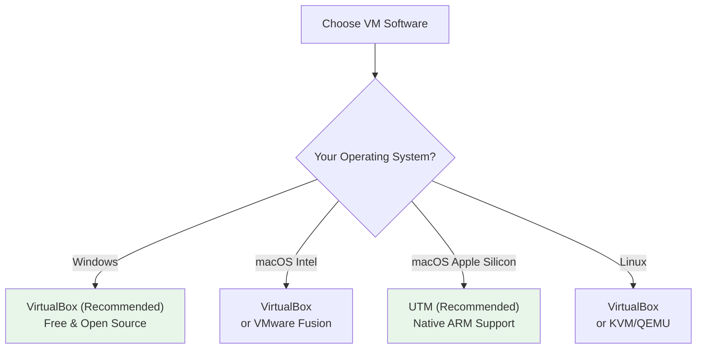
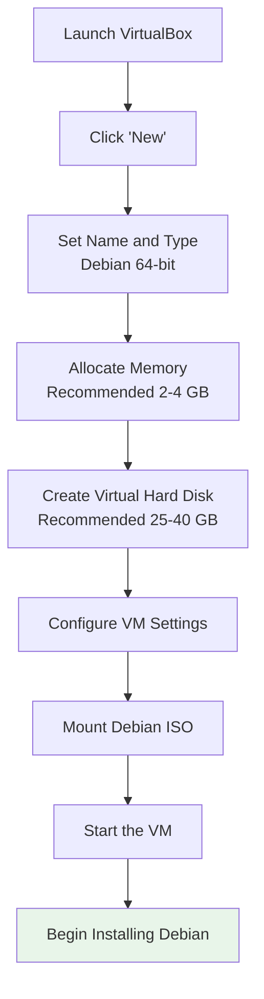

# Virtual Machine Experience Guide

If you're not ready to install Debian directly on your computer, a virtual machine is the perfect starting point. It lets you create a "virtual computer" within your existing system to experience and learn Debian with zero risk.

## 🎯 Why Start with a Virtual Machine

### Advantages at a Glance

- **Zero risk** — Does not affect your existing operating system or data
- **Rollback anytime** — Use snapshots to restore the system with one click if anything goes wrong
- **Learning and experimentation** — Freely try various commands and configurations without fear of breaking things
- **Multiple versions side by side** — Run multiple Debian virtual machines simultaneously

### Installation Method Comparison

| Method | Risk | Performance | Suitable Scenario |
|--------|------|-------------|-------------------|
| **Virtual Machine** | ✅ No risk | 70-90% | Learning, testing |
| **Dual Boot** | ⚠️ Requires partitioning | 100% | Daily use + Windows |
| **Direct Install** | ⚠️ Overwrites original OS | 100% | Fully switching to Debian |
| **Live USB** | ✅ No risk | Lower | Quick preview |

::: tip 💡 Beginner Tip
It is recommended to try Debian in a virtual machine first, and consider installing on physical hardware after you are comfortable with the basics.
:::

## 💻 Choosing Virtual Machine Software

Choose the appropriate virtual machine software based on your operating system:



### Software Comparison

| Software | Price | Supported Systems | Features | Recommendation |
|----------|-------|-------------------|----------|----------------|
| **VirtualBox** | Free | Windows/macOS/Linux | Cross-platform, full-featured | ✅ Highly recommended |
| **VMware Workstation** | Free (Personal) | Windows/Linux | Excellent performance | ✅ Recommended |
| **UTM** | Free | macOS | Apple Silicon support | ✅ Recommended for Mac users |
| **KVM/QEMU** | Free | Linux | Near-native performance | Suitable for advanced users |

## 📥 Installing VirtualBox

### Windows Installation

1. Visit the [VirtualBox website](https://www.virtualbox.org/wiki/Downloads)
2. Download the "Windows hosts" installer
3. Run the installer and click "Next" through the wizard
4. Restart your computer after installation

### macOS Installation

```bash
# Method 1: Download the installer directly
# Visit https://www.virtualbox.org/wiki/Downloads
# Download "macOS / Intel hosts"

# Method 2: Using Homebrew
brew install --cask virtualbox
```

### Linux Installation

```bash
# Debian/Ubuntu
sudo apt update
sudo apt install virtualbox

# Or install the latest version
# Download the .deb package from the official website
sudo dpkg -i virtualbox-7.1_7.1.x-xxxxx~Debian~bookworm_amd64.deb
sudo apt install -f
```

::: warning ⚠️ Important Notice
Before installing VirtualBox, make sure virtualization technology (VT-x / AMD-V) is enabled in your BIOS.
:::

## 🔧 Creating a Virtual Machine

### Creation Workflow



### Step 1: Create a New Virtual Machine

1. Open VirtualBox and click **"New"**
2. Fill in the basic information:
   - **Name**: `Debian 13`
   - **Type**: `Linux`
   - **Version**: `Debian (64-bit)`

### Step 2: Allocate Memory

Choose based on your physical memory:

| Physical Memory | Recommended Allocation | Desktop Environment |
|----------------|----------------------|---------------------|
| 8 GB | 2 GB | Xfce / MATE |
| 16 GB | 4 GB | GNOME / KDE |
| 32 GB+ | 4-8 GB | Any desktop |

::: tip 💡 Beginner Tip
Do not allocate more than half of your physical memory to the virtual machine, or your host system will slow down.
:::

### Step 3: Create a Virtual Hard Disk

- **File type**: VDI (VirtualBox Disk Image)
- **Allocation method**: Dynamically allocated (recommended — only uses actual space as needed)
- **Size**: 25-40 GB recommended

### Step 4: Mount the ISO Image

1. Select the newly created virtual machine and click **"Settings"**
2. Go to the **"Storage"** section
3. Click the disk icon under **"Empty"**
4. Select **"Choose a disk file"**
5. Browse and select the Debian ISO file you downloaded

## ⚙️ Virtual Machine Configuration Details

### System Settings

- **Processor**: Allocate 2-4 cores
- **Boot Order**: Optical drive first
- **Enable EFI**: Recommended (simulates modern UEFI boot)

### Display Settings

- **Video Memory**: Set to 128 MB
- **Graphics Controller**: VMSVGA
- **Enable 3D Acceleration**: Can be enabled after installing Guest Additions

### Network Settings

| Mode | Description | Use Case |
|------|-------------|----------|
| **NAT** | VM accesses the internet through the host; external devices cannot reach the VM | Everyday browsing (default) |
| **Bridged** | VM gets its own IP address; accessible on the local network | Server testing |
| **Host-only** | Can only communicate with the host; no internet access | Internal network testing |

## 🚀 Installing Debian in the Virtual Machine

1. Select the virtual machine and click **"Start"**
2. The virtual machine will boot from the ISO image
3. Follow the installation wizard to complete the installation

::: tip 💡 Beginner Tip
Installing in a virtual machine is exactly the same as installing on a physical machine. For detailed installation steps, refer to the [Installation Guide](/en/basics/installation). In the virtual machine, you can safely choose "Use entire disk" — it will not affect your real hard drive.
:::

Recommended choices during installation:
- **Partitioning scheme**: Use entire disk (virtual hard disk — completely safe)
- **Desktop environment**: GNOME or Xfce (Xfce is lighter and runs more smoothly in a VM)
- **Check**: SSH server + standard system utilities

## 🔌 Installing Guest Additions

Guest Additions significantly improve the virtual machine experience:

### Features

- ✅ Automatic resolution adjustment
- ✅ Seamless mouse switching
- ✅ Shared clipboard
- ✅ Shared folders
- ✅ Drag and drop files
- ✅ Better display performance

### Installation Steps

```bash
# 1. Install build dependencies
sudo apt update
sudo apt install -y build-essential dkms linux-headers-$(uname -r)

# 2. In the VirtualBox menu, select:
#    Devices → Insert Guest Additions CD image...

# 3. Mount and install
sudo mount /dev/cdrom /mnt
sudo /mnt/VBoxLinuxAdditions.run

# 4. Reboot the virtual machine
sudo reboot
```

### Enable Clipboard Sharing

After installation, in the VirtualBox menu:
- **Devices → Shared Clipboard → Bidirectional**
- **Devices → Drag and Drop → Bidirectional**

## 📁 Shared Folder Configuration

Shared folders allow you to conveniently exchange files between the host and the virtual machine.

### Creating a Shared Folder

1. Go to VM **Settings → Shared Folders**
2. Click the **Add** icon on the right
3. Select a folder path on the host
4. Set a name (e.g., `shared`)
5. Check **Auto-mount** and **Make Permanent**

### Accessing in the Virtual Machine

```bash
# Add your user to the vboxsf group
sudo usermod -aG vboxsf $USER

# After logging out and back in, the shared folder is at
ls /media/sf_shared/

# Or mount manually
sudo mount -t vboxsf shared /mnt/shared
```

## 📸 Snapshot Management

Snapshots are one of the most powerful features of virtual machines — save the system state at any time and restore with one click if something goes wrong.

### Creating a Snapshot

1. Select the virtual machine in VirtualBox
2. Click the **"Snapshots"** tab
3. Click **"Take Snapshot"**
4. Enter a snapshot name and description

### Restoring a Snapshot

1. Select the snapshot you want to restore from the snapshot list
2. Click **"Restore"**
3. The virtual machine will return to the state it was in when the snapshot was taken

::: tip 💡 Snapshot Best Practices
- Create a "clean system" snapshot immediately after installing the OS
- Create a snapshot before installing important software or making major configuration changes
- Snapshots consume disk space — periodically clean up snapshots you no longer need
:::

## ⚡ Performance Optimization

### Optimization Checklist

| Item | Optimization | Effect |
|------|-------------|--------|
| **Memory** | Allocate 2-4 GB | System responsiveness |
| **CPU** | Allocate 2-4 cores | Processing speed |
| **Video Memory** | Set to 128 MB | Display quality |
| **Hard Disk** | Store virtual disk on SSD | I/O performance |
| **Guest Additions** | Install Guest Additions | Overall experience |
| **3D Acceleration** | Enable after installing GA | Graphics performance |

### Additional Optimization

```bash
# Optimize inside the VM: reduce swap usage
echo 'vm.swappiness=10' | sudo tee -a /etc/sysctl.conf
sudo sysctl -p

# Disable unnecessary services
sudo systemctl disable bluetooth
sudo systemctl disable cups
```

## 🆘 Common Issues

### Virtual Machine Fails to Start

**Error: VT-x is disabled in the BIOS**

```
Solution:
1. Restart your computer and enter the BIOS settings
2. Find Virtualization Technology (VT-x or AMD-V)
3. Set it to Enabled
4. Save and restart
```

### Performance Is Too Slow

- Increase the allocated memory and CPU cores
- Make sure the virtual disk is stored on an SSD
- Install Guest Additions
- Choose a lightweight desktop environment (e.g., Xfce)

### No Network Connectivity

```bash
# Check if the network mode is set to NAT
# VirtualBox Settings → Network → Attached to: NAT

# Check inside the virtual machine
ip addr show
ping -c 4 debian.org

# If there is no connectivity, try restarting the network
sudo systemctl restart NetworkManager
```

### Guest Additions Installation Fails

```bash
# Make sure all dependencies are installed
sudo apt update
sudo apt install -y build-essential dkms linux-headers-$(uname -r)

# Remount the CD
sudo mount /dev/cdrom /mnt

# Check the error log
sudo /mnt/VBoxLinuxAdditions.run 2>&1 | tail -20
```

### Cannot Display in Full Screen

```bash
# Make sure Guest Additions are installed
# VirtualBox menu → View → Auto-resize Guest Display

# Or manually set the resolution
xrandr --output Virtual-1 --mode 1920x1080
```

## Next Steps

After experiencing Debian in a virtual machine, you can:

1. [Installation Guide](/en/basics/installation) - Install Debian on physical hardware
2. [Dual Boot Installation Guide](/en/basics/dual-boot) - Keep Windows while installing Debian
3. [First Boot Configuration](/en/basics/first-boot) - Complete initial system setup

---

**Is Debian running smoothly in your virtual machine?** [Ready to install for real →](/en/basics/installation)
